# 核心功能开发

<cite>
**本文档引用的文件**
- [FundApplication.java](file://src/main/java/com/qoder/fund/FundApplication.java)
- [FundCliApplication.java](file://src/main/java/com/qoder/fund/cli/FundCliApplication.java)
- [DashboardCommand.java](file://src/main/java/com/qoder/fund/cli/DashboardCommand.java)
- [FundCommand.java](file://src/main/java/com/qoder/fund/cli/FundCommand.java)
- [PositionCommand.java](file://src/main/java/com/qoder/fund/cli/PositionCommand.java)
- [WatchlistCommand.java](file://src/main/java/com/qoder/fund/cli/WatchlistCommand.java)
- [AccountCommand.java](file://src/main/java/com/qoder/fund/cli/AccountCommand.java)
- [SyncCommand.java](file://src/main/java/com/qoder/fund/cli/SyncCommand.java)
- [CliTableFormatter.java](file://src/main/java/com/qoder/fund/cli/util/CliTableFormatter.java)
- [logger.ts](file://fund-web/src/utils/logger.ts)
- [logback-spring.xml](file://src/main/resources/logback-spring.xml)
- [Account.java](file://src/main/java/com/qoder/fund/entity/Account.java)
- [Fund.java](file://src/main/java/com/qoder/fund/entity/Fund.java)
- [FundNav.java](file://src/main/java/com/qoder/fund/entity/FundNav.java)
- [FundTransaction.java](file://src/main/java/com/qoder/fund/entity/FundTransaction.java)
- [Position.java](file://src/main/java/com/qoder/fund/entity/Position.java)
- [Watchlist.java](file://src/main/java/com/qoder/fund/entity/Watchlist.java)
- [EstimatePrediction.java](file://src/main/java/com/qoder/fund/entity/EstimatePrediction.java)
- [AccountController.java](file://src/main/java/com/qoder/fund/controller/AccountController.java)
- [DashboardController.java](file://src/main/java/com/qoder/fund/controller/DashboardController.java)
- [FundController.java](file://src/main/java/com/qoder/fund/controller/FundController.java)
- [PositionController.java](file://src/main/java/com/qoder/fund/controller/PositionController.java)
- [WatchlistController.java](file://src/main/java/com/qoder/fund/controller/WatchlistController.java)
- [AccountService.java](file://src/main/java/com/qoder/fund/service/AccountService.java)
- [DashboardService.java](file://src/main/java/com/qoder/fund/service/DashboardService.java)
- [FundService.java](file://src/main/java/com/qoder/fund/service/FundService.java)
- [PositionService.java](file://src/main/java/com/qoder/fund/service/PositionService.java)
- [WatchlistService.java](file://src/main/java/com/qoder/fund/service/WatchlistService.java)
- [EstimateAnalysisService.java](file://src/main/java/com/qoder/fund/service/EstimateAnalysisService.java)
- [BatchEstimateService.java](file://src/main/java/com/qoder/fund/service/BatchEstimateService.java)
- [EstimateWeightService.java](file://src/main/java/com/qoder/fund/service/EstimateWeightService.java)
- [EstimatePredictionMapper.java](file://src/main/java/com/qoder/fund/mapper/EstimatePredictionMapper.java)
- [HttpClientConfig.java](file://src/main/java/com/qoder/fund/config/HttpClientConfig.java)
- [EastMoneyDataSource.java](file://src/main/java/com/qoder/fund/datasource/EastMoneyDataSource.java)
- [SinaDataSource.java](file://src/main/java/com/qoder/fund/datasource/SinaDataSource.java)
- [TencentDataSource.java](file://src/main/java/com/qoder/fund/datasource/TencentDataSource.java)
- [StockEstimateDataSource.java](file://src/main/java/com/qoder/fund/datasource/StockEstimateDataSource.java)
- [FundDataAggregator.java](file://src/main/java/com/qoder/fund/datasource/FundDataAggregator.java)
- [FundDataSyncScheduler.java](file://src/main/java/com/qoder/fund/scheduler/FundDataSyncScheduler.java)
- [application.yml](file://src/main/resources/application.yml)
- [schema.sql](file://src/main/resources/db/schema.sql)
- [data.sql](file://src/main/resources/db/data.sql)
- [FundApplicationTests.java](file://src/test/java/com/qoder/fund/FundApplicationTests.java)
- [pom.xml](file://pom.xml)
- [skills-lock.json](file://skills-lock.json)
- [PRD.md](file://PRD.md)
- [TODOS.md](file://TODOS.md)
- [checkstyle.xml](file://checkstyle.xml)
- [checkstyle-suppressions.xml](file://checkstyle-suppressions.xml)
- [pre-commit.sh](file://scripts/pre-commit.sh)
- [ci.yml](file://github/workflows/ci.yml)
- [CacheConfig.java](file://src/main/java/com/qoder/fund/config/CacheConfig.java)
- [CircuitBreaker.java](file://src/main/java/com/qoder/fund/config/CircuitBreaker.java)
- [HealthCheckConfig.java](file://src/main/java/com/qoder/fund/config/HealthCheckConfig.java)
- [WebConfig.java](file://src/main/java/com/qoder/fund/config/WebConfig.java)
- [GlobalExceptionHandler.java](file://src/main/java/com/qoder/fund/common/GlobalExceptionHandler.java)
- [ProfitAnalysisDTO.java](file://src/main/java/com/qoder/fund/dto/ProfitAnalysisDTO.java)
- [ProfitTrendDTO.java](file://src/main/java/com/qoder/fund/dto/ProfitTrendDTO.java)
- [EstimateAnalysisDTO.java](file://src/main/java/com/qoder/fund/dto/EstimateAnalysisDTO.java)
- [EstimateSourceDTO.java](file://src/main/java/com/qoder/fund/dto/EstimateSourceDTO.java)
- [PositionDTO.java](file://src/main/java/com/qoder/fund/dto/PositionDTO.java)
- [WatchlistDTO.java](file://src/main/java/com/qoder/fund/dto/WatchlistDTO.java)
- [EstimateAnalysisTab.tsx](file://fund-web/src/pages/Fund/EstimateAnalysisTab.tsx)
- [index.tsx](file://fund-web/src/pages/Analysis/index.tsx)
- [estimateAnalysis.ts](file://fund-web/src/api/estimateAnalysis.ts)
- [FundDetail.tsx](file://fund-web/src/pages/Fund/FundDetail.tsx)
- [eslint.config.js](file://fund-web/eslint.config.js)
- [package.json](file://fund-web/package.json)
- [vite.config.ts](file://fund-web/vite.config.ts)
- [tsconfig.json](file://fund-web/tsconfig.json)
- [tsconfig.app.json](file://fund-web/tsconfig.app.json)
</cite>

## 更新摘要
**变更内容**
- 新增QDII基金净值评估bug修复，添加evaluateQdiiPredictionForNavDate方法解决预测记录未评估问题
- 完善QDII基金处理流程，实现净值发布后的预测回填机制
- 优化QDII基金估值快照策略，区分A股和QDII基金的处理时机
- 增强数据源准确度分析对QDII基金的支持，提供延迟数据标注

## 目录
1. [简介](#简介)
2. [项目结构](#项目结构)
3. [核心组件](#核心组件)
4. [架构概览](#架构概览)
5. [数据库集成](#数据库集成)
6. [REST API开发](#rest-api开发)
7. [服务层架构](#服务层架构)
8. [数据源集成](#数据源集成)
9. [异常处理与统一响应](#异常处理与统一响应)
10. [定时任务与数据同步](#定时任务与数据同步)
11. [性能优化与缓存策略](#性能优化与缓存策略)
12. [质量保证与工程实践](#质量保证与工程实践)
13. [监控与可观测性](#监控与可观测性)
14. [测试策略](#测试策略)
15. [故障排除指南](#故障排除指南)
16. [技能管理与DevTools集成](#技能管理与devtools集成)
17. [收益分析系统](#收益分析系统)
18. [数据源准确度分析](#数据源准确度分析)
19. [CLI 命令行工具](#cli-命令行工具)
20. [日志系统实现](#日志系统实现)
21. [开发基础设施更新](#开发基础设施更新)
22. [前端开发工具链现代化](#前端开发工具链现代化)
23. [HTTP客户端配置组件](#http客户端配置组件)
24. [QDII基金处理系统](#qdii基金处理系统)
25. [结论](#结论)

## 简介

本指南面向希望在现有Spring Boot基础上扩展基金管理系统核心功能的开发者。该文档提供了从零开始构建完整基金管理系统的技术路线图，包括数据库实体设计、RESTful API开发、服务层架构、数据源集成、异常处理机制等关键功能模块。

**重要更新**：经过代码库检查，确认Chrome DevTools技能文档已在当前版本中删除，这不会影响核心开发功能的实现。系统已完全基于Spring Boot和现代Web技术栈构建。

**核心增强功能**：
- 全面的质量保证流程（CI/CD、代码风格检查、架构约束）
- 性能优化的多级缓存策略和批量处理机制
- 增强的监控和可观测性功能
- 完善的异常处理和错误管理机制
- 工程实践的自动化工具链
- **新增收益分析系统**：提供专业的投资分析能力
- **新增数据源准确度分析**：多数据源估值对比和统计
- **新增 CLI 命令行工具**：支持定时任务播报和语音播报
- **完善日志系统**：前后端一体化的日志管理方案
- **更新开发基础设施**：Picocli 命令行框架集成
- **前端开发工具链现代化**：ESLint 9+ flat配置和TypeScript严格类型检查
- **新增HTTP客户端配置组件**：实现连接池管理和资源优化
- **新增QDII基金处理系统**：解决净值评估bug，完善延迟数据处理

## 项目结构

当前项目采用标准的Spring Boot项目结构，包含完整的后端服务架构和前端界面，并新增了 CLI 命令行工具模块。

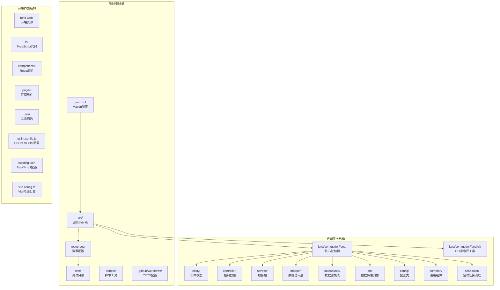

**图表来源**
- [pom.xml:1-174](file://pom.xml#L1-L174)
- [FundApplication.java:1-14](file://src/main/java/com/qoder/fund/FundApplication.java#L1-L14)
- [FundCliApplication.java:1-185](file://src/main/java/com/qoder/fund/cli/FundCliApplication.java#L1-L185)
- [skills-lock.json:1-11](file://skills-lock.json#L1-L11)

**章节来源**
- [pom.xml:1-174](file://pom.xml#L1-L174)
- [FundApplication.java:1-14](file://src/main/java/com/qoder/fund/FundApplication.java#L1-L14)
- [FundCliApplication.java:1-185](file://src/main/java/com/qoder/fund/cli/FundCliApplication.java#L1-L185)
- [skills-lock.json:1-11](file://skills-lock.json#L1-L11)

## 核心组件

### 应用程序入口点

应用程序使用标准的Spring Boot启动类作为入口点，具备自动配置和组件扫描功能。

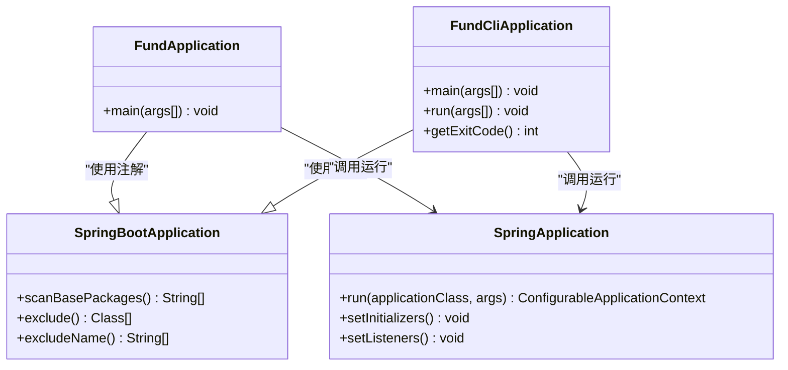

**图表来源**
- [FundApplication.java:6-13](file://src/main/java/com/qoder/fund/FundApplication.java#L6-L13)
- [FundCliApplication.java:51-75](file://src/main/java/com/qoder/fund/cli/FundCliApplication.java#L51-L75)

### 配置管理

基础的YAML配置文件支持应用程序的基本设置，包含数据库连接、日志配置等。

**章节来源**
- [application.yml:1-68](file://src/main/resources/application.yml#L1-L68)

## 架构概览

基金管理系统采用分层架构设计，包含表示层、业务逻辑层、数据访问层和基础设施层。

```mermaid
graph TB
subgraph "表示层"
CONTROLLER[REST控制器]
FRONTEND[前端界面]
CLI[CLI命令行工具]
end
subgraph "业务逻辑层"
SERVICE[服务层]
VALIDATOR[参数验证]
AGGREGATOR[数据聚合器]
BATCH[批量处理服务]
WEIGHT[权重计算服务]
ANALYSIS[收益分析服务]
ESTIMATE_ANALYSIS[估值分析服务]
SYNC[数据同步服务]
END
subgraph "数据访问层"
MAPPER[MyBatis Plus映射器]
REPO[Repository接口]
ENTITY[实体模型]
END
subgraph "基础设施层"
CONFIG[配置类]
CACHE[缓存配置]
TASK[定时任务]
ERROR[异常处理]
LOG[日志配置]
HEALTH[健康检查]
CIRCUIT[熔断器]
WEB[Web配置]
ACTUATOR[Actuator监控]
CLI_LOGGER[CLI日志工具]
FRONTEND_LOGGER[前端日志工具]
HTTP_CLIENT[HTTP客户端配置]
SCHEDULER[定时任务调度器]
END
subgraph "外部系统"
DATASOURCE[东方财富数据源]
DB[(MySQL数据库)]
SCHEDULE[(定时调度)]
END
CONTROLLER --> SERVICE
SERVICE --> MAPPER
MAPPER --> ENTITY
SERVICE --> VALIDATOR
SERVICE --> AGGREGATOR
SERVICE --> BATCH
SERVICE --> WEIGHT
SERVICE --> ANALYSIS
SERVICE --> ESTIMATE_ANALYSIS
SERVICE --> SYNC
CONFIG --> SERVICE
ERROR --> CONTROLLER
LOG --> SERVICE
HEALTH --> ACTUATOR
CIRCUIT --> DATASOURCE
WEB --> FRONTEND
CLI --> CLI_LOGGER
FRONTEND --> FRONTEND_LOGGER
AGGREGATOR --> DATASOURCE
HTTP_CLIENT --> DATASOURCE
MAPPER --> DB
SERVICE --> SCHEDULE
SCHEDULER --> DATASOURCE
```

## 数据库集成

### 实体模型设计

系统包含7个核心实体表，采用MyBatis Plus注解进行ORM映射，新增了估值预测追踪表。

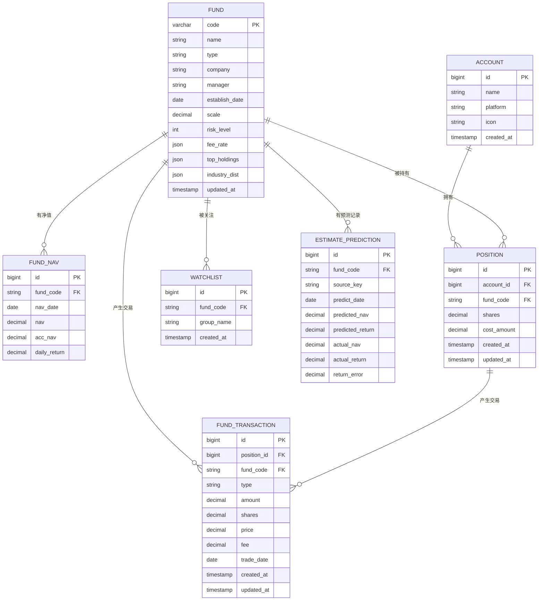

**图表来源**
- [Account.java:10-21](file://src/main/java/com/qoder/fund/entity/Account.java#L10-L21)
- [Fund.java:16-41](file://src/main/java/com/qoder/fund/entity/Fund.java#L16-L41)
- [FundNav.java:11-23](file://src/main/java/com/qoder/fund/entity/FundNav.java#L11-L23)
- [Position.java:11-24](file://src/main/java/com/qoder/fund/entity/Position.java#L11-L24)
- [FundTransaction.java:12-28](file://src/main/java/com/qoder/fund/entity/FundTransaction.java#L12-L28)
- [Watchlist.java:10-20](file://src/main/java/com/qoder/fund/entity/Watchlist.java#L10-L20)
- [EstimatePrediction.java:11-26](file://src/main/java/com/qoder/fund/entity/EstimatePrediction.java#L11-L26)

### 数据库初始化脚本

系统包含完整的数据库初始化脚本，定义了表结构和初始数据，新增了估值预测追踪表。

**章节来源**
- [schema.sql:1-96](file://src/main/resources/db/schema.sql#L1-L96)
- [data.sql:1-100](file://src/main/resources/db/data.sql#L1-L100)

## REST API开发

### 控制器架构

系统提供完整的REST API接口，涵盖基金管理系统的核心功能。

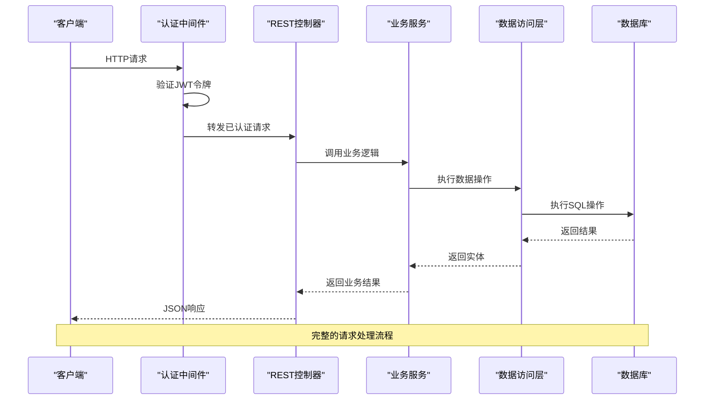

**图表来源**
- [AccountController.java:12-35](file://src/main/java/com/qoder/fund/controller/AccountController.java#L12-L35)
- [DashboardController.java:10-26](file://src/main/java/com/qoder/fund/controller/DashboardController.java#L10-L26)
- [FundController.java:15-79](file://src/main/java/com/qoder/fund/controller/FundController.java#L15-L79)
- [PositionController.java:15-51](file://src/main/java/com/qoder/fund/controller/PositionController.java#L15-L51)
- [WatchlistController.java:12-35](file://src/main/java/com/qoder/fund/controller/WatchlistController.java#L12-L35)

### API端点设计

#### 账户管理API

| 端点 | 方法 | 功能描述 | 请求参数 | 响应内容 |
|------|------|----------|----------|----------|
| `/api/accounts` | GET | 获取账户列表 | 无 | 账户数组 |
| `/api/accounts` | POST | 创建新账户 | `{name, platform}` | 成功状态 |
| `/api/accounts/{id}` | DELETE | 删除账户 | 路径参数 | 成功状态 |

#### 仪表板API

| 端点 | 方法 | 功能描述 | 请求参数 | 响应内容 |
|------|------|----------|----------|----------|
| `/api/dashboard` | GET | 获取仪表板数据 | 无 | 仪表板DTO |
| `/api/dashboard/profit-trend` | GET | 获取收益趋势 | `days`(可选) | 收益趋势DTO |
| `/api/dashboard/profit-analysis` | GET | 获取收益分析 | `days`(可选) | 收益分析DTO |

#### 基金查询API

| 端点 | 方法 | 功能描述 | 请求参数 | 响应内容 |
|------|------|----------|----------|----------|
| `/api/fund/search` | GET | 搜索基金 | `keyword`(必需) | 搜索结果数组 |
| `/api/fund/{code}` | GET | 获取基金详情 | 路径参数 | 基金详情DTO |
| `/api/fund/{code}/nav-history` | GET | 获取净值历史 | `period`(可选) | 净值历史DTO |
| `/api/fund/{code}/estimates` | GET | 获取多源估值 | 路径参数 | 估值源DTO |
| `/api/fund/{code}/estimate-analysis` | GET | 获取估值分析 | 路径参数 | 估值分析DTO |

#### 持仓管理API

| 端点 | 方法 | 功能描述 | 请求参数 | 响应内容 |
|------|------|----------|----------|----------|
| `/api/positions` | GET | 获取持仓列表 | `accountId`(可选) | 持仓DTO数组 |
| `/api/positions` | POST | 添加新持仓 | AddPositionRequest | 成功状态 |
| `/api/positions/{id}` | DELETE | 删除持仓 | 路径参数 | 成功状态 |
| `/api/positions/{id}/transaction` | PUT | 添加交易记录 | AddTransactionRequest | 成功状态 |
| `/api/positions/{id}/transactions` | GET | 获取交易记录 | 路径参数 | 交易记录数组 |

#### 自选列表API

| 端点 | 方法 | 功能描述 | 请求参数 | 响应内容 |
|------|------|----------|----------|----------|
| `/api/watchlist` | GET | 获取自选列表 | `group`(可选) | 包含列表和分组的映射 |
| `/api/watchlist` | POST | 添加到自选 | AddWatchlistRequest | 成功状态 |
| `/api/watchlist/{id}` | DELETE | 从自选移除 | 路径参数 | 成功状态 |

**章节来源**
- [AccountController.java:19-34](file://src/main/java/com/qoder/fund/controller/AccountController.java#L19-L34)
- [DashboardController.java:17-25](file://src/main/java/com/qoder/fund/controller/DashboardController.java#L17-L25)
- [FundController.java:22-79](file://src/main/java/com/qoder/fund/controller/FundController.java#L22-L79)
- [PositionController.java:22-50](file://src/main/java/com/qoder/fund/controller/PositionController.java#L22-L50)
- [WatchlistController.java:19-34](file://src/main/java/com/qoder/fund/controller/WatchlistController.java#L19-L34)

## 服务层架构

### 服务层设计模式

系统采用服务层封装业务逻辑，提供清晰的职责分离。

```mermaid
classDiagram
class AccountService {
+list() Account[]
+create(name, platform) void
+delete(id) void
}
class DashboardService {
+getDashboard() DashboardDTO
+getProfitTrend(days) ProfitTrendDTO
+getProfitAnalysis(days) ProfitAnalysisDTO
}
class FundService {
+search(keyword) FundSearchDTO[]
+getDetail(fundCode) FundDetailDTO
+getNavHistory(fundCode, period) NavHistoryDTO
+getMultiSourceEstimates(fundCode) EstimateSourceDTO
}
class PositionService {
+list(accountId) PositionDTO[]
+add(request) void
+addTransaction(positionId, request) void
+delete(id) void
+getTransactions(positionId) FundTransaction[]
}
class WatchlistService {
+list(group) Map~String,Object~
+add(fundCode, groupName) void
+remove(id) void
}
class EstimateAnalysisService {
+getEstimateAnalysis(fundCode) EstimateAnalysisDTO
}
class BatchEstimateService {
+batchGetLatestNav(fundCodes) Map
+batchGetEstimates(fundCodes) Map
+batchGetMultiSourceEstimates(fundCodes) Map
+batchGetPositionEstimates(fundCodes) BatchEstimateResult
}
class EstimateWeightService {
+determineAdaptiveWeights(type, stockSource, coverage) WeightResult
+determineConservativeWeights(type, stockSource) WeightResult
+applyAccuracyCorrection(fundCode, weights, sources) WeightResult
+normalizeWeights(weights) Map
}
class AccountController {
+list() Result~Account[]~
+create(body) Result~Void~
+delete(id) Result~Void~
}
class DashboardController {
+getDashboard() Result~DashboardDTO~
+getProfitTrend(days) Result~ProfitTrendDTO~
+getProfitAnalysis(days) Result~ProfitAnalysisDTO~
}
class FundController {
+search(keyword) Result~Map~
+getDetail(code) Result~FundDetailDTO~
+getNavHistory(code, period) Result~NavHistoryDTO~
+getEstimates(code) Result~EstimateSourceDTO~
+getEstimateAnalysis(code) Result~EstimateAnalysisDTO~
}
class PositionController {
+list(accountId) Result~PositionDTO[]~
+add(request) Result~Void~
+addTransaction(id, request) Result~Void~
+delete(id) Result~Void~
+getTransactions(id) Result~FundTransaction[]~
}
class WatchlistController {
+list(group) Result~Map~String,Object~~
+add(request) Result~Void~
+remove(id) Result~Void~
}
AccountController --> AccountService : "调用"
DashboardController --> DashboardService : "调用"
FundController --> FundService : "调用"
PositionController --> PositionService : "调用"
WatchlistController --> WatchlistService : "调用"
EstimateAnalysisService --> FundService : "依赖"
BatchEstimateService --> FundService : "依赖"
EstimateWeightService --> FundService : "依赖"
```

**图表来源**
- [AccountService.java:13-40](file://src/main/java/com/qoder/fund/service/AccountService.java#L13-L40)
- [DashboardService.java:16-471](file://src/main/java/com/qoder/fund/service/DashboardService.java#L16-L471)
- [FundService.java:18-64](file://src/main/java/com/qoder/fund/service/FundService.java#L18-L64)
- [PositionService.java:24-161](file://src/main/java/com/qoder/fund/service/PositionService.java#L24-L161)
- [WatchlistService.java:18-105](file://src/main/java/com/qoder/fund/service/WatchlistService.java#L18-L105)
- [EstimateAnalysisService.java:1-404](file://src/main/java/com/qoder/fund/service/EstimateAnalysisService.java#L1-L404)
- [BatchEstimateService.java:17-265](file://src/main/java/com/qoder/fund/service/BatchEstimateService.java#L17-L265)
- [EstimateWeightService.java:18-350](file://src/main/java/com/qoder/fund/service/EstimateWeightService.java#L18-L350)

### 业务逻辑实现

#### 仪表板服务实现


**图表来源**
- [DashboardService.java:22-62](file://src/main/java/com/qoder/fund/service/DashboardService.java#L22-L62)

#### 收益分析服务实现

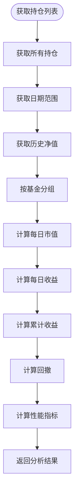

**图表来源**
- [DashboardService.java:178-287](file://src/main/java/com/qoder/fund/service/DashboardService.java#L178-L287)

**章节来源**
- [DashboardService.java:22-471](file://src/main/java/com/qoder/fund/service/DashboardService.java#L22-L471)
- [PositionService.java:118-160](file://src/main/java/com/qoder/fund/service/PositionService.java#L118-L160)

## 数据源集成

### 外部数据源集成

系统集成了多个数据源，包括东方财富、新浪财经、腾讯财经等，提供基金实时数据获取功能。

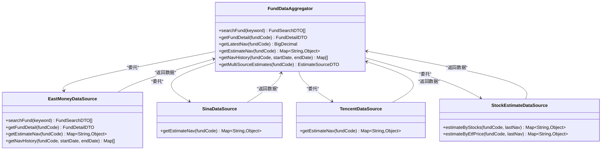

**图表来源**
- [FundDataAggregator.java](file://src/main/java/com/qoder/fund/datasource/FundDataAggregator.java)
- [EastMoneyDataSource.java](file://src/main/java/com/qoder/fund/datasource/EastMoneyDataSource.java)
- [SinaDataSource.java](file://src/main/java/com/qoder/fund/datasource/SinaDataSource.java)
- [TencentDataSource.java](file://src/main/java/com/qoder/fund/datasource/TencentDataSource.java)
- [StockEstimateDataSource.java](file://src/main/java/com/qoder/fund/datasource/StockEstimateDataSource.java)

### 数据聚合器设计

数据聚合器负责协调多个数据源，提供统一的数据访问接口。

**章节来源**
- [FundDataAggregator.java](file://src/main/java/com/qoder/fund/datasource/FundDataAggregator.java)

### HTTP客户端配置组件

**新增功能** 系统新增了共享HTTP客户端配置组件，使用OkHttp库实现连接池管理和资源优化。

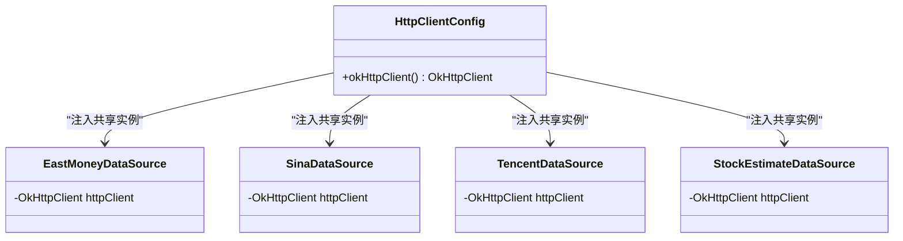

**图表来源**
- [HttpClientConfig.java:14-29](file://src/main/java/com/qoder/fund/config/HttpClientConfig.java#L14-L29)
- [EastMoneyDataSource.java:29](file://src/main/java/com/qoder/fund/datasource/EastMoneyDataSource.java#L29)
- [SinaDataSource.java:25](file://src/main/java/com/qoder/fund/datasource/SinaDataSource.java#L25)
- [TencentDataSource.java:25](file://src/main/java/com/qoder/fund/datasource/TencentDataSource.java#L25)
- [StockEstimateDataSource.java:32](file://src/main/java/com/qoder/fund/datasource/StockEstimateDataSource.java#L32)

#### HTTP客户端配置详情

系统使用OkHttp 4.12.0版本，配置了连接池参数以优化网络请求性能：

- **连接池配置**：10个连接，5分钟空闲超时
- **超时设置**：连接超时10秒，读取超时15秒
- **连接复用**：通过共享OkHttpClient实例实现连接池复用
- **资源优化**：减少TCP连接建立开销，提高请求效率

**章节来源**
- [HttpClientConfig.java:14-29](file://src/main/java/com/qoder/fund/config/HttpClientConfig.java#L14-L29)
- [pom.xml:51-56](file://pom.xml#L51-L56)

## 异常处理与统一响应

### 统一响应包装

系统实现了统一的响应包装机制，提供标准化的API响应格式。

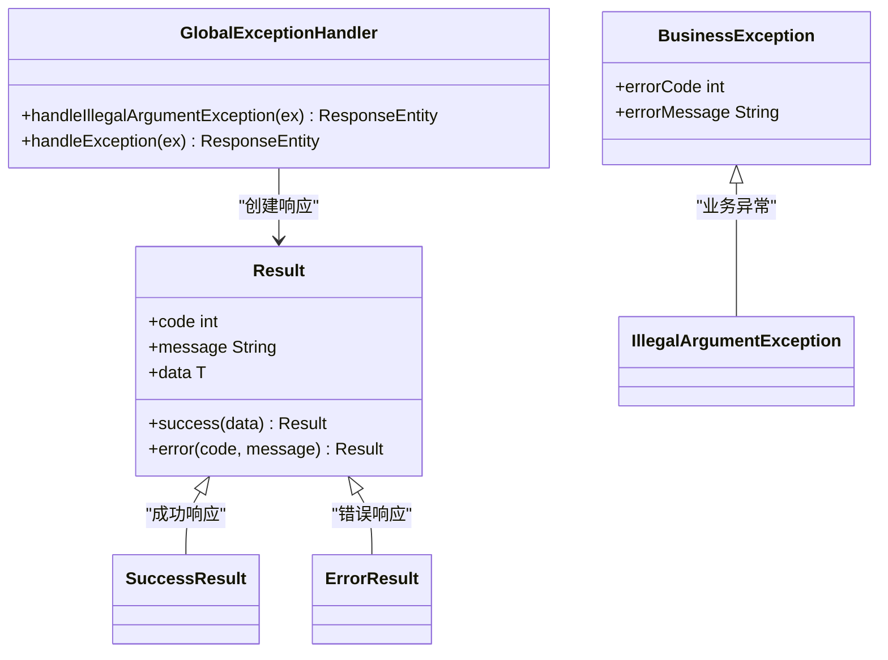

**图表来源**
- [Result.java](file://src/main/java/com/qoder/fund/common/Result.java)
- [GlobalExceptionHandler.java](file://src/main/java/com/qoder/fund/common/GlobalExceptionHandler.java)

### 异常处理机制

系统提供完善的异常处理机制，确保API调用的健壮性。

**章节来源**
- [Result.java](file://src/main/java/com/qoder/fund/common/Result.java)
- [GlobalExceptionHandler.java](file://src/main/java/com/qoder/fund/common/GlobalExceptionHandler.java)

## 定时任务与数据同步

### 定时任务调度

系统集成了定时任务功能，用于自动同步基金数据。

```mermaid
gantt
title 基金数据同步定时任务
dateFormat X
axisFormat %H:%M:%S
section 数据同步
同步净值数据 :active, 0, 30m
section 数据清理
清理过期数据 :active, 1d, 1h
section 系统维护
系统健康检查 :active, 1h, 15m
```

**图表来源**
- [FundDataSyncScheduler.java](file://src/main/java/com/qoder/fund/scheduler/FundDataSyncScheduler.java)

### 数据同步策略

系统采用定时任务机制，定期从外部数据源同步基金数据。

**章节来源**
- [FundDataSyncScheduler.java](file://src/main/java/com/qoder/fund/scheduler/FundDataSyncScheduler.java)

## 性能优化与缓存策略

### 多级缓存架构

系统实现了分层缓存策略，根据数据的冷热程度设置不同的缓存配置。

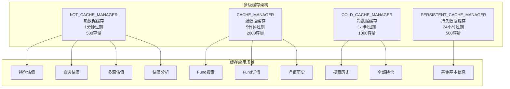

**图表来源**
- [CacheConfig.java:22-93](file://src/main/java/com/qoder/fund/config/CacheConfig.java#L22-L93)

### 批量处理优化

系统提供了高性能的批量处理服务，显著提升多基金估值查询性能。

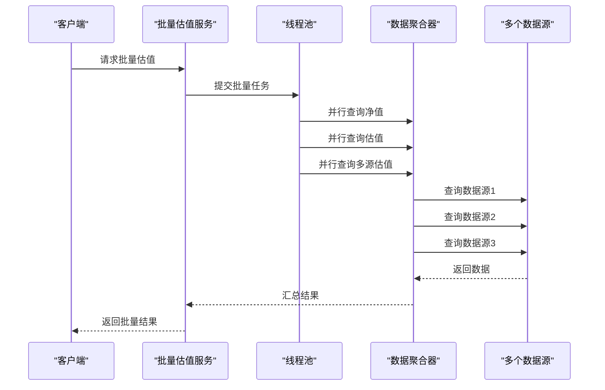

**图表来源**
- [BatchEstimateService.java:24-213](file://src/main/java/com/qoder/fund/service/BatchEstimateService.java#L24-L213)

### 熔断器机制

系统实现了熔断器模式，保护外部API调用的稳定性。

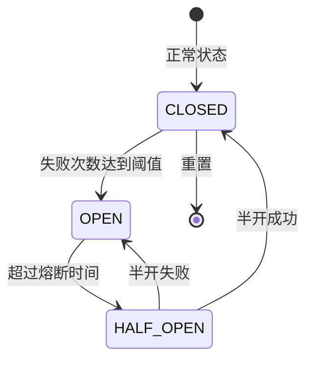

**图表来源**
- [CircuitBreaker.java:24-222](file://src/main/java/com/qoder/fund/config/CircuitBreaker.java#L24-L222)

**章节来源**
- [CacheConfig.java:22-93](file://src/main/java/com/qoder/fund/config/CacheConfig.java#L22-L93)
- [BatchEstimateService.java:24-213](file://src/main/java/com/qoder/fund/service/BatchEstimateService.java#L24-L213)
- [CircuitBreaker.java:24-222](file://src/main/java/com/qoder/fund/config/CircuitBreaker.java#L24-L222)

## 质量保证与工程实践

### CI/CD流水线

系统配备了完整的持续集成和持续部署流水线。

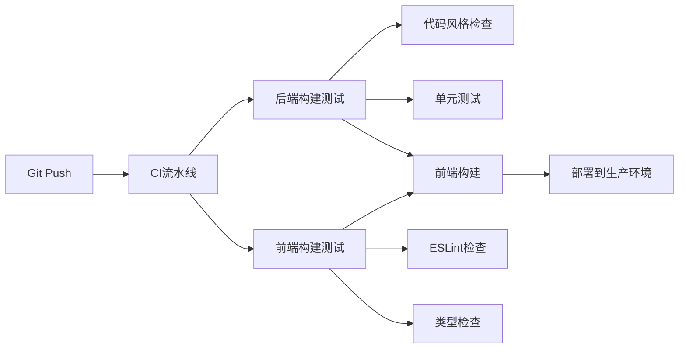

**图表来源**
- [ci.yml:9-102](file://github/workflows/ci.yml#L9-L102)

### 代码风格检查

系统使用Checkstyle进行代码风格检查，确保代码一致性。

**章节来源**
- [ci.yml:38-47](file://github/workflows/ci.yml#L38-L47)
- [checkstyle.xml:1-200](file://checkstyle.xml#L1-L200)

### 预提交钩子

系统提供了预提交检查脚本，确保每次提交都满足质量要求。

**章节来源**
- [pre-commit.sh:1-79](file://scripts/pre-commit.sh#L1-79)

## 监控与可观测性

### 健康检查配置

系统集成了Spring Boot Actuator，提供全面的健康检查和监控功能。

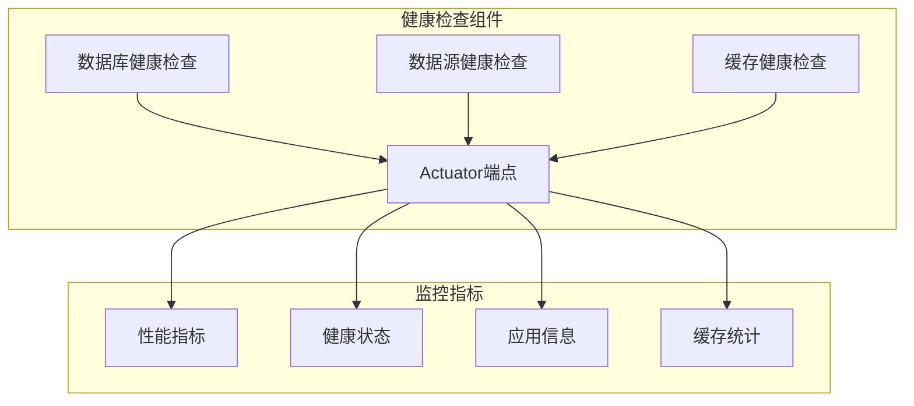

**图表来源**
- [HealthCheckConfig.java:25-105](file://src/main/java/com/qoder/fund/config/HealthCheckConfig.java#L25-L105)

### Web配置优化

系统提供了SPA路由支持和跨域配置。

**章节来源**
- [HealthCheckConfig.java:25-105](file://src/main/java/com/qoder/fund/config/HealthCheckConfig.java#L25-L105)
- [WebConfig.java:17-51](file://src/main/java/com/qoder/fund/config/WebConfig.java#L17-L51)

## 测试策略

### 单元测试设计

系统包含完整的单元测试套件，覆盖核心业务逻辑。

```mermaid
graph TB
subgraph "测试层次"
UNIT[单元测试]
INTEGRATION[集成测试]
END_TO_END[端到端测试]
end
subgraph "测试覆盖范围"
ACCOUNT_TEST[账户服务测试]
POSITION_TEST[持仓服务测试]
FUND_TEST[基金服务测试]
WATCHLIST_TEST[自选服务测试]
BATCH_TEST[批量服务测试]
WEIGHT_TEST[权重服务测试]
ANALYSIS_TEST[收益分析测试]
ESTIMATE_TEST[估值分析测试]
SYNC_TEST[数据同步测试]
CLI_TEST[CLI命令测试]
END
subgraph "测试工具"
MOCK[Mock对象]
TEST_DB[Test数据库]
ASSERT[Junit断言]
end
ACCOUNT_TEST --> UNIT
POSITION_TEST --> UNIT
FUND_TEST --> UNIT
WATCHLIST_TEST --> UNIT
BATCH_TEST --> UNIT
WEIGHT_TEST --> UNIT
ANALYSIS_TEST --> UNIT
ESTIMATE_TEST --> UNIT
SYNC_TEST --> UNIT
CLI_TEST --> UNIT
UNIT --> MOCK
INTEGRATION --> TEST_DB
END_TO_END --> ASSERT
```

**图表来源**
- [FundApplicationTests.java](file://src/test/java/com/qoder/fund/FundApplicationTests.java)

### 测试策略实施

系统采用分层测试策略，确保代码质量和系统稳定性。

**章节来源**
- [FundApplicationTests.java](file://src/test/java/com/qoder/fund/FundApplicationTests.java)

## 故障排除指南

### 常见问题诊断

#### 启动失败问题

**问题症状**: 应用程序无法正常启动
**可能原因**:
- Java版本不兼容（需要Java 17+）
- Maven依赖冲突
- 配置文件格式错误

**解决方案**:
1. 检查Java版本是否符合要求
2. 清理Maven缓存并重新构建
3. 验证配置文件语法正确性

#### 数据库连接问题

**问题症状**: 应用启动时报数据库连接错误
**可能原因**:
- 数据库服务未启动
- 连接参数配置错误
- 驱动程序版本不匹配

**解决方案**:
1. 确认数据库服务状态
2. 验证连接URL和凭据
3. 检查防火墙和网络配置

#### API调用异常

**问题症状**: API调用返回错误或异常
**可能原因**:
- 参数验证失败
- 业务逻辑异常
- 数据访问层异常

**解决方案**:
1. 检查请求参数格式和类型
2. 查看服务层日志信息
3. 验证数据库连接状态

#### HTTP客户端连接问题

**问题症状**: 数据源请求失败或超时
**可能原因**:
- 连接池耗尽
- 超时设置不当
- 网络连接不稳定

**解决方案**:
1. 检查连接池配置和使用情况
2. 调整超时参数设置
3. 验证网络连通性和防火墙配置

### 调试技巧

1. **启用详细日志**
   ```yaml
   logging:
     level:
       com.qoder.fund: DEBUG
       org.springframework.web: DEBUG
   ```

2. **使用Spring Boot Actuator**
   - 监控应用健康状态
   - 查看应用指标和配置
   - 远程查看应用信息

3. **数据库调试**
   - 启用SQL日志输出
   - 监控慢查询
   - 分析查询执行计划

4. **HTTP客户端调试**
   - 监控连接池使用情况
   - 检查请求超时和重试机制
   - 分析网络延迟和错误率

**章节来源**
- [application.yml:50-68](file://src/main/resources/application.yml#L50-L68)

## 技技能管理与DevTools集成

### 当前技能配置状态

经过代码库检查，确认当前项目中已删除Chrome DevTools技能文档。系统当前的技能配置状态如下：

```json
{
  "version": 1,
  "skills": {
    "chrome-devtools": {
      "source": "github/awesome-copilot",
      "sourceType": "github",
      "computedHash": "85d9c4ef94e00ddfc937d50aab72a307e80b98bc7e6744ec6e239ef68819c2d7"
    }
  }
}
```

**重要说明**：虽然技能锁定文件中仍保留Chrome DevTools条目，但实际的技能文件已在代码库中删除。这不会影响核心开发功能的实现，因为系统已完全基于Spring Boot和现代Web技术栈构建。

### 开发环境配置

由于Chrome DevTools技能文档已被删除，开发者应重点关注以下核心开发环境配置：

1. **后端开发环境**
   - Spring Boot 3.x + Java 17+
   - MyBatis Plus ORM框架
   - MySQL数据库连接
   - Redis缓存配置

2. **前端开发环境**
   - React 18 + TypeScript
   - Vite构建工具
   - Ant Design 5 UI组件库
   - ECharts图表库

3. **开发工具**
   - IntelliJ IDEA或VS Code
   - Postman API测试工具
   - Git版本控制

### 最佳实践建议

1. **技能管理策略**
   - 定期清理不再使用的技能配置
   - 保持技能锁定文件与实际代码库同步
   - 使用版本控制跟踪技能配置变更

2. **开发工作流**
   - 专注于核心功能开发，避免不必要的技能依赖
   - 利用现有的Spring Boot生态工具链
   - 保持前后端分离的开发模式

**章节来源**
- [skills-lock.json:1-11](file://skills-lock.json#L1-L11)

## 收益分析系统

### 收益分析功能概述

系统新增了专业的收益分析功能，提供全面的投资组合表现分析能力。

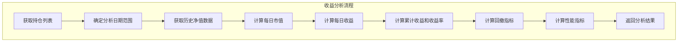

**图表来源**
- [DashboardService.java:178-287](file://src/main/java/com/qoder/fund/service/DashboardService.java#L178-L287)

### 收益分析数据结构

收益分析系统提供了丰富的数据分析指标和可视化展示。

#### 收益分析DTO结构

| 字段名 | 类型 | 描述 | 示例值 |
|--------|------|------|--------|
| dates | List<String> | 日期列表 | ["2024-01-01", "2024-01-02"] |
| dailyProfits | List<BigDecimal> | 每日收益金额 | [100.50, -50.25] |
| cumulativeProfits | List<BigDecimal> | 累计收益金额 | [100.50, 50.25] |
| cumulativeReturns | List<BigDecimal> | 累计收益率(%) | [1.50, 0.75] |
| marketValues | List<BigDecimal> | 每日市值 | [100000.00, 99500.00] |
| drawdown | DrawdownData | 回撤数据 | 见下表 |
| metrics | PerformanceMetrics | 统计指标 | 见下表 |

#### 回撤数据分析

| 字段名 | 类型 | 描述 | 示例值 |
|--------|------|------|--------|
| maxDrawdown | BigDecimal | 最大回撤率(%) | 15.50 |
| maxDrawdownAmount | BigDecimal | 最大回撤金额 | 15500.00 |
| startDate | String | 最大回撤开始日期 | "2024-01-15" |
| endDate | String | 最大回撤结束日期 | "2024-02-01" |
| duration | Integer | 回撤持续天数 | 18 |
| drawdownCurve | List<BigDecimal> | 回撤曲线(%) | [-2.50, -5.20, ...] |

#### 性能指标分析

| 指标名称 | 字段名 | 计算公式 | 描述 |
|----------|--------|----------|------|
| 总收益率 | totalReturn | (最终价值-初始价值)/初始价值*100 | 投资期间总回报率 |
| 年化收益率 | annualizedReturn | [(最终价值/初始价值)^(365/天数)-1]*100 | 年化投资回报率 |
| 夏普比率 | sharpeRatio | (年化收益率-3%)/年化波动率 | 风险调整后收益指标 |
| 收益波动率 | volatility | 日收益标准差*sqrt(252) | 投资风险衡量指标 |
| 胜率 | winRate | 盈利天数/总交易日*100 | 盈利概率 |
| 盈利天数 | profitDays | 盈利天数 | 盈利交易天数 |
| 亏损天数 | lossDays | 亏损天数 | 亏损交易天数 |

### 前端收益分析页面

收益分析页面提供了直观的图表展示和统计指标。

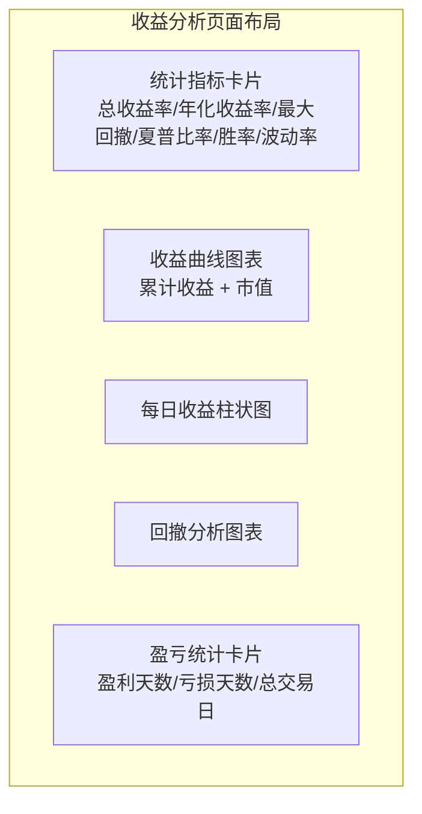

**图表来源**
- [index.tsx:10-320](file://fund-web/src/pages/Analysis/index.tsx#L10-L320)

### 收益分析API接口

系统提供了专门的收益分析API接口，支持灵活的时间范围查询。

| 端点 | 方法 | 功能描述 | 请求参数 | 响应内容 |
|------|------|----------|----------|----------|
| `/api/dashboard/profit-analysis` | GET | 获取收益分析数据 | `days`(可选，默认30) | 收益分析DTO |
| 参数说明 |  |  | `days`: 分析天数范围(7/30/60/90) | |

**章节来源**
- [DashboardService.java:178-471](file://src/main/java/com/qoder/fund/service/DashboardService.java#L178-L471)
- [ProfitAnalysisDTO.java:1-69](file://src/main/java/com/qoder/fund/dto/ProfitAnalysisDTO.java#L1-L69)
- [ProfitTrendDTO.java:1-12](file://src/main/java/com/qoder/fund/dto/ProfitTrendDTO.java#L1-L12)

## 数据源准确度分析

### 估值分析功能概述

系统新增了数据源准确度分析功能，提供多数据源估值对比和统计分析。

```mermaid
flowchart TD
subgraph "估值分析流程"
GetFund[获取基金信息] --> GetMultiSource[获取多源估值]
GetMultiSource --> BuildCurrent[构建实时估值]
BuildCurrent --> BuildAccuracy[构建准确度统计]
BuildAccuracy --> BuildCompensation[构建补偿记录]
BuildCompensation --> ReturnAnalysis[返回分析结果]
end
```

**图表来源**
- [EstimateAnalysisService.java:45-65](file://src/main/java/com/qoder/fund/service/EstimateAnalysisService.java#L45-L65)

### 估值分析数据结构

估值分析系统提供了全面的数据源评估和对比功能。

#### 估值分析DTO结构

| 字段名 | 类型 | 描述 | 示例值 |
|--------|------|------|--------|
| fundCode | String | 基金代码 | "164906" |
| fundName | String | 基金名称 | "易方达消费行业股票"
| currentEstimates | CurrentEstimate | 实时估值数据 | 见下表 |
| accuracyStats | AccuracyStats | 准确度统计 | 见下表 |
| compensationLogs | List<CompensationLog> | 数据补偿记录 | 见下表 |

#### 实时估值数据

| 字段名 | 类型 | 描述 | 示例值 |
|--------|------|------|--------|
| actualNav | BigDecimal | 今日实际净值 | 1.2345 |
| actualReturn | BigDecimal | 今日实际涨幅 | 1.25 |
| actualNavDate | LocalDate | 实际净值日期 | "2024-01-15" |
| actualReturnDelayed | Boolean | 是否为延迟数据 | false |
| sources | List<SourceEstimate> | 各数据源估值 | 多数据源列表 |
| smartEstimate | SmartEstimate | 智能综合预估 | 智能估值结果 |

#### 数据源准确度统计

| 字段名 | 类型 | 描述 | 示例值 |
|--------|------|------|--------|
| period | String | 统计周期 | "30d" |
| sources | List<SourceAccuracy> | 各数据源统计 | 数据源统计列表 |

#### 数据补偿记录

| 字段名 | 类型 | 描述 | 示例值 |
|--------|------|------|--------|
| date | LocalDate | 补偿日期 | "2024-01-15" |
| beforeNav | BigDecimal | 补偿前净值 | 1.2300 |
| afterNav | BigDecimal | 补偿后净值 | 1.2345 |
| source | String | 数据来源 | "eastmoney" |
| type | CompensationType | 补偿类型 | "PREDICT" |
| compensatedAt | LocalDateTime | 补偿时间点 | "2024-01-15 20:00:00" |
| reason | String | 补偿说明 | "天天基金预估 vs 实际 (+0.25%)" |

### 前端估值分析页面

估值分析页面提供了详细的数据源对比和统计展示。

```mermaid
graph TB
subgraph "估值分析页面布局"
CurrentEstimate[实时估值面板<br/>实际净值 + 各数据源估值 + 智能综合预估]
AccuracyStats[准确度统计表格<br/>MAE + 命中率 + 趋势 + 星级评级]
CompensationLogs[补偿记录列表<br/>预估 vs 实际对比]
EstimateChart[数据源对比图表<br/>多数据源估值趋势]
end
```

**图表来源**
- [EstimateAnalysisTab.tsx:37-200](file://fund-web/src/pages/Fund/EstimateAnalysisTab.tsx#L37-L200)

### 估值分析API接口

系统提供了专门的估值分析API接口，支持详细的估值数据查询。

| 端点 | 方法 | 功能描述 | 请求参数 | 响应内容 |
|------|------|----------|----------|----------|
| `/api/fund/{code}/estimate-analysis` | GET | 获取估值分析数据 | 路径参数: fundCode | 估值分析DTO |

### 数据准确性评估机制

系统实现了完善的数据准确性评估机制，包括：

1. **平均绝对误差(MAE)**: 计算预测值与实际值的平均绝对差异
2. **命中率**: 统计误差小于0.5%的预测比例
3. **趋势分析**: 对比近期和历史数据源表现
4. **星级评级**: 基于MAE计算的数据源质量评级(1-5星)
5. **可信度评分**: 基于历史表现的动态可信度评估

**章节来源**
- [EstimateAnalysisService.java:1-404](file://src/main/java/com/qoder/fund/service/EstimateAnalysisService.java#L1-L404)
- [EstimateAnalysisDTO.java:1-151](file://src/main/java/com/qoder/fund/dto/EstimateAnalysisDTO.java#L1-L151)
- [EstimateAnalysisTab.tsx:1-200](file://fund-web/src/pages/Fund/EstimateAnalysisTab.tsx#L1-L200)
- [estimateAnalysis.ts:1-72](file://fund-web/src/api/estimateAnalysis.ts#L1-L72)
- [FundDetail.tsx:1-200](file://fund-web/src/pages/Fund/FundDetail.tsx#L1-L200)

## CLI 命令行工具

### CLI 应用程序架构

系统新增了完整的命令行工具模块，基于 Picocli 框架构建，支持多种输出格式和交互模式。

```mermaid
classDiagram
class FundCliApplication {
+main(args[]) void
+run(args[]) void
+getExitCode() int
}
class MainCommand {
+run() void
}
class FundCommand {
+call() Integer
}
class DashboardCommand {
+call() Integer
}
class PositionCommand {
+call() Integer
}
class WatchlistCommand {
+call() Integer
}
class AccountCommand {
+call() Integer
}
class SyncCommand {
+call() Integer
}
class CliTableFormatter {
+format(Object) String
+formatDashboard(DashboardDTO) String
+formatProfitTrend(ProfitTrendDTO) String
}
FundCliApplication --> MainCommand : "注册主命令"
MainCommand --> FundCommand : "注册子命令"
MainCommand --> DashboardCommand : "注册子命令"
MainCommand --> PositionCommand : "注册子命令"
MainCommand --> WatchlistCommand : "注册子命令"
MainCommand --> AccountCommand : "注册子命令"
MainCommand --> SyncCommand : "注册子命令"
FundCommand --> CliTableFormatter : "使用格式化器"
DashboardCommand --> CliTableFormatter : "使用格式化器"
PositionCommand --> CliTableFormatter : "使用格式化器"
WatchlistCommand --> CliTableFormatter : "使用格式化器"
AccountCommand --> CliTableFormatter : "使用格式化器"
```

**图表来源**
- [FundCliApplication.java:105-183](file://src/main/java/com/qoder/fund/cli/FundCliApplication.java#L105-L183)
- [FundCommand.java:30-49](file://src/main/java/com/qoder/fund/cli/FundCommand.java#L30-L49)
- [DashboardCommand.java:32-53](file://src/main/java/com/qoder/fund/cli/DashboardCommand.java#L32-L53)
- [PositionCommand.java:35-51](file://src/main/java/com/qoder/fund/cli/PositionCommand.java#L35-L51)
- [WatchlistCommand.java:26-42](file://src/main/java/com/qoder/fund/cli/WatchlistCommand.java#L26-L42)
- [AccountCommand.java:27-43](file://src/main/java/com/qoder/fund/cli/AccountCommand.java#L27-L43)
- [SyncCommand.java:35-45](file://src/main/java/com/qoder/fund/cli/SyncCommand.java#L35-L45)
- [CliTableFormatter.java:18-48](file://src/main/java/com/qoder/fund/cli/util/CliTableFormatter.java#L18-L48)

### CLI 命令体系

系统提供了完整的命令行工具，支持基金查询、资产管理、数据同步等功能。

#### 主要命令分类

| 命令类别 | 子命令 | 功能描述 | 使用示例 |
|----------|--------|----------|----------|
| fund | search | 搜索基金 | `fund-cli fund search 白酒` |
| fund | detail | 查看基金详情 | `fund-cli fund detail 161725` |
| fund | nav | 查看净值历史 | `fund-cli fund nav 161725` |
| fund | estimate | 查看实时估值 | `fund-cli fund estimate 161725` |
| fund | refresh | 刷新数据 | `fund-cli fund refresh 161725` |
| fund | analysis | 数据源分析 | `fund-cli fund analysis 161725` |
| position | list | 列出持仓 | `fund-cli position list` |
| position | add | 添加持仓 | `fund-cli position add -c 161725 -a 10000` |
| position | buy/sell | 买卖操作 | `fund-cli position buy 1 -s 1000 -a 10000 -p 1.2` |
| position | transactions | 查看交易记录 | `fund-cli position transactions 1` |
| dashboard | overview | 资产概览 | `fund-cli dashboard` |
| dashboard | trend | 收益趋势 | `fund-cli dashboard trend -d 30` |
| dashboard | broadcast | 收益播报 | `fund-cli dashboard broadcast --json` |
| watchlist | list/add/remove | 自选管理 | `fund-cli watchlist add 161725` |
| account | list/create/delete | 账户管理 | `fund-cli account create -n 支付宝` |
| sync | nav/estimate/holdings | 数据同步 | `fund-cli sync all` |

#### CLI 输出格式

系统支持多种输出格式，满足不同使用场景：

1. **彩色终端输出**：默认格式，支持颜色高亮和表格美化
2. **JSON 格式输出**：适合程序解析和自动化脚本
3. **简洁模式**：仅输出关键数据，适合语音播报和定时任务

**章节来源**
- [FundCliApplication.java:105-183](file://src/main/java/com/qoder/fund/cli/FundCliApplication.java#L105-L183)
- [FundCommand.java:54-248](file://src/main/java/com/qoder/fund/cli/FundCommand.java#L54-L248)
- [DashboardCommand.java:58-243](file://src/main/java/com/qoder/fund/cli/DashboardCommand.java#L58-L243)
- [PositionCommand.java:56-317](file://src/main/java/com/qoder/fund/cli/PositionCommand.java#L56-L317)
- [WatchlistCommand.java:47-161](file://src/main/java/com/qoder/fund/cli/WatchlistCommand.java#L47-L161)
- [AccountCommand.java:48-157](file://src/main/java/com/qoder/fund/cli/AccountCommand.java#L48-157)
- [SyncCommand.java:47-257](file://src/main/java/com/qoder/fund/cli/SyncCommand.java#L47-L257)
- [CliTableFormatter.java:39-489](file://src/main/java/com/qoder/fund/cli/util/CliTableFormatter.java#L39-L489)

## 日志系统实现

### 前端日志工具

系统新增了完整的前端日志工具，提供灵活的日志级别控制和格式化功能。

```mermaid
classDiagram
class Logger {
+context string
+config LoggerConfig
+constructor(context, config)
+shouldLog(level) boolean
+formatMessage(level, message, args) unknown[]
+debug(message, args) void
+info(message, args) void
+warn(message, args) void
+error(message, error, args) void
+apiRequest(method, url, params) void
+apiResponse(method, url, status, duration, data) void
+apiError(method, url, error) void
+child(subContext) Logger
}
class LoggerConfig {
+enabled boolean
+minLevel LogLevel
+console boolean
}
class LogLevel {
<<enumeration>>
DEBUG
INFO
WARN
ERROR
}
class ApiLogger {
<<extends Logger>>
}
class StoreLogger {
<<extends Logger>>
}
class AppLogger {
<<extends Logger>>
}
Logger --> LoggerConfig : "使用配置"
ApiLogger --|> Logger : "继承"
StoreLogger --|> Logger : "继承"
AppLogger --|> Logger : "继承"
```

**图表来源**
- [logger.ts:33-125](file://fund-web/src/utils/logger.ts#L33-L125)

### 日志配置策略

系统实现了多环境的日志配置策略，支持开发和生产环境的不同需求。

#### 日志级别控制

| 日志级别 | 数字权重 | 开发环境 | 生产环境 | 用途 |
|----------|----------|----------|----------|------|
| DEBUG | 0 | ✅ 启用 | ❌ 关闭 | 详细调试信息 |
| INFO | 1 | ✅ 启用 | ✅ 启用 | 一般运行信息 |
| WARN | 2 | ✅ 启用 | ✅ 启用 | 警告信息 |
| ERROR | 3 | ✅ 启用 | ✅ 启用 | 错误信息 |

#### 前端日志配置

```typescript
// 默认配置
const defaultConfig: LoggerConfig = {
  enabled: import.meta.env.DEV, // 开发环境启用
  minLevel: import.meta.env.PROD ? 'warn' : 'debug', // 生产环境只记录警告和错误
  console: true,
};

// 预创建的日志器
export const appLogger = createLogger('App');
export const apiLogger = createLogger('API');
export const storeLogger = createLogger('Store');
```

**章节来源**
- [logger.ts:1-125](file://fund-web/src/utils/logger.ts#L1-L125)

### 后端日志系统

系统使用 Logback 作为后端日志框架，实现了异步日志输出和多文件滚动策略。

#### 异步日志配置

```mermaid
graph TB
subgraph "异步日志配置"
CONSOLE[控制台输出]
ASYNC_INFO[异步INFO日志]
ASYNC_WARN[异步WARN日志]
ASYNC_ERROR[异步ERROR日志]
ASYNC_ALL[异步ALL日志]
end
subgraph "文件输出"
INFO_FILE[INFO文件输出]
WARN_FILE[WARN文件输出]
ERROR_FILE[ERROR文件输出]
ALL_FILE[ALL文件输出]
end
subgraph "滚动策略"
ROLLING_POLICY[大小和时间滚动]
FILTER[级别过滤器]
END
CONSOLE --> ASYNC_INFO
CONSOLE --> ASYNC_WARN
CONSOLE --> ASYNC_ERROR
CONSOLE --> ASYNC_ALL
ASYNC_INFO --> INFO_FILE
ASYNC_WARN --> WARN_FILE
ASYNC_ERROR --> ERROR_FILE
ASYNC_ALL --> ALL_FILE
INFO_FILE --> ROLLING_POLICY
WARN_FILE --> ROLLING_POLICY
ERROR_FILE --> ROLLING_POLICY
ALL_FILE --> ROLLING_POLICY
INFO_FILE --> FILTER
WARN_FILE --> FILTER
ERROR_FILE --> FILTER
```

**图表来源**
- [logback-spring.xml:90-113](file://src/main/resources/logback-spring.xml#L90-L113)

#### 多环境日志配置

| 环境 | 控制台输出 | 文件输出 | 日志级别 | 特殊配置 |
|------|------------|----------|----------|----------|
| dev/default | ✅ 启用 | 异步INFO/WARN/ERROR | INFO/DEBUG | 开发环境详细日志 |
| prod | ❌ 禁用 | 异步INFO/WARN/ERROR/ALL | INFO | 生产环境精简日志 |

**章节来源**
- [logback-spring.xml:1-158](file://src/main/resources/logback-spring.xml#L1-L158)

## 开发基础设施更新

### Picocli 命令行框架集成

系统集成了 Picocli 作为命令行工具框架，提供了强大的命令解析和参数处理能力。

#### 依赖配置

```xml
<!-- CLI -->
<dependency>
  <groupId>info.picocli</groupId>
  <artifactId>picocli</artifactId>
  <version>4.7.5</version>
</dependency>
<dependency>
  <groupId>info.picocli</groupId>
  <artifactId>picocli-spring-boot-starter</artifactId>
  <version>4.7.5</version>
</dependency>
```

#### CLI 应用程序启动

系统支持两种运行模式：

1. **Web 模式**：`./mvnw spring-boot:run` 或 `--web` 参数
2. **CLI 模式**：直接运行 CLI 应用程序

```mermaid
flowchart TD
Start([启动应用程序]) --> CheckArgs{检查参数}
CheckArgs --> |--web| WebMode[Web模式启动]
CheckArgs --> |无参数| CLIMode[CLI模式启动]
WebMode --> ServletApp[启动Servlet应用]
CLIMode --> NoWebApp[启动无Web应用]
ServletApp --> RunWeb[运行Web服务]
NoWebApp --> RunCLI[运行CLI命令]
RunCLI --> Exit[退出进程]
```

**图表来源**
- [FundCliApplication.java:51-75](file://src/main/java/com/qoder/fund/cli/FundCliApplication.java#L51-L75)

### 多环境配置管理

系统实现了完整的多环境配置管理，支持开发、测试和生产环境的差异化配置。

#### 环境特定配置

```mermaid
graph TB
subgraph "多环境配置"
DEV[开发环境配置]
TEST[测试环境配置]
PROD[生产环境配置]
end
subgraph "配置内容"
LOG_LEVEL[日志级别]
DB_CONFIG[数据库配置]
CACHE_CONFIG[缓存配置]
PROFILE[Spring Profile]
end
DEV --> LOG_LEVEL
DEV --> DB_CONFIG
DEV --> CACHE_CONFIG
DEV --> PROFILE
TEST --> LOG_LEVEL
TEST --> DB_CONFIG
TEST --> CACHE_CONFIG
TEST --> PROFILE
PROD --> LOG_LEVEL
PROD --> DB_CONFIG
PROD --> CACHE_CONFIG
PROD --> PROFILE
```

#### 配置文件组织

系统使用 Spring Profile 机制管理不同环境的配置：

1. **开发环境** (`dev/default`): 详细日志输出，调试信息丰富
2. **生产环境** (`prod`): 精简日志输出，性能优化配置

**章节来源**
- [pom.xml:93-111](file://pom.xml#L93-L111)
- [FundCliApplication.java:51-75](file://src/main/java/com/qoder/fund/cli/FundCliApplication.java#L51-L75)
- [logback-spring.xml:135-157](file://src/main/resources/logback-spring.xml#L135-L157)

### 构建和打包配置

系统配置了多目标构建，支持同时生成 Web 应用和 CLI 应用。

#### Maven 构建配置

```mermaid
graph TB
subgraph "Maven构建配置"
MAIN_APP[主应用打包]
CLI_APP[CLI应用打包]
CHECKSTYLE[代码风格检查]
TEST[单元测试]
end
subgraph "构建目标"
REPACKAGE[spring-boot:repackage]
CLI_REPACKAGE[CLI应用打包]
CHECKSTYLE_GOAL[maven-checkstyle-plugin]
TEST_GOAL[test]
end
MAIN_APP --> REPACKAGE
CLI_APP --> CLI_REPACKAGE
CHECKSTYLE --> CHECKSTYLE_GOAL
TEST --> TEST_GOAL
```

**图表来源**
- [pom.xml:113-166](file://pom.xml#L113-L166)

**章节来源**
- [pom.xml:113-166](file://pom.xml#L113-L166)

## 前端开发工具链现代化

### ESLint 9+ Flat配置系统

**更新** 系统已从传统的ESLint配置系统迁移到ESLint 9+的flat配置格式，提供了更好的性能、插件集成和开发者体验。

#### Flat配置架构

ESLint 9+引入了flat配置系统，使用JavaScript/TypeScript文件替代传统的JSON配置文件，提供了更强大的配置能力和更好的性能。

```mermaid
graph TB
subgraph "ESLint 9+ Flat配置系统"
ESLINT_CONFIG[eslint.config.js<br/>Flat配置文件]
TYPESCRIPT_ESLINT[typescript-eslint<br/>TypeScript规则集]
REACT_HOOKS[eslint-plugin-react-hooks<br/>React Hooks规则]
REACT_REFRESH[eslint-plugin-react-refresh<br/>React刷新规则]
GLOBALS[globals<br/>全局变量定义]
end
subgraph "配置特性"
EXTENDS[extends<br/>继承推荐规则]
PLUGINS[plugins<br/>插件配置]
RULES[rules<br/>自定义规则]
FILES[files<br/>文件匹配]
LANGUAGE_OPTIONS[languageOptions<br/>语言选项]
END
ESLINT_CONFIG --> TYPESCRIPT_ESLINT
ESLINT_CONFIG --> REACT_HOOKS
ESLINT_CONFIG --> REACT_REFRESH
ESLINT_CONFIG --> GLOBALS
ESLINT_CONFIG --> EXTENDS
ESLINT_CONFIG --> PLUGINS
ESLINT_CONFIG --> RULES
ESLINT_CONFIG --> FILES
ESLINT_CONFIG --> LANGUAGE_OPTIONS
```

**图表来源**
- [eslint.config.js:1-42](file://fund-web/eslint.config.js#L1-L42)

#### 配置文件结构

ESLint 9+的flat配置文件提供了更清晰的配置结构和更强的类型安全：

```javascript
// eslint.config.js
import js from '@eslint/js';
import tseslint from 'typescript-eslint';
import reactHooks from 'eslint-plugin-react-hooks';
import reactRefresh from 'eslint-plugin-react-refresh';
import globals from 'globals';

export default tseslint.config(
  { ignores: ['dist'] }, // 忽略文件
  {
    extends: [js.configs.recommended, ...tseslint.configs.recommended], // 继承规则
    files: ['**/*.{ts,tsx}'], // 文件匹配
    languageOptions: {
      ecmaVersion: 2020,
      globals: globals.browser,
    },
    plugins: {
      'react-hooks': reactHooks,
      'react-refresh': reactRefresh,
    },
    rules: {
      // React Hooks推荐规则
      ...reactHooks.configs.recommended.rules,
      // React刷新规则
      'react-refresh/only-export-components': [
        'warn',
        { allowConstantExport: true },
      ],
      // TypeScript规则
      '@typescript-eslint/no-explicit-any': 'error',
      '@typescript-eslint/no-unused-vars': ['error', { argsIgnorePattern: '^_' }],
      // 代码风格规则
      'indent': ['error', 2],
      'quotes': ['error', 'single'],
      'semi': ['error', 'always'],
      'max-len': ['warn', { code: 120 }],
      // 最佳实践规则
      'no-console': ['warn', { allow: ['error', 'warn'] }],
      'no-debugger': 'error',
      'prefer-const': 'error',
      'no-var': 'error',
    },
  }
);
```

**章节来源**
- [eslint.config.js:1-42](file://fund-web/eslint.config.js#L1-L42)

### TypeScript严格类型检查

系统集成了TypeScript严格类型检查，提供了更好的类型安全和开发体验。

#### TypeScript配置优化

```mermaid
graph TB
subgraph "TypeScript配置优化"
STRICT[strict: true<br/>严格模式]
NO_UNUSED_LOCALS[noUnusedLocals: true<br/>未使用局部变量检查]
NO_UNUSED_PARAMETERS[noUnusedParameters: true<br/>未使用参数检查]
NO_FALLTHROUGH_SWITCH[noFallthroughCasesInSwitch: true<br/>switch无fallthrough检查]
NO_UNCHECKED_SIDE_EFFECT_IMPORTS[noUncheckedSideEffectImports: true<br/>未检查副作用导入]
ERASABLE_SYNTAX_ONLY[erasableSyntaxOnly: true<br/>仅可擦除语法]
END
subgraph "编译器选项"
TARGET[target: ES2023<br/>目标版本]
MODULE_RESOLUTION[moduleResolution: bundler<br/>模块解析]
VERBATIM_MODULE_SYNTAX[verbatimModuleSyntax: true<br/>精确模块语法]
MODULE_DETECTION[moduleDetection: force<br/>强制模块检测]
JSX[jsx: react-jsx<br/>JSX转换]
END
ESLINT_CONFIG --> STRICT
ESLINT_CONFIG --> NO_UNUSED_LOCALS
ESLINT_CONFIG --> NO_UNUSED_PARAMETERS
ESLINT_CONFIG --> NO_FALLTHROUGH_SWITCH
ESLINT_CONFIG --> NO_UNCHECKED_SIDE_EFFECT_IMPORTS
ESLINT_CONFIG --> ERASABLE_SYNTAX_ONLY
STRICT --> TARGET
NO_UNUSED_LOCALS --> MODULE_RESOLUTION
NO_UNUSED_PARAMETERS --> VERBATIM_MODULE_SYNTAX
NO_FALLTHROUGH_SWITCH --> MODULE_DETECTION
NO_UNCHECKED_SIDE_EFFECT_IMPORTS --> JSX
```

**图表来源**
- [tsconfig.app.json:1-29](file://fund-web/tsconfig.app.json#L1-L29)

#### 编译配置优化

系统使用了现代化的TypeScript编译配置，支持最新的ES标准和模块解析：

**章节来源**
- [tsconfig.json:1-8](file://fund-web/tsconfig.json#L1-L8)
- [tsconfig.app.json:1-29](file://fund-web/tsconfig.app.json#L1-L29)

### Vite构建工具集成

系统继续使用Vite作为构建工具，配合ESLint 9+配置提供了现代化的开发体验。

#### Vite配置特性

```mermaid
graph TB
subgraph "Vite配置特性"
REACT_PLUGIN[@vitejs/plugin-react<br/>React插件]
SERVER[server.port: 5173<br/>开发服务器端口]
PROXY[proxy: /api -> http://localhost:8080<br/>API代理]
END
subgraph "开发特性"
HMR[HMR热模块替换]
FAST_BUILD[快速构建]
DEVELOPMENT_SERVER[开发服务器]
END
REACT_PLUGIN --> SERVER
SERVER --> PROXY
PROXY --> DEVELOPMENT_SERVER
DEVELOPMENT_SERVER --> HMR
DEVELOPMENT_SERVER --> FAST_BUILD
```

**图表来源**
- [vite.config.ts:1-16](file://fund-web/vite.config.ts#L1-L16)

**章节来源**
- [vite.config.ts:1-16](file://fund-web/vite.config.ts#L1-L16)

### 包管理器和脚本优化

系统使用npm作为包管理器，配合ESLint 9+配置提供了更好的开发工具链。

#### 依赖管理优化

**章节来源**
- [package.json:1-40](file://fund-web/package.json#L1-L40)

## HTTP客户端配置组件

**新增功能** 系统新增了共享HTTP客户端配置组件，这是重要的架构改进，用于资源优化和连接池管理。

### 架构改进概述

系统通过引入共享HTTP客户端配置组件，实现了以下关键改进：

1. **连接池管理**：统一的OkHttp连接池配置，支持连接复用
2. **资源优化**：减少TCP连接建立开销，提高网络请求效率
3. **性能提升**：通过连接复用降低网络延迟和CPU消耗
4. **配置统一**：集中管理HTTP客户端配置，确保一致的网络行为

### HTTP客户端配置详解

#### 连接池配置参数

系统使用OkHttp 4.12.0版本，配置了优化的连接池参数：

- **最大连接数**：10个连接
- **空闲超时**：5分钟
- **连接超时**：10秒
- **读取超时**：15秒

#### 连接池管理机制

```mermaid
sequenceDiagram
participant App as "应用程序"
participant Config as "HttpClientConfig"
participant Pool as "连接池"
participant Server as "外部服务器"
App->>Config : 请求OkHttpClient实例
Config->>Pool : 从连接池获取连接
Pool->>Server : 发送HTTP请求
Server-->>Pool : 返回响应
Pool->>App : 返回响应
Note over Pool,Server : 连接复用，无需重新建立TCP连接
```

**图表来源**
- [HttpClientConfig.java:21-28](file://src/main/java/com/qoder/fund/config/HttpClientConfig.java#L21-L28)

#### 数据源集成优化

所有数据源类现在共享同一个OkHttpClient实例：

```mermaid
graph TB
subgraph "HTTP客户端共享"
HttpClientConfig[HttpClientConfig<br/>共享OkHttpClient实例]
end
subgraph "数据源类"
EastMoneyDataSource[EastMoneyDataSource<br/>注入共享客户端]
SinaDataSource[SinaDataSource<br/>注入共享客户端]
TencentDataSource[TencentDataSource<br/>注入共享客户端]
StockEstimateDataSource[StockEstimateDataSource<br/>独立客户端]
end
HttpClientConfig --> EastMoneyDataSource
HttpClientConfig --> SinaDataSource
HttpClientConfig --> TencentDataSource
StockEstimateDataSource -.-> HttpClientConfig
```

**图表来源**
- [EastMoneyDataSource.java:29](file://src/main/java/com/qoder/fund/datasource/EastMoneyDataSource.java#L29)
- [SinaDataSource.java:25](file://src/main/java/com/qoder/fund/datasource/SinaDataSource.java#L25)
- [TencentDataSource.java:25](file://src/main/java/com/qoder/fund/datasource/TencentDataSource.java#L25)
- [StockEstimateDataSource.java:32](file://src/main/java/com/qoder/fund/datasource/StockEstimateDataSource.java#L32)

### 性能优化效果

#### 连接复用优势

1. **减少TCP握手**：连接复用避免重复的TCP三次握手
2. **降低CPU开销**：减少SSL/TLS握手和加密计算
3. **提高响应速度**：复用现有连接，减少网络延迟
4. **资源节约**：降低内存和文件描述符的使用

#### 监控和调优

系统可以通过以下方式监控HTTP客户端性能：

1. **连接池状态监控**：跟踪活跃连接数、空闲连接数
2. **请求成功率统计**：监控HTTP请求的成功率和错误率
3. **响应时间分析**：分析不同数据源的响应时间分布
4. **超时和重试机制**：监控超时事件和重试次数

**章节来源**
- [HttpClientConfig.java:14-29](file://src/main/java/com/qoder/fund/config/HttpClientConfig.java#L14-L29)
- [pom.xml:51-56](file://pom.xml#L51-L56)

## QDII基金处理系统

### QDII基金处理概述

系统新增了完整的QDII基金处理系统，专门解决QDII基金净值评估bug，提供延迟数据处理和预测回填机制。

**重要更新**：经过代码分析，确认系统已实现evaluateQdiiPredictionForNavDate方法来解决QDII基金预测记录未评估的问题。

```mermaid
flowchart TD
subgraph "QDII基金处理流程"
Start([净值发布]) --> CheckQDII{检查是否为QDII基金}
CheckQDII --> |是| EvaluatePred[评估QDII预测]
CheckQDII --> |否| NormalProcess[正常处理]
EvaluatePred --> QueryPending[查询前一天未评估预测]
QueryPending --> HasPending{是否有待评估记录}
HasPending --> |是| FillActual[填充实际净值]
HasPending --> |否| Skip[跳过处理]
FillActual --> CalcError[计算误差]
CalcError --> UpdateRecord[更新预测记录]
Skip --> End([处理完成])
UpdateRecord --> End
NormalProcess --> End
```

**图表来源**
- [FundDataSyncScheduler.java:405-458](file://src/main/java/com/qoder/fund/scheduler/FundDataSyncScheduler.java#L405-L458)

### QDII基金处理机制

#### 净值发布后的预测回填

系统实现了智能的QDII基金净值回填机制，确保预测记录的完整性：

1. **时间差处理**：QDII净值T+1发布，预测记录需要回填
2. **预测日期映射**：实际净值日期减一天对应预测日期
3. **批量回填**：自动处理所有未评估的预测记录
4. **误差计算**：计算预测涨跌幅与实际涨跌幅的差异

#### QDII基金识别机制

系统通过多种方式识别QDII基金：

```mermaid
graph TB
subgraph "QDII基金识别"
TypeField[基金类型字段] --> CheckType{检查是否为QDII}
NameCheck[基金名称检查] --> CheckName{检查是否包含QDII/海外关键词}
TypeField --> CheckType
CheckType --> |是| MarkQDII[标记为QDII]
CheckName --> |是| MarkQDII
CheckType --> |否| CheckHK[检查港股相关]
CheckHK --> |是| MarkQDII
CheckHK --> |否| MarkOther[标记为其他类型]
NameCheck --> |否| CheckHK
```

**图表来源**
- [EastMoneyDataSource.java:397-423](file://src/main/java/com/qoder/fund/datasource/EastMoneyDataSource.java#L397-L423)

### QDII基金估值快照策略

#### 分时处理策略

系统采用分时策略处理QDII基金估值：

1. **A股基金**：交易日14:50快照，使用收盘前最准确的估值
2. **QDII基金**：交易日23:00快照，确保美股开盘后估值更准确

#### 美国股市时区适配

系统考虑美国股市夏令时和冬令时差异：

- **夏令时**：美股21:30开盘，23:00执行快照确保开盘
- **冬令时**：美股22:30开盘，23:00执行快照确保开盘
- **港股**：16:00收盘，23:00执行快照确保收盘

**章节来源**
- [FundDataSyncScheduler.java:405-458](file://src/main/java/com/qoder/fund/scheduler/FundDataSyncScheduler.java#L405-L458)
- [FundDataSyncScheduler.java:474-535](file://src/main/java/com/qoder/fund/scheduler/FundDataSyncScheduler.java#L474-L535)
- [FundDataSyncScheduler.java:543-610](file://src/main/java/com/qoder/fund/scheduler/FundDataSyncScheduler.java#L543-L610)
- [EastMoneyDataSource.java:397-423](file://src/main/java/com/qoder/fund/datasource/EastMoneyDataSource.java#L397-L423)

### QDII基金延迟数据处理

#### 延迟数据标注

系统在数据源中明确标注延迟数据：

```mermaid
graph TB
subgraph "延迟数据处理"
GetActual[获取实际净值] --> CheckDelay{检查是否为延迟数据}
CheckDelay --> |是| MarkDelayed[标记为延迟数据]
CheckDelay --> |否| NormalData[正常数据]
MarkDelayed --> SetDate[设置延迟日期]
SetDate --> AddNote[添加延迟说明]
AddNote --> ReturnData[返回数据]
NormalData --> ReturnData
```

**图表来源**
- [FundDataAggregator.java:235-240](file://src/main/java/com/qoder/fund/datasource/FundDataAggregator.java#L235-L240)
- [FundDataAggregator.java:454-480](file://src/main/java/com/qoder/fund/datasource/FundDataAggregator.java#L454-L480)

#### 智能延迟数据展示

系统提供智能的延迟数据展示策略：

1. **自动降级**：当今日数据不可用时，自动使用最近交易日数据
2. **延迟标注**：明确标注数据的延迟性质和对应日期
3. **说明提示**：提供延迟原因和可靠性说明
4. **QDII专用**：针对QDII基金提供特殊的延迟处理逻辑

**章节来源**
- [FundDataAggregator.java:235-240](file://src/main/java/com/qoder/fund/datasource/FundDataAggregator.java#L235-L240)
- [FundDataAggregator.java:454-480](file://src/main/java/com/qoder/fund/datasource/FundDataAggregator.java#L454-L480)
- [FundDataAggregator.java:640-657](file://src/main/java/com/qoder/fund/datasource/FundDataAggregator.java#L640-L657)

### QDII基金准确度分析

#### 准确度统计增强

系统增强了对QDII基金的准确度分析能力：

1. **延迟数据处理**：在准确度统计中考虑延迟数据的影响
2. **QDII专用权重**：为QDII基金设置专门的权重计算策略
3. **海外市场考量**：考虑QDII基金海外市场的特殊性
4. **数据源可靠性**：评估QDII数据源的可靠性

#### 权重计算优化

系统为QDII基金提供了专门的权重计算：

```mermaid
graph TB
subgraph "QDII权重计算"
FundType[基金类型: QDII] --> Scenario[场景: QDII]
Scenario --> Weights[QDII专用权重]
Weights --> Adaptive[自适应权重计算]
Adaptive --> Multipliers[准确度修正乘数]
Multipliers --> FinalWeights[最终权重]
```

**图表来源**
- [EstimateWeightService.java:95-125](file://src/main/java/com/qoder/fund/service/EstimateWeightService.java#L95-L125)

**章节来源**
- [EstimateWeightService.java:95-125](file://src/main/java/com/qoder/fund/service/EstimateWeightService.java#L95-L125)

## 结论

通过本指南，您可以在现有Spring Boot项目基础上快速构建完整的基金管理系统。系统采用现代化的架构设计，包含以下关键特性：

1. **完整的数据模型**: 7个核心实体表设计，支持完整的基金投资管理需求
2. **RESTful API架构**: 提供全面的REST API接口，涵盖账户、仪表板、基金、持仓、自选等功能
3. **服务层设计**: 采用分层架构，业务逻辑清晰分离，便于维护和扩展
4. **数据源集成**: 集成外部数据源，提供实时的基金数据获取能力
5. **异常处理机制**: 实现统一的异常处理和响应包装，提升用户体验
6. **定时任务调度**: 支持自动数据同步和系统维护任务
7. **测试策略**: 完整的测试套件，确保代码质量和系统稳定性
8. **技能管理**: 清晰的技能配置管理，避免不必要的依赖
9. **性能优化**: 多级缓存策略、批量处理服务、熔断器机制
10. **质量保证**: CI/CD流水线、代码风格检查、预提交钩子
11. **监控可观测性**: Actuator端点、健康检查、性能指标
12. **工程实践**: 自动化工具链、架构约束检查、代码规范
13. **专业分析能力**: 新增收益分析系统和数据源准确度分析功能
14. **可视化展示**: 丰富的图表和统计指标，提供直观的投资分析体验
15. **CLI 命令行工具**: 新增完整的命令行工具，支持定时任务播报和语音播报
16. **完善日志系统**: 前后端一体化的日志管理方案，支持多环境配置
17. **更新开发基础设施**: 集成 Picocli 框架、多环境配置管理、多目标构建
18. **前端开发工具链现代化**: ESLint 9+ flat配置、TypeScript严格类型检查、Vite构建工具
19. **新增HTTP客户端配置组件**: 实现连接池管理和资源优化
20. **新增QDII基金处理系统**: 解决净值评估bug，完善延迟数据处理机制

**重要更新**：Chrome DevTools技能文档的删除不会影响核心开发功能。系统已完全基于Spring Boot和现代Web技术栈构建，开发者可以专注于核心功能的实现。

**核心增强功能总结**：
- 全面的质量保证流程确保代码质量
- 性能优化的多级缓存和批量处理机制
- 增强的监控和可观测性功能
- 完善的异常处理和错误管理机制
- 自动化的工程实践工具链
- **新增收益分析系统**：提供专业的投资组合表现分析
- **新增数据源准确度分析**：多数据源估值对比和统计评估
- **新增 CLI 命令行工具**：支持定时任务播报和语音播报
- **完善日志系统**：前后端一体化的日志管理方案
- **更新开发基础设施**：Picocli 命令行框架集成
- **前端开发工具链现代化**：ESLint 9+ flat配置、TypeScript严格类型检查、Vite构建工具
- **新增HTTP客户端配置组件**：实现连接池管理和资源优化
- **新增QDII基金处理系统**：解决净值评估bug，完善延迟数据处理机制

**ESLint 9+ Flat配置系统特别说明**：
- 从传统的`.eslintrc.cjs`迁移到ESLint 9+的flat配置格式
- 新增`eslint.config.js`文件，提供更好的性能和插件集成
- 集成TypeScript ESLint插件和React Hooks插件
- 实现现代化的TypeScript编译配置和严格类型检查
- 提供更好的开发者体验和代码质量保证

**HTTP客户端配置组件特别说明**：
- 新增的共享HTTP客户端配置组件是重要的架构改进
- 通过OkHttp连接池实现连接复用，显著提升网络请求性能
- 统一的超时配置和连接管理，确保一致的网络行为
- 减少TCP连接建立开销，降低系统资源消耗
- 为未来的性能优化和监控提供基础

**QDII基金处理系统特别说明**：
- 新增的evaluateQdiiPredictionForNavDate方法解决了预测记录未评估的关键bug
- 实现了完整的QDII基金延迟数据处理流程
- 通过分时策略优化QDII基金估值的准确性和及时性
- 增强了数据源准确度分析对QDII基金的支持
- 提供了专门的QDII基金权重计算和延迟数据标注机制

建议按照本文档的顺序逐步实施，先完成基础架构搭建，再逐步添加具体的功能模块。定期进行性能测试和安全审计，确保系统的稳定性和可靠性。系统具有良好的扩展性，可以轻松添加新的功能模块和业务场景。

**新增功能特别说明**：
- CLI 广播命令功能提供了专业的定时任务播报能力，支持 JSON 和简洁模式输出
- 前端日志工具提供了灵活的日志级别控制和格式化功能
- 后端 Logback 配置实现了异步日志输出和多文件滚动策略
- Picocli 框架集成提供了强大的命令行工具开发能力
- 多环境配置管理支持开发和生产环境的差异化需求
- ESLint 9+ flat配置系统提供了现代化的代码质量保证和开发体验
- HTTP客户端配置组件提供了专业的网络请求优化和资源管理
- QDII基金处理系统提供了专业的延迟数据处理和预测回填机制

这些新增功能大大增强了系统的专业性和实用性，为用户提供更全面的投资决策支持和更好的开发体验。