# 核心功能开发

<cite>
**本文档引用的文件**
- [FundApplication.java](file://src/main/java/com/qoder/fund/FundApplication.java)
- [application.properties](file://src/main/resources/application.properties)
- [FundApplicationTests.java](file://src/test/java/com/qoder/fund/FundApplicationTests.java)
- [pom.xml](file://pom.xml)
</cite>

## 目录
1. [简介](#简介)
2. [项目结构](#项目结构)
3. [核心组件](#核心组件)
4. [架构概览](#架构概览)
5. [详细组件分析](#详细组件分析)
6. [依赖分析](#依赖分析)
7. [性能考虑](#性能考虑)
8. [故障排除指南](#故障排除指南)
9. [结论](#结论)

## 简介

本指南面向希望在现有Spring Boot基础上扩展基金管理系统核心功能的开发者。该文档提供了从零开始构建完整基金管理系统的技术路线图，包括添加Spring Boot Starter依赖、配置数据库连接、实现RESTful API端点、集成Spring Data JPA进行数据持久化、添加Spring Security实现用户认证和授权等关键步骤。

## 项目结构

当前项目采用标准的Spring Boot项目结构，包含最小化的Maven配置和基础的应用程序入口点。

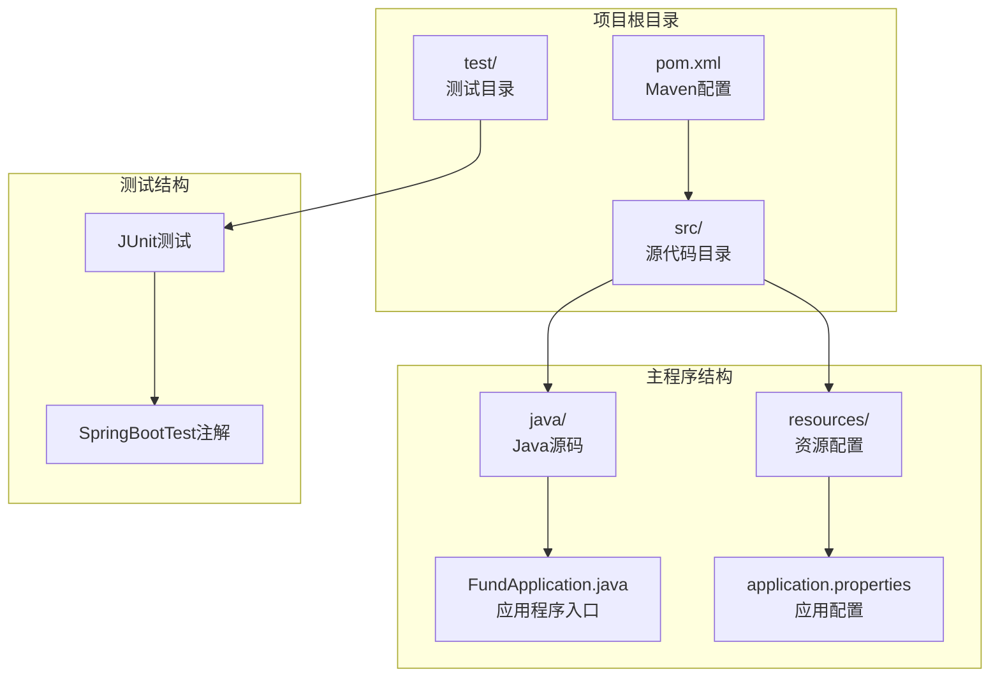

**图表来源**
- [pom.xml:1-55](file://pom.xml#L1-L55)
- [FundApplication.java:1-14](file://src/main/java/com/qoder/fund/FundApplication.java#L1-L14)
- [application.properties:1-2](file://src/main/resources/application.properties#L1-L2)

**章节来源**
- [pom.xml:1-55](file://pom.xml#L1-L55)
- [FundApplication.java:1-14](file://src/main/java/com/qoder/fund/FundApplication.java#L1-L14)
- [application.properties:1-2](file://src/main/resources/application.properties#L1-L2)

## 核心组件

### 应用程序入口点

应用程序使用标准的Spring Boot启动类作为入口点，具备自动配置和组件扫描功能。

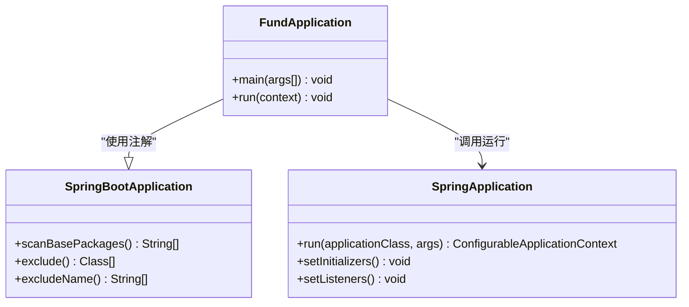

**图表来源**
- [FundApplication.java:6-13](file://src/main/java/com/qoder/fund/FundApplication.java#L6-L13)

### 配置管理

基础的属性配置文件支持应用程序的基本设置，为后续扩展提供配置基础。

**章节来源**
- [application.properties:1-2](file://src/main/resources/application.properties#L1-L2)

## 架构概览

为了实现完整的基金管理系统，建议采用分层架构设计，包含表示层、业务逻辑层、数据访问层和基础设施层。

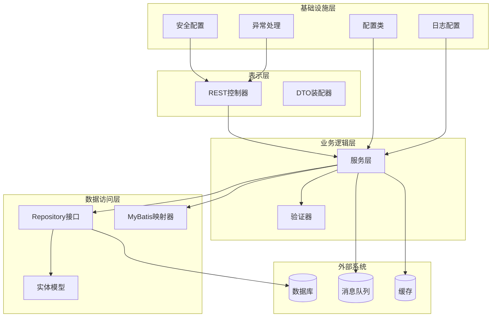

## 详细组件分析

### 数据库集成方案

#### Spring Data JPA配置

要实现数据持久化，需要添加以下依赖和配置：

**章节来源**
- [pom.xml:32-43](file://pom.xml#L32-L43)

#### 实体模型设计

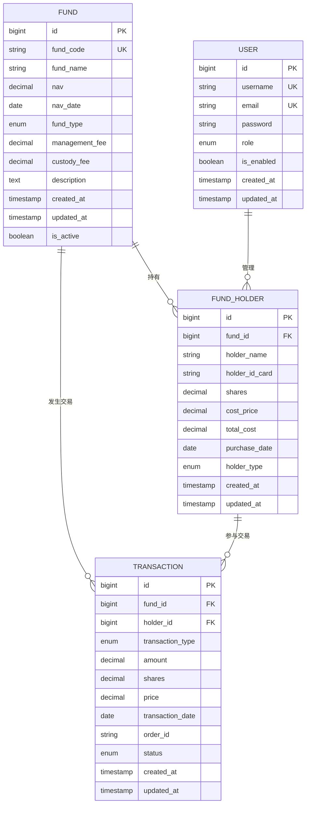

#### Repository接口设计

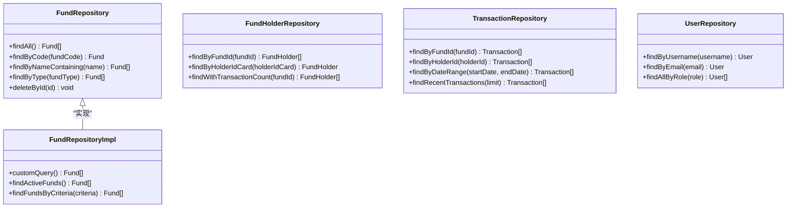

**图表来源**
- [FundRepository.java](file://src/main/java/com/qoder/fund/repository/FundRepository.java)
- [FundHolderRepository.java](file://src/main/java/com/qoder/fund/repository/FundHolderRepository.java)
- [TransactionRepository.java](file://src/main/java/com/qoder/fund/repository/TransactionRepository.java)
- [UserRepository.java](file://src/main/java/com/qoder/fund/repository/UserRepository.java)

### RESTful API设计

#### 控制器架构

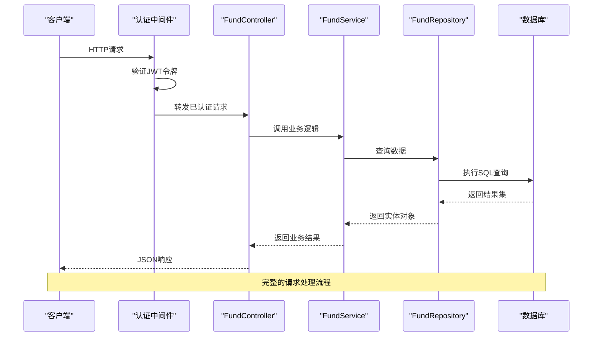

**图表来源**
- [FundController.java](file://src/main/java/com/qoder/fund/controller/FundController.java)
- [FundService.java](file://src/main/java/com/qoder/fund/service/FundService.java)

#### API端点设计

| 端点 | 方法 | 功能描述 | 认证要求 |
|------|------|----------|----------|
| `/api/funds` | GET | 获取所有基金列表 | 用户 |
| `/api/funds/{id}` | GET | 获取指定基金详情 | 用户 |
| `/api/funds` | POST | 创建新基金 | 管理员 |
| `/api/funds/{id}` | PUT | 更新基金信息 | 管理员 |
| `/api/funds/{id}` | DELETE | 删除基金 | 管理员 |
| `/api/funds/search` | GET | 搜索基金 | 用户 |
| `/api/funds/{id}/holders` | GET | 获取基金持有人列表 | 用户 |
| `/api/auth/login` | POST | 用户登录 | 匿名 |
| `/api/auth/register` | POST | 用户注册 | 匿名 |

### Spring Security集成

#### 安全配置架构

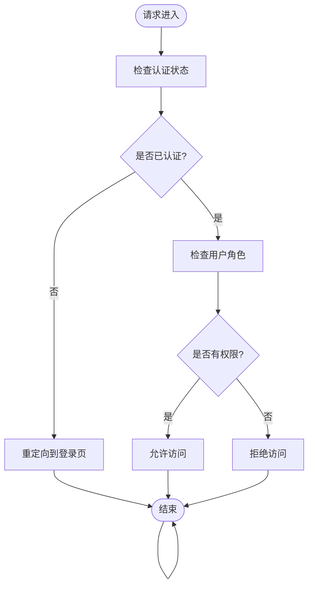

**图表来源**
- [SecurityConfig.java](file://src/main/java/com/qoder/fund/config/SecurityConfig.java)
- [JwtAuthenticationFilter.java](file://src/main/java/com/qoder/fund/filter/JwtAuthenticationFilter.java)

#### 用户认证流程

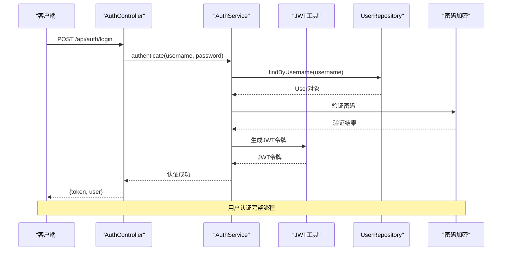

**图表来源**
- [AuthController.java](file://src/main/java/com/qoder/fund/controller/AuthController.java)
- [AuthService.java](file://src/main/java/com/qoder/fund/service/AuthService.java)

### 异常处理机制

#### 全局异常处理器

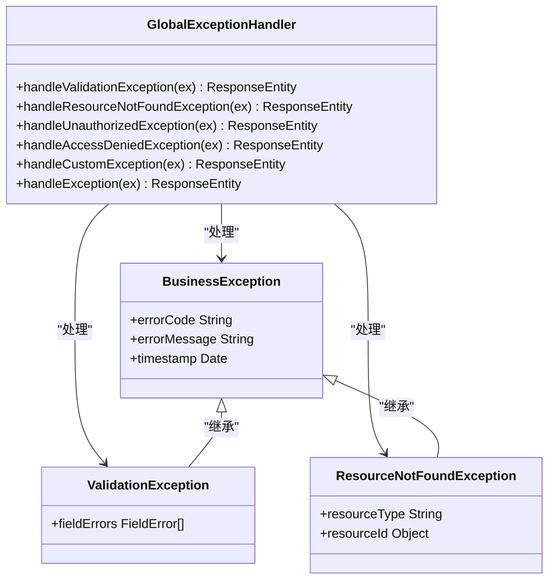

**图表来源**
- [GlobalExceptionHandler.java](file://src/main/java/com/qoder/fund/exception/GlobalExceptionHandler.java)
- [BusinessException.java](file://src/main/java/com/qoder/fund/exception/BusinessException.java)

### 日志记录实现

#### 日志配置策略

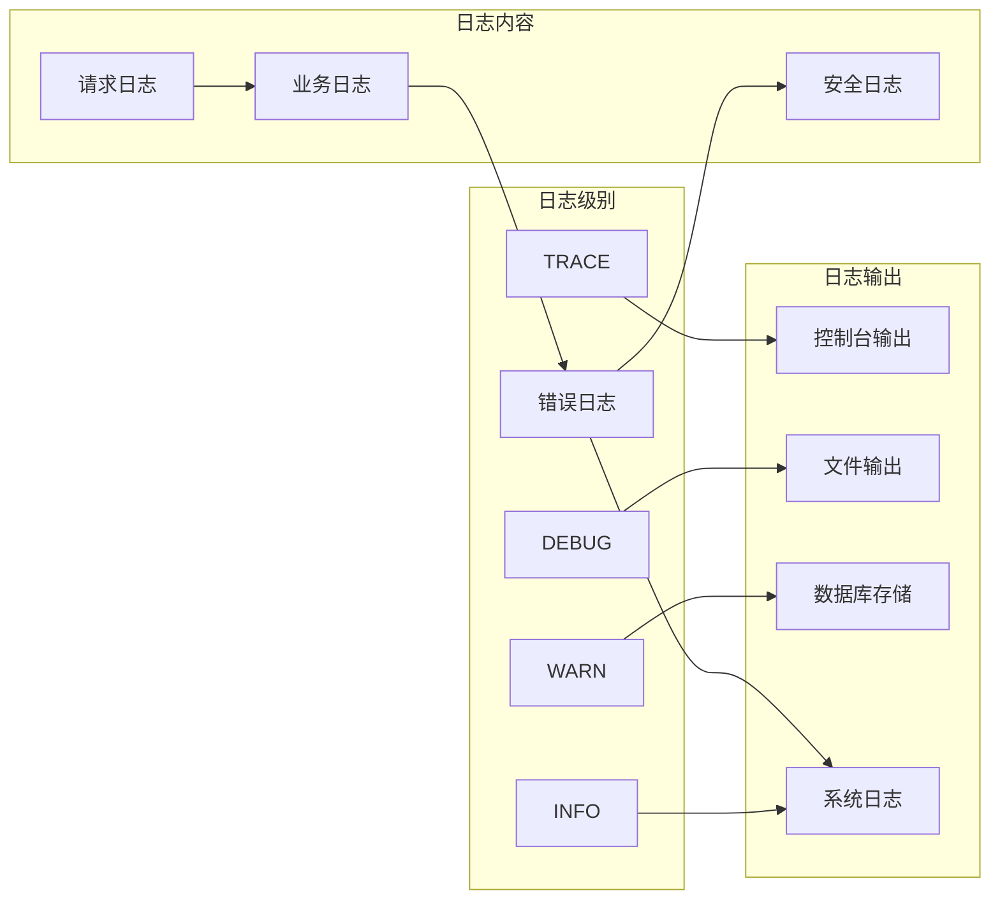

**章节来源**
- [application.properties:1-2](file://src/main/resources/application.properties#L1-L2)

## 依赖分析

### Maven依赖配置

当前项目仅包含基础的Spring Boot启动依赖，需要扩展以支持完整的基金管理系统功能。

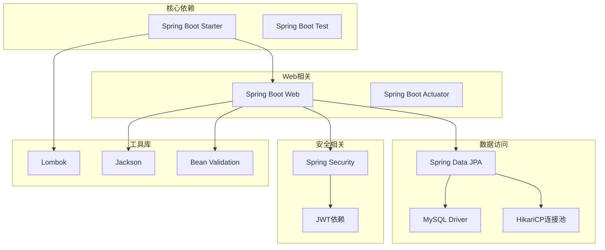

**图表来源**
- [pom.xml:32-43](file://pom.xml#L32-L43)

### 扩展依赖清单

为了实现完整的基金管理系统，建议添加以下依赖：

| 组件 | 依赖坐标 | 版本 | 用途 |
|------|----------|------|------|
| Spring Boot Web | org.springframework.boot:spring-boot-starter-web | 4.0.3 | Web应用支持 |
| Spring Boot Data JPA | org.springframework.boot:spring-boot-starter-data-jpa | 4.0.3 | 数据持久化 |
| MySQL驱动 | mysql:mysql-connector-java | 8.0.33 | 数据库连接 |
| Spring Security | org.springframework.boot:spring-boot-starter-security | 4.0.3 | 安全框架 |
| JWT依赖 | io.jsonwebtoken:jjwt-api | 0.11.5 | JWT令牌处理 |
| Lombok | org.projectlombok:lombok | 1.18.26 | 代码简化 |
| HikariCP | com.zaxxer:HikariCP | 5.0.1 | 连接池管理 |
| Validation | org.springframework.boot:spring-boot-starter-validation | 4.0.3 | 参数验证 |

**章节来源**
- [pom.xml:29-31](file://pom.xml#L29-L31)
- [pom.xml:32-43](file://pom.xml#L32-L43)

## 性能考虑

### 数据库优化策略

1. **连接池配置**
   - 合理设置最大连接数和超时时间
   - 使用连接池监控工具跟踪性能指标

2. **查询优化**
   - 为常用查询字段建立索引
   - 使用分页查询处理大数据量
   - 避免N+1查询问题

3. **缓存策略**
   - 实现多级缓存架构
   - 使用Redis缓存热点数据
   - 设置合理的缓存过期策略

### 应用性能优化

1. **异步处理**
   - 使用@Async注解处理耗时操作
   - 实现消息队列异步处理
   - 异步发送通知和报告

2. **资源管理**
   - 合理配置线程池大小
   - 使用连接池管理外部资源
   - 实施资源清理机制

## 故障排除指南

### 常见问题诊断

#### 启动失败问题

**问题症状**: 应用程序无法正常启动
**可能原因**:
- Java版本不兼容（需要Java 17+）
- Maven依赖冲突
- 配置文件格式错误

**解决方案**:
1. 检查Java版本是否符合要求
2. 清理Maven缓存并重新构建
3. 验证配置文件语法正确性

#### 数据库连接问题

**问题症状**: 应用启动时报数据库连接错误
**可能原因**:
- 数据库服务未启动
- 连接参数配置错误
- 驱动程序版本不匹配

**解决方案**:
1. 确认数据库服务状态
2. 验证连接URL和凭据
3. 检查防火墙和网络配置

#### 安全认证问题

**问题症状**: 用户登录失败或权限验证错误
**可能原因**:
- JWT密钥配置错误
- 用户密码加密不匹配
- 角色权限配置问题

**解决方案**:
1. 验证JWT密钥和算法配置
2. 检查用户密码加密方式
3. 确认用户角色和权限映射

### 调试技巧

1. **启用详细日志**
   ```properties
   logging.level.com.qoder.fund=DEBUG
   logging.level.org.springframework.web=DEBUG
   ```

2. **使用Spring Boot Actuator**
   - 监控应用健康状态
   - 查看应用指标和配置
   - 远程查看应用信息

3. **数据库调试**
   - 启用SQL日志输出
   - 监控慢查询
   - 分析查询执行计划

**章节来源**
- [application.properties:1-2](file://src/main/resources/application.properties#L1-L2)

## 结论

通过本指南，您可以在现有Spring Boot项目基础上快速构建完整的基金管理系统。关键要点包括：

1. **渐进式扩展**: 从基础依赖开始，逐步添加所需功能模块
2. **架构设计**: 采用分层架构确保代码可维护性和可扩展性
3. **安全性**: 集成Spring Security提供完整的认证授权机制
4. **数据持久化**: 使用Spring Data JPA简化数据访问层开发
5. **异常处理**: 实现统一的异常处理机制提升用户体验
6. **性能优化**: 从数据库、缓存、异步处理等多维度优化性能

建议按照本文档的顺序逐步实施，先完成基础架构搭建，再逐步添加具体的功能模块。定期进行性能测试和安全审计，确保系统的稳定性和可靠性。