# 测试策略

<cite>
**本文档中引用的文件**
- [.github/workflows/ci.yml](file://.github/workflows/ci.yml)
- [checkstyle.xml](file://checkstyle.xml)
- [checkstyle-suppressions.xml](file://checkstyle-suppressions.xml)
- [scripts/pre-commit.sh](file://scripts/pre-commit.sh)
- [pom.xml](file://pom.xml)
- [FundApplication.java](file://src/main/java/com/qoder/fund/FundApplication.java)
- [FundApplicationTests.java](file://src/test/java/com/qoder/fund/FundApplicationTests.java)
- [FundService.java](file://src/main/java/com/qoder/fund/service/FundService.java)
- [FundController.java](file://src/main/java/com/qoder/fund/controller/FundController.java)
- [FundMapper.java](file://src/main/java/com/qoder/fund/mapper/FundMapper.java)
- [application.yml](file://src/main/resources/application.yml)
- [package.json](file://fund-web/package.json)
- [vite.config.ts](file://fund-web/vite.config.ts)
- [eslint.config.js](file://fund-web/eslint.config.js)
</cite>

## 更新摘要
**变更内容**
- 新增GitHub Actions CI/CD流水线配置，包含后端构建测试、前端构建和代码质量检查
- 新增Checkstyle代码质量检查配置，建立统一的Java代码规范
- 新增pre-commit钩子脚本，实现本地代码质量门禁
- 新增ESLint前端代码质量检查配置
- 新增架构约束检查，确保代码架构符合设计原则
- 更新持续集成配置，包含MySQL服务依赖和测试数据库配置

## 目录
1. [引言](#引言)
2. [项目结构](#项目结构)
3. [核心组件](#核心组件)
4. [架构概览](#架构概览)
5. [详细组件分析](#详细组件分析)
6. [依赖分析](#依赖分析)
7. [性能考虑](#性能考虑)
8. [故障排除指南](#故障排除指南)
9. [结论](#结论)
10. [附录](#附录)

## 引言

本测试策略文档为基金管理系统制定了全面的测试方法论，涵盖了从单元测试到集成测试的完整测试金字塔。该文档特别针对Spring Boot 3.4.3 + Java 17 + React 19的技术栈，结合JUnit 5、Mockito等现代测试框架，以及现代化的CI/CD和代码质量保证实践，为基金管理系统提供了可操作的测试指导。

基金管理系统的测试策略重点关注以下方面：
- **分层测试架构**：单元测试、集成测试、API测试、性能测试、安全测试
- **测试工具链**：JUnit 5、Mockito、Spring Boot Test、Vitest、React Testing Library
- **质量保证**：测试覆盖率、测试数据管理、持续集成、代码质量检查
- **最佳实践**：测试命名规范、断言策略、模拟对象设计、前端组件测试
- **现代化实践**：GitHub Actions CI/CD、Checkstyle代码质量检查、pre-commit钩子

## 项目结构

当前项目采用标准的Spring Boot Maven项目结构，包含生产代码、测试代码、前端组件测试配置以及现代化的质量保证工具。

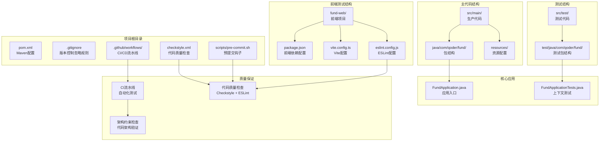

**图表来源**
- [pom.xml:1-134](file://pom.xml#L1-L134)
- [FundApplication.java:1-16](file://src/main/java/com/qoder/fund/FundApplication.java#L1-L16)
- [FundApplicationTests.java:1-14](file://src/test/java/com/qoder/fund/FundApplicationTests.java#L1-L14)
- [.github/workflows/ci.yml:1-102](file://.github/workflows/ci.yml#L1-L102)
- [checkstyle.xml:1-200](file://checkstyle.xml#L1-L200)
- [scripts/pre-commit.sh:1-79](file://scripts/pre-commit.sh#L1-L79)
- [package.json:1-40](file://fund-web/package.json#L1-L40)
- [vite.config.ts:1-16](file://fund-web/vite.config.ts#L1-L16)
- [eslint.config.js:1-24](file://fund-web/eslint.config.js#L1-L24)

**章节来源**
- [pom.xml:1-134](file://pom.xml#L1-L134)
- [FundApplication.java:1-16](file://src/main/java/com/qoder/fund/FundApplication.java#L1-L16)
- [FundApplicationTests.java:1-14](file://src/test/java/com/qoder/fund/FundApplicationTests.java#L1-L14)
- [.github/workflows/ci.yml:1-102](file://.github/workflows/ci.yml#L1-L102)
- [checkstyle.xml:1-200](file://checkstyle.xml#L1-L200)
- [scripts/pre-commit.sh:1-79](file://scripts/pre-commit.sh#L1-L79)
- [package.json:1-40](file://fund-web/package.json#L1-L40)
- [vite.config.ts:1-16](file://fund-web/vite.config.ts#L1-L16)
- [eslint.config.js:1-24](file://fund-web/eslint.config.js#L1-L24)

## 核心组件

### 应用程序组件

当前项目的核心组件包含Spring Boot应用、前端React应用以及现代化的CI/CD和代码质量保证工具：

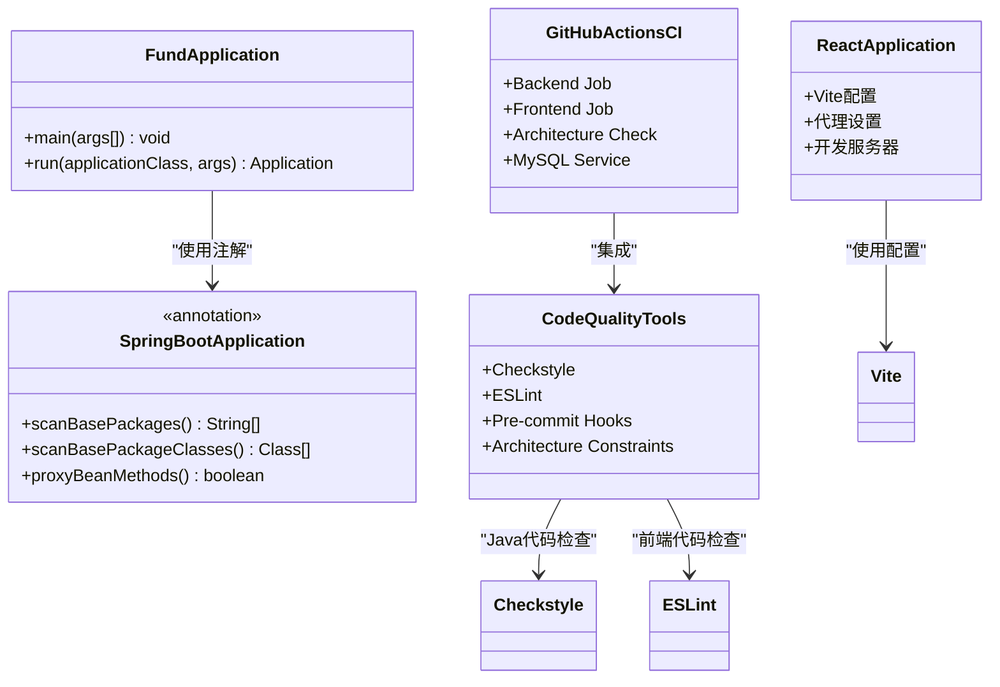

**图表来源**
- [FundApplication.java:7-13](file://src/main/java/com/qoder/fund/FundApplication.java#L7-L13)
- [vite.config.ts:4-15](file://fund-web/vite.config.ts#L4-L15)
- [.github/workflows/ci.yml:9-102](file://.github/workflows/ci.yml#L9-L102)
- [checkstyle.xml:47-198](file://checkstyle.xml#L47-L198)
- [scripts/pre-commit.sh:15-79](file://scripts/pre-commit.sh#L15-L79)

### 测试组件

现有的测试组件主要验证应用程序上下文的正确加载，并为后续的单元测试和集成测试奠定基础。同时集成了现代化的代码质量保证工具：

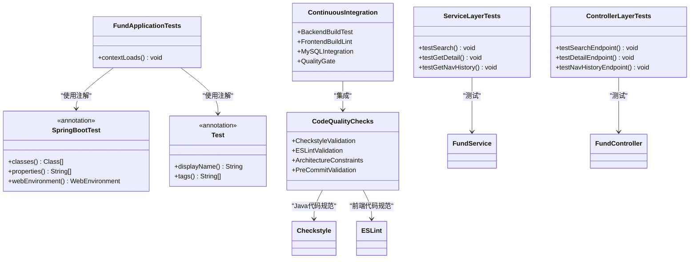

**图表来源**
- [FundApplicationTests.java:6-11](file://src/test/java/com/qoder/fund/FundApplicationTests.java#L6-L11)
- [FundService.java:18-75](file://src/main/java/com/qoder/fund/service/FundService.java#L18-L75)
- [FundController.java:15-67](file://src/main/java/com/qoder/fund/controller/FundController.java#L15-L67)
- [.github/workflows/ci.yml:38-47](file://.github/workflows/ci.yml#L38-L47)
- [scripts/pre-commit.sh:15-63](file://scripts/pre-commit.sh#L15-L63)

**章节来源**
- [FundApplication.java:1-16](file://src/main/java/com/qoder/fund/FundApplication.java#L1-L16)
- [FundApplicationTests.java:1-14](file://src/test/java/com/qoder/fund/FundApplicationTests.java#L1-L14)
- [FundService.java:1-75](file://src/main/java/com/qoder/fund/service/FundService.java#L1-L75)
- [FundController.java:1-67](file://src/main/java/com/qoder/fund/controller/FundController.java#L1-L67)
- [.github/workflows/ci.yml:1-102](file://.github/workflows/ci.yml#L1-L102)
- [scripts/pre-commit.sh:1-79](file://scripts/pre-commit.sh#L1-L79)

## 架构概览

基于当前项目状态，系统架构包含了现代化的CI/CD和代码质量保证实践，为未来的测试扩展预留了充分空间。

```mermaid
graph TB
subgraph "测试环境"
JUNIT[JUnit 5<br/>测试框架]
MOCKITO[Mockito<br/>模拟框架]
SPRING_TEST[Spring Boot Test<br/>测试支持]
VITEST[Vitest<br/>前端测试框架]
RTL[React Testing Library<br/>React测试库]
CHECKSTYLE[Checkstyle<br/>代码质量检查]
ESLINT[ESLint<br/>前端代码检查]
PRE_COMMIT[Pre-commit Hooks<br/>本地质量门禁]
GITHUB_ACTIONS[GitHub Actions<br/>CI/CD流水线]
end
subgraph "Spring Boot核心"
SPRING_BOOT[Spring Boot 3.4.3<br/>应用框架]
MYBATIS_PLUS[MyBatis-Plus<br/>数据访问]
OKHTTP[OkHttp<br/>HTTP客户端]
MYSQL[MySQL 8.0<br/>测试数据库]
ACTUATOR[Actuator<br/>健康检查]
end
subgraph "前端测试环境"
REACT[React 19<br/>前端框架]
VITE[Vite<br/>构建工具]
ANTD[Ant Design<br/>UI组件库]
ECHARTS[ECharts<br/>图表库]
TYPESCRIPT[TypeScript<br/>类型检查]
END
subgraph "测试金字塔"
UNIT[单元测试<br/>Service层]
INTEGRATION[集成测试<br/>Repository层]
API[API测试<br/>Controller层]
FRONTEND[前端组件测试<br/>React组件]
PERFORMANCE[性能测试<br/>负载测试]
SECURITY[安全测试<br/>漏洞扫描]
ARCHITECTURE[架构测试<br/>约束检查]
end
JUNIT --> UNIT
MOCKITO --> UNIT
SPRING_TEST --> INTEGRATION
VITEST --> FRONTEND
RTL --> FRONTEND
SPRING_BOOT --> SPRING_TEST
MYBATIS_PLUS --> SPRING_TEST
OKHTTP --> SPRING_TEST
MYSQL --> SPRING_TEST
ACTUATOR --> SPRING_TEST
REACT --> VITE
VITE --> ANTD
VITE --> ECHARTS
TYPESCRIPT --> ESLINT
CHECKSTYLE --> CODE_QUALITY
ESLINT --> CODE_QUALITY
PRE_COMMIT --> CODE_QUALITY
GITHUB_ACTIONS --> CODE_QUALITY
UNIT --> INTEGRATION
INTEGRATION --> API
API --> FRONTEND
FRONTEND --> PERFORMANCE
PERFORMANCE --> SECURITY
ARCHITECTURE --> CODE_QUALITY
```

**图表来源**
- [pom.xml:20-92](file://pom.xml#L20-L92)
- [package.json:12-38](file://fund-web/package.json#L12-L38)
- [.github/workflows/ci.yml:14-26](file://.github/workflows/ci.yml#L14-L26)
- [checkstyle.xml:47-198](file://checkstyle.xml#L47-L198)
- [eslint.config.js:8-23](file://fund-web/eslint.config.js#L8-L23)

## 详细组件分析

### 单元测试策略

#### JUnit 5配置与使用

JUnit 5作为现代化的Java测试框架，提供了强大的注解驱动测试能力：

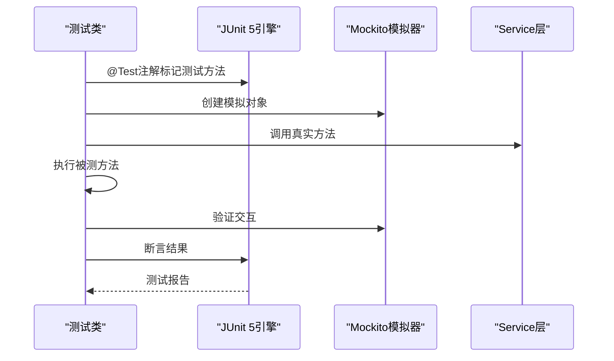

**图表来源**
- [FundApplicationTests.java:9-11](file://src/test/java/com/qoder/fund/FundApplicationTests.java#L9-L11)

#### Mockito模拟对象设计

Mockito提供了灵活的对象模拟机制，适用于Service层的单元测试：

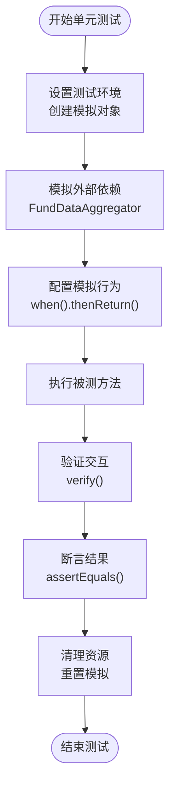

**图表来源**
- [FundService.java:24-25](file://src/main/java/com/qoder/fund/service/FundService.java#L24-L25)

### 集成测试策略

#### SpringBootTest注解使用

@SpringBootTest注解提供了完整的Spring应用上下文测试能力：

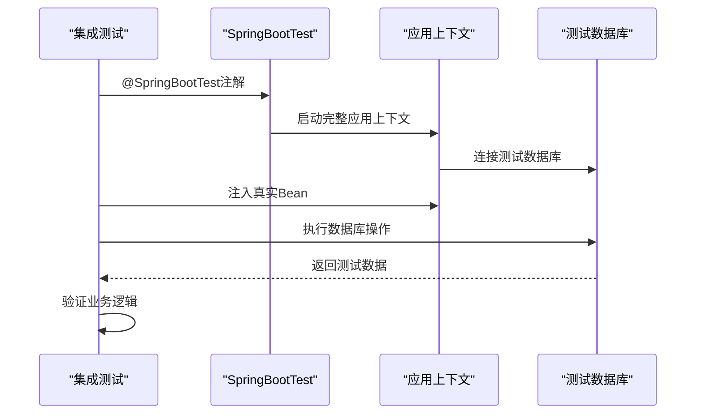

**图表来源**
- [FundApplicationTests.java:6](file://src/test/java/com/qoder/fund/FundApplicationTests.java#L6)

#### 测试数据库配置

集成测试通常需要独立的测试数据库环境，GitHub Actions CI/CD流水线中已配置MySQL服务：

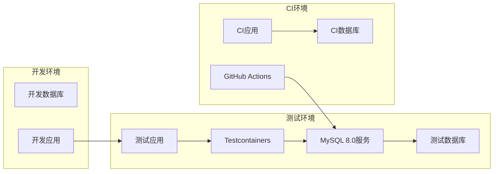

**图表来源**
- [.github/workflows/ci.yml:14-26](file://.github/workflows/ci.yml#L14-L26)

### API测试策略

#### Web测试与控制器测试

对于基金管理系统的API层测试，需要覆盖RESTful接口的所有端点：

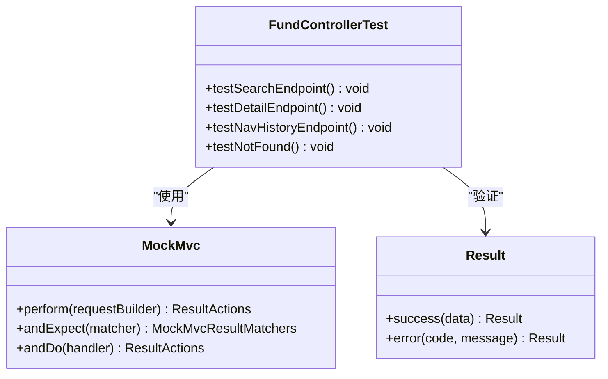

**图表来源**
- [FundController.java:29-65](file://src/main/java/com/qoder/fund/controller/FundController.java#L29-L65)

### 前端组件测试策略

#### React组件测试配置

前端组件测试采用Vitest + React Testing Library的组合，配合ESLint进行代码质量检查：

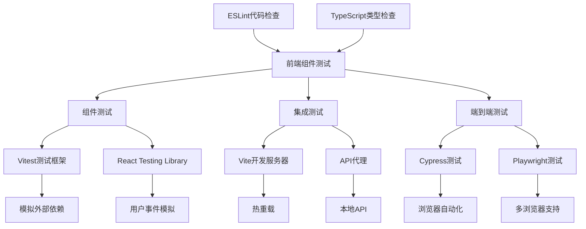

**图表来源**
- [package.json:25-38](file://fund-web/package.json#L25-L38)
- [vite.config.ts:6-14](file://fund-web/vite.config.ts#L6-L14)
- [eslint.config.js:8-23](file://fund-web/eslint.config.js#L8-L23)

#### 前端测试数据管理

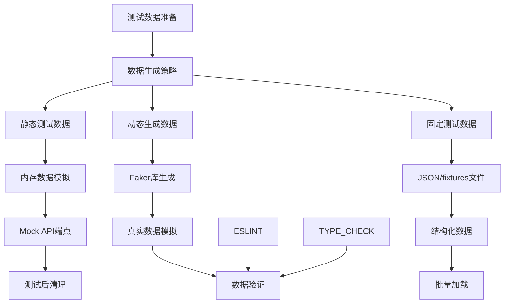

### 代码质量保证策略

#### Checkstyle代码质量检查

项目集成了Checkstyle插件，建立了统一的Java代码规范：

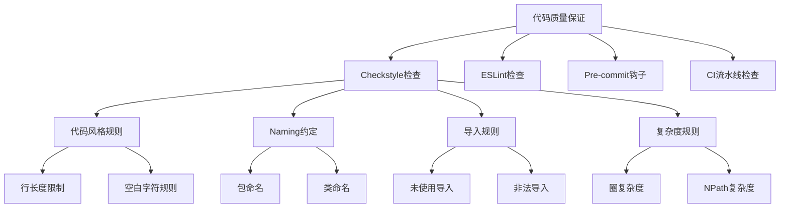

**图表来源**
- [checkstyle.xml:47-198](file://checkstyle.xml#L47-L198)
- [checkstyle-suppressions.xml:5-11](file://checkstyle-suppressions.xml#L5-L11)

#### 架构约束检查

项目实现了架构约束检查，确保代码架构符合设计原则：

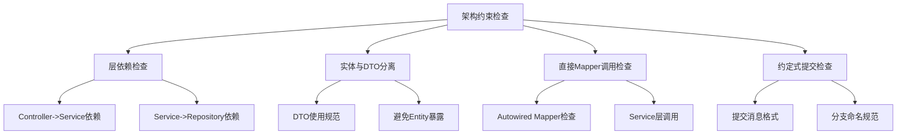

**图表来源**
- [.github/workflows/ci.yml:88-101](file://.github/workflows/ci.yml#L88-L101)
- [scripts/pre-commit.sh:52-75](file://scripts/pre-commit.sh#L52-L75)

**章节来源**
- [FundController.java:1-67](file://src/main/java/com/qoder/fund/controller/FundController.java#L1-L67)
- [package.json:1-40](file://fund-web/package.json#L1-L40)
- [vite.config.ts:1-16](file://fund-web/vite.config.ts#L1-L16)
- [eslint.config.js:1-24](file://fund-web/eslint.config.js#L1-L24)
- [checkstyle.xml:1-200](file://checkstyle.xml#L1-L200)
- [checkstyle-suppressions.xml:1-12](file://checkstyle-suppressions.xml#L1-L12)
- [scripts/pre-commit.sh:1-79](file://scripts/pre-commit.sh#L1-L79)
- [.github/workflows/ci.yml:1-102](file://.github/workflows/ci.yml#L1-L102)

## 依赖分析

### Maven依赖配置

当前项目的依赖配置相对完整，主要包含Spring Boot基础依赖、测试依赖、前端相关依赖以及代码质量检查工具：

```mermaid
graph TB
subgraph "项目依赖"
PARENT[spring-boot-starter-parent<br/>版本3.4.3]
MAIN_DEP[spring-boot-starter<br/>核心启动器]
TEST_DEP[spring-boot-starter-test<br/>测试启动器]
WEB_DEP[spring-boot-starter-web<br/>Web支持]
DATA_DEP[spring-boot-starter-data-jpa<br/>数据访问]
CACHE_DEP[spring-boot-starter-cache<br/>缓存支持]
VALIDATION_DEP[spring-boot-starter-validation<br/>验证支持]
ACTUATOR[actuator<br/>健康检查]
OKHTTP[okhttp 4.12.0<br/>HTTP客户端]
JACKSON[jackson-databind<br/>JSON处理]
LOMBOK[lombok<br/>代码简化]
MYSQL[mysql-connector-j<br/>数据库驱动]
MYBATIS_PLUS[mybatis-plus-spring-boot3-starter<br/>ORM框架]
CAFFEINE[caffeine<br/>缓存实现]
END
subgraph "测试框架"
JUNIT5[JUnit 5<br/>测试框架]
MOCKITO[Mockito<br/>模拟框架]
ASSERTJ[AssertJ<br/>断言库]
TESTCONTAINERS[Testcontainers<br/>容器化测试]
end
subgraph "代码质量工具"
CHECKSTYLE[maven-checkstyle-plugin<br/>代码质量检查]
ESLINT[ESLint<br/>前端代码检查]
PRE_COMMIT[Pre-commit Hook<br/>本地质量门禁]
end
PARENT --> MAIN_DEP
PARENT --> TEST_DEP
TEST_DEP --> JUNIT5
TEST_DEP --> MOCKITO
TEST_DEP --> ASSERTJ
MAIN_DEP --> WEB_DEP
MAIN_DEP --> DATA_DEP
MAIN_DEP --> CACHE_DEP
MAIN_DEP --> VALIDATION_DEP
DATA_DEP --> MYSQL
DATA_DEP --> MYBATIS_PLUS
CACHE_DEP --> CAFFEINE
WEB_DEP --> OKHTTP
WEB_DEP --> JACKSON
MAIN_DEP --> LOMBOK
ACTUATOR --> ACTUATOR
CHECKSTYLE --> CHECKSTYLE_PLUGIN
ESLINT --> ESLINT_TOOL
PRE_COMMIT --> PRE_COMMIT_HOOK
```

**图表来源**
- [pom.xml:20-92](file://pom.xml#L20-L92)
- [pom.xml:109-129](file://pom.xml#L109-L129)

**章节来源**
- [pom.xml:1-134](file://pom.xml#L1-L134)

## 性能考虑

### 测试性能优化

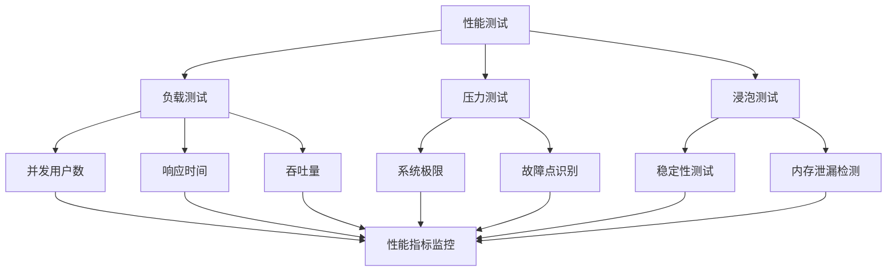

### 测试执行优化

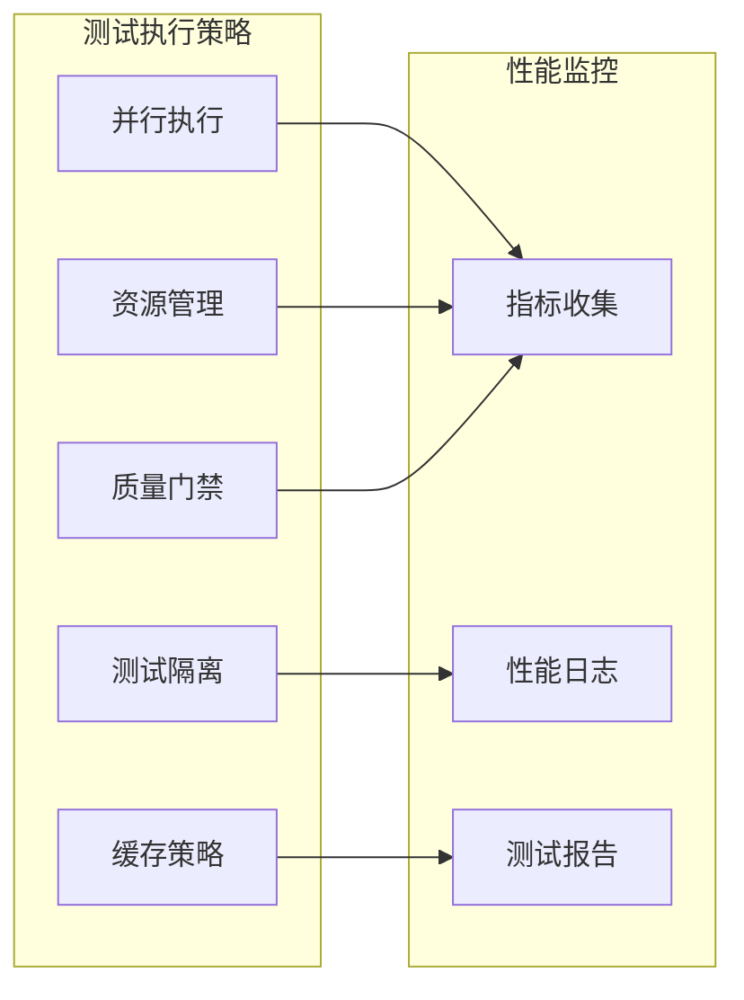

### CI/CD性能优化

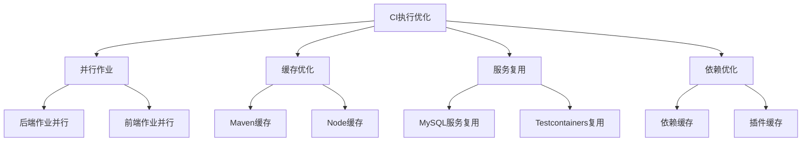

**图表来源**
- [.github/workflows/ci.yml:31-36](file://.github/workflows/ci.yml#L31-L36)
- [.github/workflows/ci.yml:58-63](file://.github/workflows/ci.yml#L58-L63)

## 故障排除指南

### 常见测试问题

```mermaid
flowchart TD
TestFailure[测试失败] --> UnitTestFailures[单元测试失败]
TestFailure --> IntegrationFailures[集成测试失败]
TestFailure --> APITestFailures[API测试失败]
TestFailure --> FrontendTestFailures[前端测试失败]
TestFailure --> CodeQualityFailures[代码质量检查失败]
TestFailure --> CIFailure[CI流水线失败]
UnitTestFailures --> MockSetupIssues[模拟设置问题]
UnitTestFailures --> AssertionIssues[断言问题]
UnitTestFailures --> TestDataIssues[测试数据问题]
IntegrationFailures --> DBConnectionIssues[数据库连接问题]
IntegrationFailures --> TransactionIssues[事务问题]
IntegrationFailures --> ContextIssues[上下文问题]
APITestFailures --> EndpointIssues[端点问题]
APITestFailures --> ResponseIssues[响应问题]
APITestFailures --> AuthenticationIssues[认证问题]
FrontendTestFailures --> ComponentIssues[组件问题]
FrontendTestFailures --> RenderingIssues[渲染问题]
FrontendTestFailures --> StateIssues[状态问题]
CodeQualityFailures --> CheckstyleIssues[Checkstyle规则问题]
CodeQualityFailures --> ESLintIssues[ESLint规则问题]
CodeQualityFailures --> ArchitectureIssues[架构约束问题]
CIFailure --> BuildIssues[构建问题]
CIFailure --> TestIssues[测试问题]
CIFailure --> QualityGateIssues[质量门禁问题]
MockSetupIssues --> FixMockSetup["修复模拟设置"]
AssertionIssues --> FixAssertions["修正断言"]
TestDataIssues --> FixTestData["更新测试数据"]
DBConnectionIssues --> FixDBConfig["检查数据库配置"]
TransactionIssues --> FixTransaction["处理事务"]
ContextIssues --> FixContext["修复上下文"]
EndpointIssues --> FixEndpoint["修复端点"]
ResponseIssues --> FixResponse["修正响应"]
AuthenticationIssues --> FixAuth["处理认证"]
ComponentIssues --> FixComponent["修复组件"]
RenderingIssues --> FixRendering["修正渲染"]
StateIssues --> FixState["处理状态"]
CheckstyleIssues --> FixCheckstyle["修复代码风格"]
ESLintIssues --> FixESLint["修复前端代码"]
ArchitectureIssues --> FixArchitecture["修复架构问题"]
BuildIssues --> FixBuild["修复构建配置"]
TestIssues --> FixTest["修复测试配置"]
QualityGateIssues --> FixQualityGate["修复质量门禁"]
```

### 调试技巧

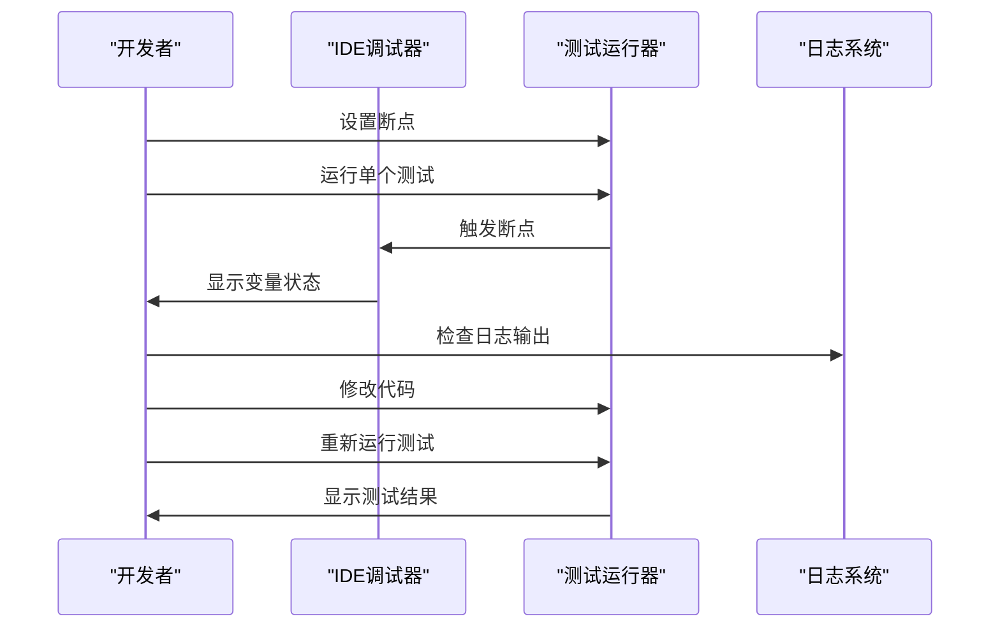

### CI/CD调试技巧

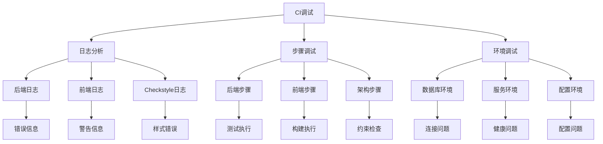

**章节来源**
- [FundApplicationTests.java:1-14](file://src/test/java/com/qoder/fund/FundApplicationTests.java#L1-L14)
- [.github/workflows/ci.yml:1-102](file://.github/workflows/ci.yml#L1-L102)
- [scripts/pre-commit.sh:1-79](file://scripts/pre-commit.sh#L1-L79)

## 结论

本测试策略文档为基金管理系统建立了完整的测试框架基础，集成了现代化的CI/CD和代码质量保证实践。通过合理的测试策略规划，可以确保系统在功能扩展过程中保持高质量和高可靠性。

### 关键要点总结

1. **渐进式测试实施**：从单元测试开始，逐步扩展到集成测试、API测试、前端组件测试、性能测试和安全测试
2. **工具链选择**：基于JUnit 5 + Mockito + Spring Boot Test + Vitest + React Testing Library的现代测试技术栈
3. **质量保证**：建立测试覆盖率要求、测试命名规范和测试数据管理流程
4. **持续改进**：在持续集成环境中自动化测试执行，确保代码质量
5. **现代化实践**：集成GitHub Actions CI/CD、Checkstyle代码质量检查、pre-commit钩子和ESLint前端代码检查
6. **架构约束**：通过架构约束检查确保代码架构符合设计原则

### 未来发展方向

随着基金管理系统功能的不断完善，建议逐步引入：
- 更丰富的测试数据生成策略
- 容器化测试环境
- 性能基准测试
- 安全渗透测试
- 用户体验测试
- 测试自动化工具集成

## 附录

### 测试命名规范

| 测试类型 | 命名模式 | 示例 |
|---------|---------|------|
| 单元测试 | `should_[条件]_when_[场景]` | should_return_fund_when_fund_exists |
| 集成测试 | `integration_should_[功能]_with_[条件]` | integration_should_create_fund_with_valid_data |
| API测试 | `api_should_[行为]_for_[端点]` | api_should_return_200_for_get_fund |
| 前端组件测试 | `component_should_[行为]_when_[事件]` | component_should_render_search_results_when_keyword_provided |
| 性能测试 | `performance_should_[指标]_within_[阈值]` | performance_should_handle_1000_requests_per_second |
| 架构测试 | `architecture_should_[约束]_for_[模块]` | architecture_should_not_contain_direct_mapper_calls |

### 测试覆盖率要求

| 测试层级 | 覆盖率目标 | 工具推荐 |
|---------|-----------|----------|
| 单元测试 | ≥80% | JaCoCo |
| 集成测试 | ≥60% | JaCoCo |
| API测试 | ≥70% | JaCoCo |
| 前端组件测试 | ≥75% | React Testing Library |
| 行为测试 | 全面覆盖 | Cucumber |
| 性能测试 | 全面覆盖 | JMeter |
| 架构测试 | 全面覆盖 | 自定义检查 |

### 持续集成配置

```mermaid
flowchart LR
GitPush[Git推送] --> CI[CI流水线]
CI --> BackendBuild[后端构建]
BackendBuild --> Checkstyle[Checkstyle检查]
Checkstyle --> BackendTest[后端测试]
BackendTest --> MySQLService[MySQL服务]
MySQLService --> IntegrationTest[集成测试]
IntegrationTest --> FrontendBuild[前端构建]
FrontendBuild --> ESLint[ESLint检查]
ESLint --> TypeCheck[TypeScript类型检查]
TypeCheck --> FrontendTest[前端测试]
FrontendTest --> ArchitectureCheck[架构约束检查]
ArchitectureCheck --> QualityGate[质量门禁]
QualityGate --> Deploy[部署到测试环境]
QualityGate --> Block[阻止部署]
```

### 代码质量检查配置

```mermaid
flowchart TD
CodeQuality[代码质量检查] --> LocalCheck[本地检查]
CodeQuality --> CICheck[CI检查]
LocalCheck --> PreCommit[Pre-commit钩子]
LocalCheck --> ManualCheck[手动检查]
CICheck --> GitHubActions[GitHub Actions]
CICheck --> MavenPlugin[Maven插件]
PreCommit --> Checkstyle[Checkstyle]
PreCommit --> ESLint[ESLint]
PreCommit --> Architecture[架构约束]
GitHubActions --> BackendJob[后端作业]
GitHubActions --> FrontendJob[前端作业]
GitHubActions --> ArchitectureJob[架构作业]
MavenPlugin --> ValidatePhase[validate阶段]
MavenPlugin --> CheckGoal[check目标]
```

### 前端测试配置示例

```mermaid
flowchart TD
FrontendTestSetup[前端测试环境配置] --> VitestConfig[Vitest配置]
FrontendTestSetup --> RTLConfig[React Testing Library配置]
FrontendTestSetup --> ProxyConfig[API代理配置]
FrontendTestSetup --> ESLintConfig[ESLint配置]
FrontendTestSetup --> TypeCheckConfig[TypeScript配置]
VitestConfig --> TestFiles[测试文件组织]
RTLConfig --> ComponentTesting[组件测试]
ProxyConfig --> LocalAPI[本地API代理]
ESLintConfig --> CodeQuality[代码质量检查]
TypeCheckConfig --> TypeSafety[类型安全检查]
TestFiles --> MockData[模拟数据]
ComponentTesting --> UserEvents[用户事件]
LocalAPI --> CORS[CORS配置]
MockData --> TestScenarios[测试场景]
UserEvents --> Assertions[断言验证]
CORS --> TestExecution[测试执行]
Assertions --> TestReporting[测试报告]
CodeQuality --> ESLintCheck[ESLint检查]
TypeSafety --> TypeCheck[类型检查]
```

**章节来源**
- [pom.xml:1-134](file://pom.xml#L1-L134)
- [FundService.java:1-75](file://src/main/java/com/qoder/fund/service/FundService.java#L1-L75)
- [FundController.java:1-67](file://src/main/java/com/qoder/fund/controller/FundController.java#L1-L67)
- [FundMapper.java:1-10](file://src/main/java/com/qoder/fund/mapper/FundMapper.java#L1-L10)
- [package.json:1-40](file://fund-web/package.json#L1-L40)
- [vite.config.ts:1-16](file://fund-web/vite.config.ts#L1-L16)
- [eslint.config.js:1-24](file://fund-web/eslint.config.js#L1-L24)
- [checkstyle.xml:1-200](file://checkstyle.xml#L1-L200)
- [checkstyle-suppressions.xml:1-12](file://checkstyle-suppressions.xml#L1-L12)
- [scripts/pre-commit.sh:1-79](file://scripts/pre-commit.sh#L1-L79)
- [.github/workflows/ci.yml:1-102](file://.github/workflows/ci.yml#L1-L102)
- [application.yml:1-68](file://src/main/resources/application.yml#L1-L68)