# 测试策略

<cite>
**本文档中引用的文件**
- [pom.xml](file://pom.xml)
- [FundApplication.java](file://src/main/java/com/qoder/fund/FundApplication.java)
- [FundApplicationTests.java](file://src/test/java/com/qoder/fund/FundApplicationTests.java)
- [FundService.java](file://src/main/java/com/qoder/fund/service/FundService.java)
- [FundController.java](file://src/main/java/com/qoder/fund/controller/FundController.java)
- [FundMapper.java](file://src/main/java/com/qoder/fund/mapper/FundMapper.java)
- [package.json](file://fund-web/package.json)
- [vite.config.ts](file://fund-web/vite.config.ts)
</cite>

## 目录
1. [引言](#引言)
2. [项目结构](#项目结构)
3. [核心组件](#核心组件)
4. [架构概览](#架构概览)
5. [详细组件分析](#详细组件分析)
6. [依赖分析](#依赖分析)
7. [性能考虑](#性能考虑)
8. [故障排除指南](#故障排除指南)
9. [结论](#结论)
10. [附录](#附录)

## 引言

本测试策略文档为基金管理系统制定了全面的测试方法论，涵盖了从单元测试到集成测试的完整测试金字塔。该文档特别针对Spring Boot 3.4.3 + Java 17 + React 19的技术栈，结合JUnit 5、Mockito等现代测试框架，为基金管理系统提供了可操作的测试指导。

基金管理系统的测试策略重点关注以下方面：
- **分层测试架构**：单元测试、集成测试、API测试、性能测试、安全测试
- **测试工具链**：JUnit 5、Mockito、Spring Boot Test、Vitest、React Testing Library
- **质量保证**：测试覆盖率、测试数据管理、持续集成
- **最佳实践**：测试命名规范、断言策略、模拟对象设计、前端组件测试

## 项目结构

当前项目采用标准的Spring Boot Maven项目结构，包含生产代码、测试代码和前端组件测试配置。

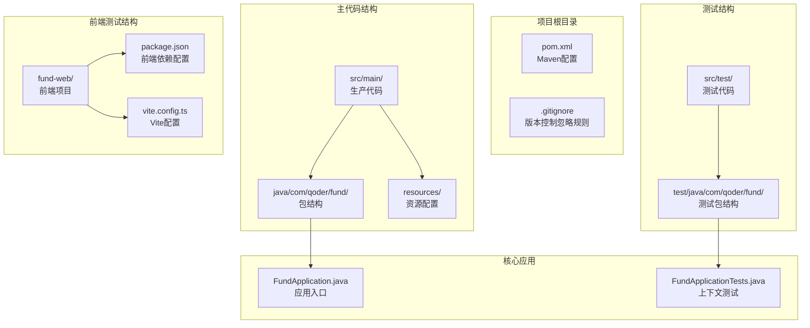

**图表来源**
- [pom.xml:1-107](file://pom.xml#L1-L107)
- [FundApplication.java:1-16](file://src/main/java/com/qoder/fund/FundApplication.java#L1-L16)
- [FundApplicationTests.java:1-14](file://src/test/java/com/qoder/fund/FundApplicationTests.java#L1-L14)
- [package.json:1-39](file://fund-web/package.json#L1-L39)
- [vite.config.ts:1-16](file://fund-web/vite.config.ts#L1-L16)

**章节来源**
- [pom.xml:1-107](file://pom.xml#L1-L107)
- [FundApplication.java:1-16](file://src/main/java/com/qoder/fund/FundApplication.java#L1-L16)
- [FundApplicationTests.java:1-14](file://src/test/java/com/qoder/fund/FundApplicationTests.java#L1-L14)
- [package.json:1-39](file://fund-web/package.json#L1-L39)
- [vite.config.ts:1-16](file://fund-web/vite.config.ts#L1-L16)

## 核心组件

### 应用程序组件

当前项目的核心组件包含Spring Boot应用和前端React应用：

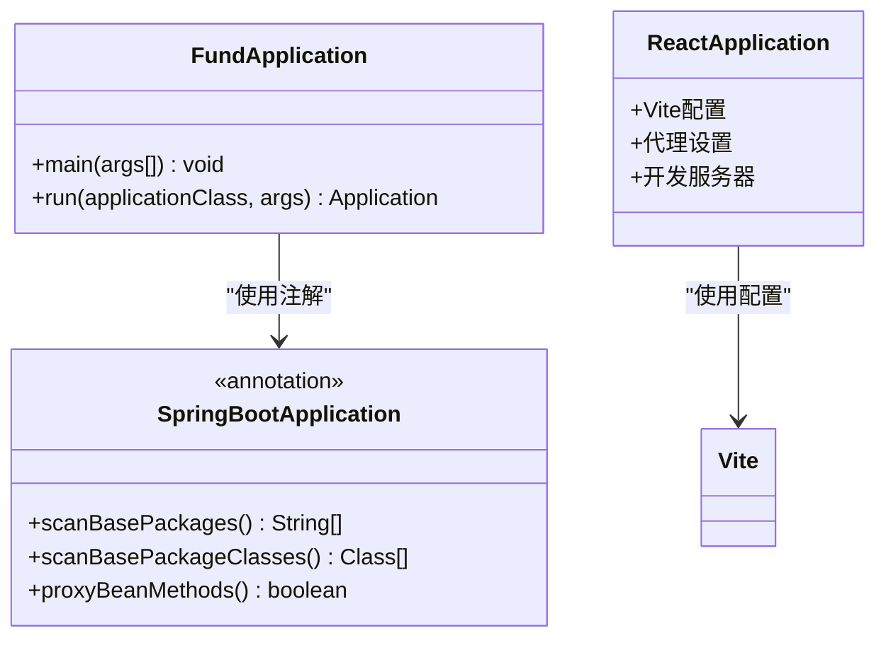

**图表来源**
- [FundApplication.java:7-13](file://src/main/java/com/qoder/fund/FundApplication.java#L7-L13)
- [vite.config.ts:4-15](file://fund-web/vite.config.ts#L4-L15)

### 测试组件

现有的测试组件主要验证应用程序上下文的正确加载，并为后续的单元测试和集成测试奠定基础：

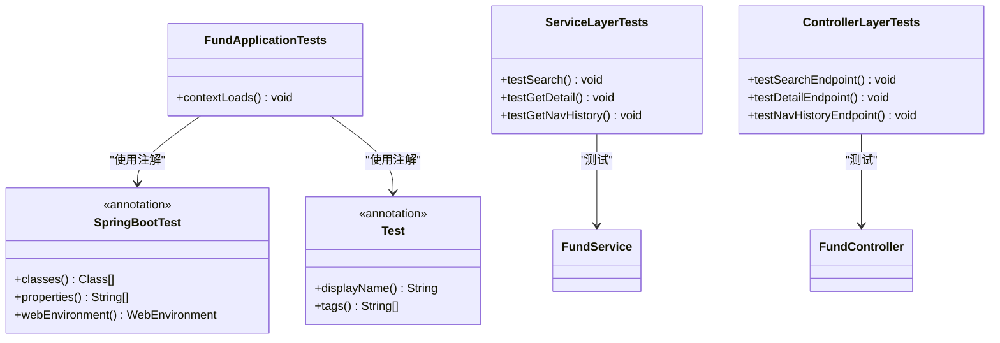

**图表来源**
- [FundApplicationTests.java:6-11](file://src/test/java/com/qoder/fund/FundApplicationTests.java#L6-L11)
- [FundService.java:18-64](file://src/main/java/com/qoder/fund/service/FundService.java#L18-L64)
- [FundController.java:15-45](file://src/main/java/com/qoder/fund/controller/FundController.java#L15-L45)

**章节来源**
- [FundApplication.java:1-16](file://src/main/java/com/qoder/fund/FundApplication.java#L1-L16)
- [FundApplicationTests.java:1-14](file://src/test/java/com/qoder/fund/FundApplicationTests.java#L1-L14)
- [FundService.java:1-65](file://src/main/java/com/qoder/fund/service/FundService.java#L1-L65)
- [FundController.java:1-46](file://src/main/java/com/qoder/fund/controller/FundController.java#L1-L46)

## 架构概览

基于当前项目状态，系统架构相对简单，但为未来的测试扩展预留了充分空间。

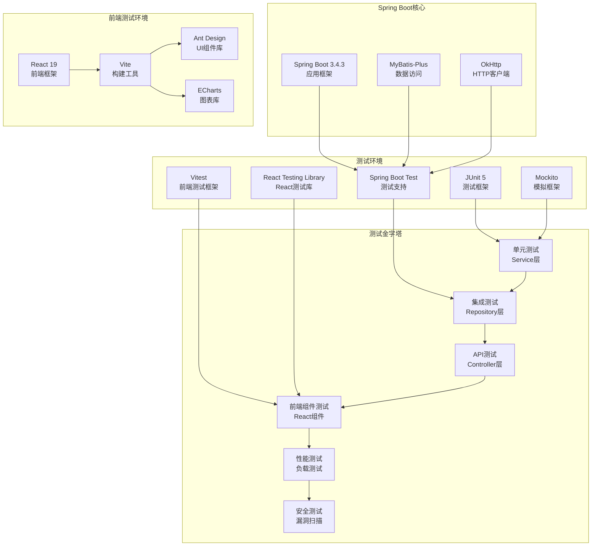

**图表来源**
- [pom.xml:20-86](file://pom.xml#L20-L86)
- [package.json:12-36](file://fund-web/package.json#L12-L36)

## 详细组件分析

### 单元测试策略

#### JUnit 5配置与使用

JUnit 5作为现代化的Java测试框架，提供了强大的注解驱动测试能力：

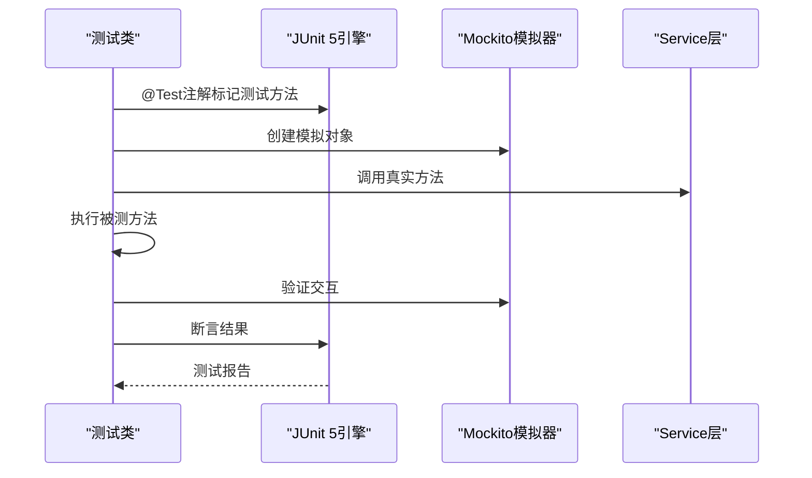

**图表来源**
- [FundApplicationTests.java:9-11](file://src/test/java/com/qoder/fund/FundApplicationTests.java#L9-L11)

#### Mockito模拟对象设计

Mockito提供了灵活的对象模拟机制，适用于Service层的单元测试：


**图表来源**
- [FundService.java:24-33](file://src/main/java/com/qoder/fund/service/FundService.java#L24-L33)

### 集成测试策略

#### SpringBootTest注解使用

@SpringBootTest注解提供了完整的Spring应用上下文测试能力：

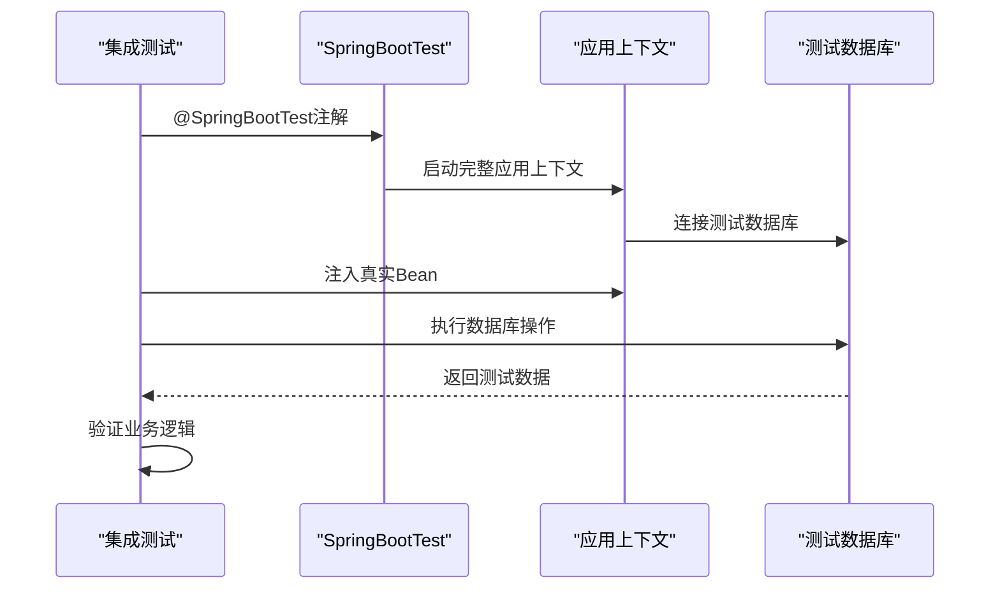

**图表来源**
- [FundApplicationTests.java:6](file://src/test/java/com/qoder/fund/FundApplicationTests.java#L6)

#### 测试数据库配置

集成测试通常需要独立的测试数据库环境：

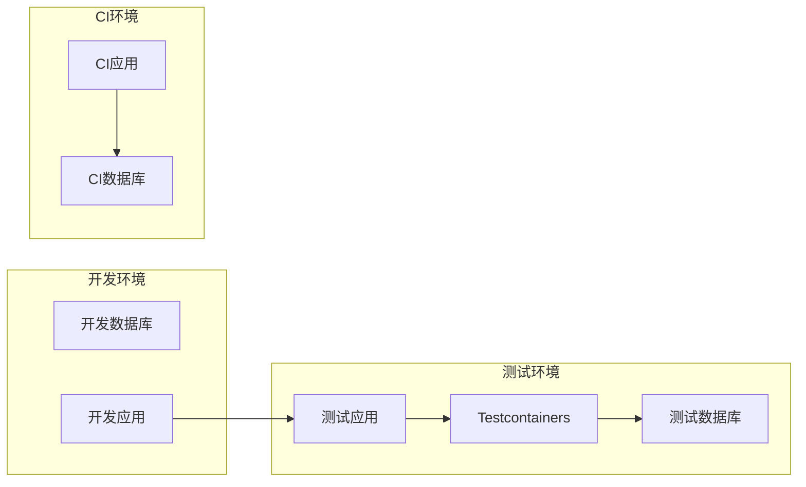

### API测试策略

#### Web测试与控制器测试

对于基金管理系统的API层测试，需要覆盖RESTful接口的所有端点：

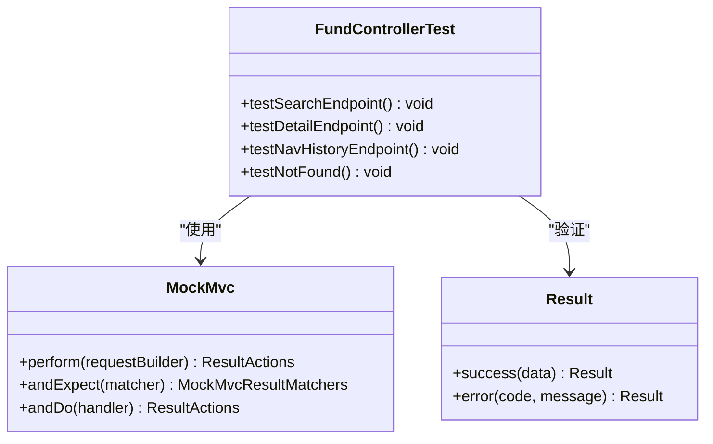

**图表来源**
- [FundController.java:22-44](file://src/main/java/com/qoder/fund/controller/FundController.java#L22-L44)

### 前端组件测试策略

#### React组件测试配置

前端组件测试采用Vitest + React Testing Library的组合：

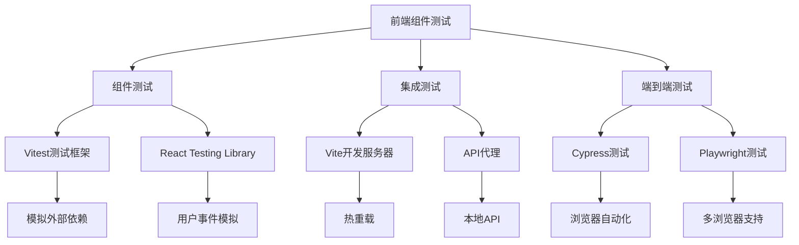

**图表来源**
- [package.json:24-36](file://fund-web/package.json#L24-L36)
- [vite.config.ts:6-14](file://fund-web/vite.config.ts#L6-L14)

#### 前端测试数据管理

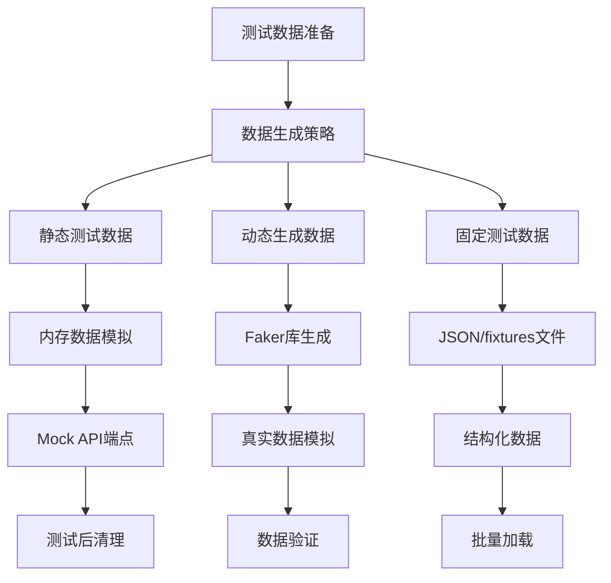

**章节来源**
- [FundController.java:1-46](file://src/main/java/com/qoder/fund/controller/FundController.java#L1-L46)
- [package.json:1-39](file://fund-web/package.json#L1-L39)
- [vite.config.ts:1-16](file://fund-web/vite.config.ts#L1-L16)

## 依赖分析

### Maven依赖配置

当前项目的依赖配置相对完整，主要包含Spring Boot基础依赖、测试依赖和前端相关依赖：

```mermaid
graph TB
subgraph "项目依赖"
PARENT[spring-boot-starter-parent<br/>版本3.4.3]
MAIN_DEP[spring-boot-starter<br/>核心启动器]
TEST_DEP[spring-boot-starter-test<br/>测试启动器]
WEB_DEP[spring-boot-starter-web<br/>Web支持]
DATA_DEP[spring-boot-starter-data-jpa<br/>数据访问]
CACHE_DEP[spring-boot-starter-cache<br/>缓存支持]
VALIDATION_DEP[spring-boot-starter-validation<br/>验证支持]
OKHTTP[okhttp 4.12.0<br/>HTTP客户端]
JACKSON[jackson-databind<br/>JSON处理]
LOMBOK[lombok<br/>代码简化]
MYSQL[mysql-connector-j<br/>数据库驱动]
MYBATIS_PLUS[mybatis-plus-spring-boot3-starter<br/>ORM框架]
CAFFEINE[caffeine<br/>缓存实现]
END
subgraph "测试框架"
JUNIT5[JUnit 5<br/>测试框架]
MOCKITO[Mockito<br/>模拟框架]
ASSERTJ[AssertJ<br/>断言库]
TESTCONTAINERS[Testcontainers<br/>容器化测试]
end
PARENT --> MAIN_DEP
PARENT --> TEST_DEP
TEST_DEP --> JUNIT5
TEST_DEP --> MOCKITO
TEST_DEP --> ASSERTJ
MAIN_DEP --> WEB_DEP
MAIN_DEP --> DATA_DEP
MAIN_DEP --> CACHE_DEP
MAIN_DEP --> VALIDATION_DEP
DATA_DEP --> MYSQL
DATA_DEP --> MYBATIS_PLUS
CACHE_DEP --> CAFFEINE
WEB_DEP --> OKHTTP
WEB_DEP --> JACKSON
MAIN_DEP --> LOMBOK
```

**图表来源**
- [pom.xml:20-86](file://pom.xml#L20-L86)

**章节来源**
- [pom.xml:1-107](file://pom.xml#L1-L107)

## 性能考虑

### 测试性能优化

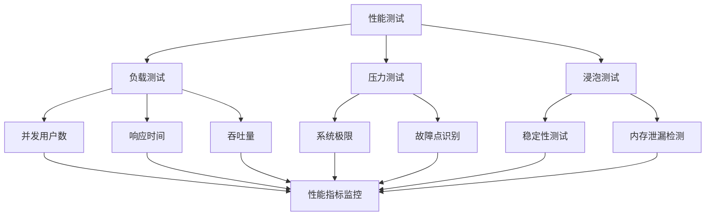

### 测试执行优化

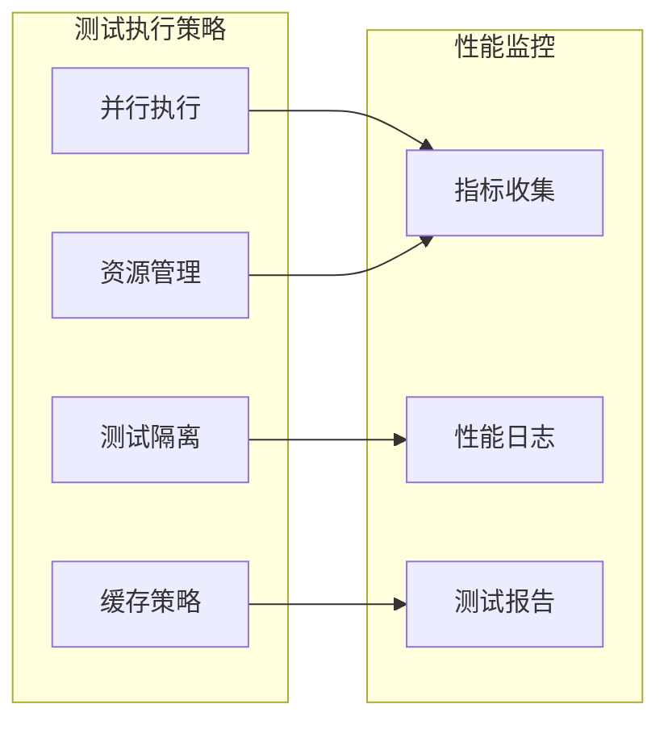

## 故障排除指南

### 常见测试问题

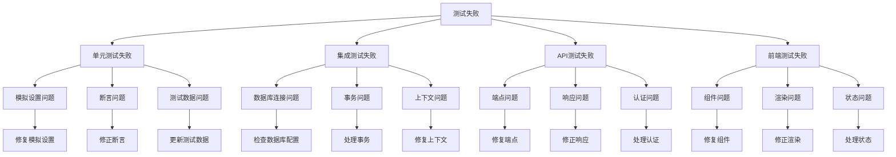

### 调试技巧

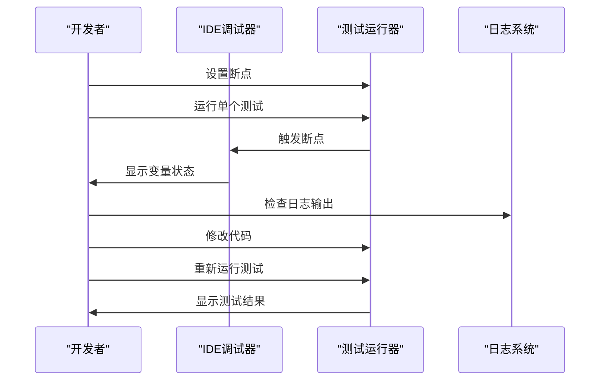

**章节来源**
- [FundApplicationTests.java:1-14](file://src/test/java/com/qoder/fund/FundApplicationTests.java#L1-L14)

## 结论

本测试策略文档为基金管理系统建立了完整的测试框架基础。通过合理的测试策略规划，可以确保系统在功能扩展过程中保持高质量和高可靠性。

### 关键要点总结

1. **渐进式测试实施**：从单元测试开始，逐步扩展到集成测试、API测试、前端组件测试、性能测试和安全测试
2. **工具链选择**：基于JUnit 5 + Mockito + Spring Boot Test + Vitest + React Testing Library的现代测试技术栈
3. **质量保证**：建立测试覆盖率要求、测试命名规范和测试数据管理流程
4. **持续改进**：在持续集成环境中自动化测试执行，确保代码质量

### 未来发展方向

随着基金管理系统功能的不断完善，建议逐步引入：
- 更丰富的测试数据生成策略
- 容器化测试环境
- 性能基准测试
- 安全渗透测试
- 用户体验测试

## 附录

### 测试命名规范

| 测试类型 | 命名模式 | 示例 |
|---------|---------|------|
| 单元测试 | `should_[条件]_when_[场景]` | should_return_fund_when_fund_exists |
| 集成测试 | `integration_should_[功能]_with_[条件]` | integration_should_create_fund_with_valid_data |
| API测试 | `api_should_[行为]_for_[端点]` | api_should_return_200_for_get_fund |
| 前端组件测试 | `component_should_[行为]_when_[事件]` | component_should_render_search_results_when_keyword_provided |
| 性能测试 | `performance_should_[指标]_within_[阈值]` | performance_should_handle_1000_requests_per_second |

### 测试覆盖率要求

| 测试层级 | 覆盖率目标 | 工具推荐 |
|---------|-----------|----------|
| 单元测试 | ≥80% | JaCoCo |
| 集成测试 | ≥60% | JaCoCo |
| API测试 | ≥70% | JaCoCo |
| 前端组件测试 | ≥75% | React Testing Library |
| 行为测试 | 全面覆盖 | Cucumber |
| 性能测试 | 全面覆盖 | JMeter |

### 持续集成配置

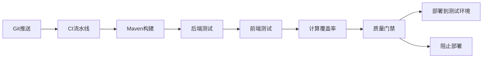

### 前端测试配置示例

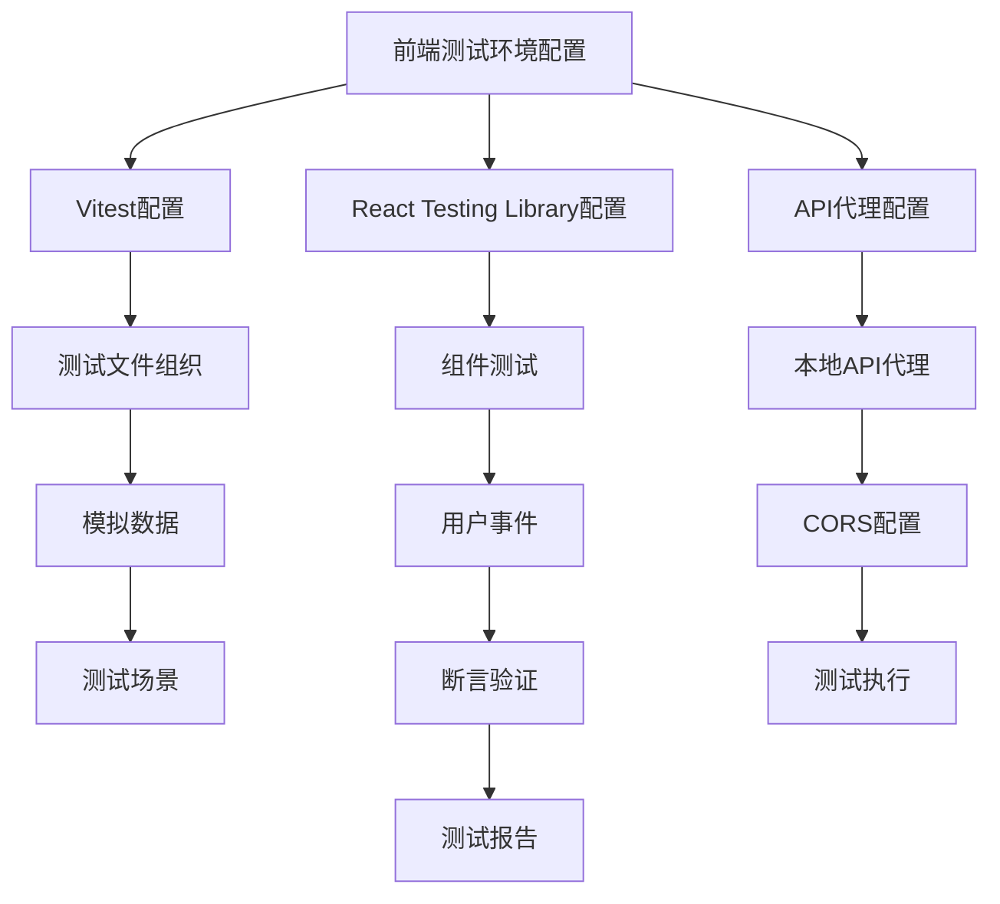

**章节来源**
- [pom.xml:1-107](file://pom.xml#L1-L107)
- [FundService.java:1-65](file://src/main/java/com/qoder/fund/service/FundService.java#L1-L65)
- [FundController.java:1-46](file://src/main/java/com/qoder/fund/controller/FundController.java#L1-L46)
- [FundMapper.java:1-10](file://src/main/java/com/qoder/fund/mapper/FundMapper.java#L1-L10)
- [package.json:1-39](file://fund-web/package.json#L1-L39)
- [vite.config.ts:1-16](file://fund-web/vite.config.ts#L1-L16)