# 股票估算覆盖率计算增强

<cite>
**本文档引用的文件**
- [FundApplication.java](file://src/main/java/com/qoder/fund/FundApplication.java)
- [application.yml](file://src/main/resources/application.yml)
- [BatchEstimateService.java](file://src/main/java/com/qoder/fund/service/BatchEstimateService.java)
- [EstimateWeightService.java](file://src/main/java/com/qoder/fund/service/EstimateWeightService.java)
- [FundEstimateCalculator.java](file://src/main/java/com/qoder/fund/service/FundEstimateCalculator.java)
- [StockEstimateDataSource.java](file://src/main/java/com/qoder/fund/datasource/StockEstimateDataSource.java)
- [FundDataAggregator.java](file://src/main/java/com/qoder/fund/datasource/FundDataAggregator.java)
- [EstimatePrediction.java](file://src/main/java/com/qoder/fund/entity/EstimatePrediction.java)
- [EstimatePredictionMapper.java](file://src/main/java/com/qoder/fund/mapper/EstimatePredictionMapper.java)
- [EastMoneyDataSource.java](file://src/main/java/com/qoder/fund/datasource/EastMoneyDataSource.java)
- [SinaDataSource.java](file://src/main/java/com/qoder/fund/datasource/SinaDataSource.java)
- [TencentDataSource.java](file://src/main/java/com/qoder/fund/datasource/TencentDataSource.java)
- [PRD.md](file://PRD.md)
</cite>

## 目录
1. [项目概述](#项目概述)
2. [系统架构](#系统架构)
3. [核心组件分析](#核心组件分析)
4. [估值权重计算增强](#估值权重计算增强)
5. [股票估算覆盖率算法](#股票估算覆盖率算法)
6. [数据流分析](#数据流分析)
7. [性能优化策略](#性能优化策略)
8. [故障处理机制](#故障处理机制)
9. [总结](#总结)

## 项目概述

本项目是一个基于Spring Boot和React的基金管理系统，专注于提供准确的基金估值和持仓分析功能。系统通过多数据源聚合、智能权重计算和股票估算覆盖率分析，为用户提供全面的基金投资决策支持。

### 核心功能特性

- **多数据源估值聚合**：整合天天基金、新浪财经、腾讯财经等多个数据源
- **智能权重计算**：基于历史准确度和基金类型动态调整数据源权重
- **股票估算覆盖率**：精确计算重仓股覆盖率，提升估算精度
- **实时性能监控**：提供完整的估值准确度跟踪和修正机制

## 系统架构

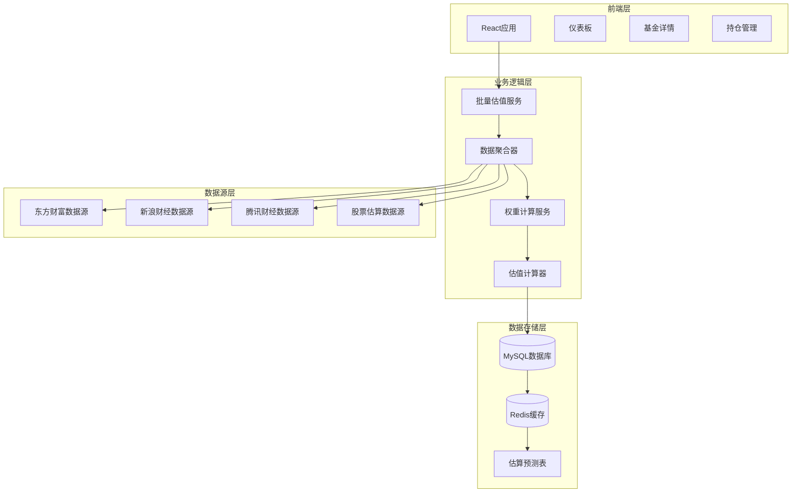

**架构图来源**
- [FundApplication.java:1-16](file://src/main/java/com/qoder/fund/FundApplication.java#L1-L16)
- [application.yml:1-68](file://src/main/resources/application.yml#L1-L68)

**章节来源**
- [FundApplication.java:1-16](file://src/main/java/com/qoder/fund/FundApplication.java#L1-L16)
- [application.yml:1-68](file://src/main/resources/application.yml#L1-L68)

## 核心组件分析

### 批量估值服务

批量估值服务是系统的核心组件，负责高效处理大量基金的估值查询请求。

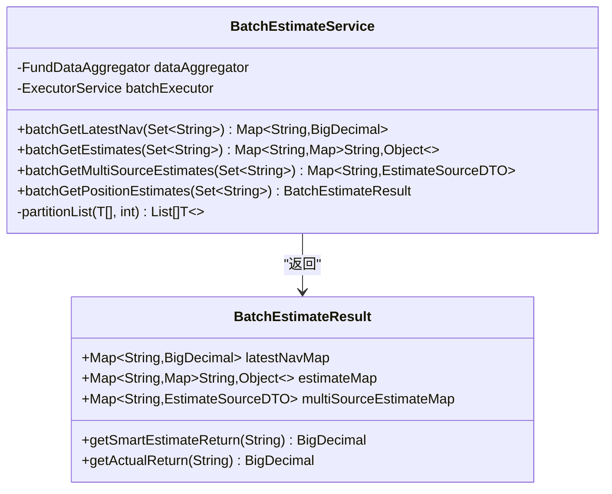

**类图来源**
- [BatchEstimateService.java:20-265](file://src/main/java/com/qoder/fund/service/BatchEstimateService.java#L20-L265)

### 权重计算服务

权重计算服务实现了复杂的自适应权重算法，根据不同场景动态调整数据源权重。

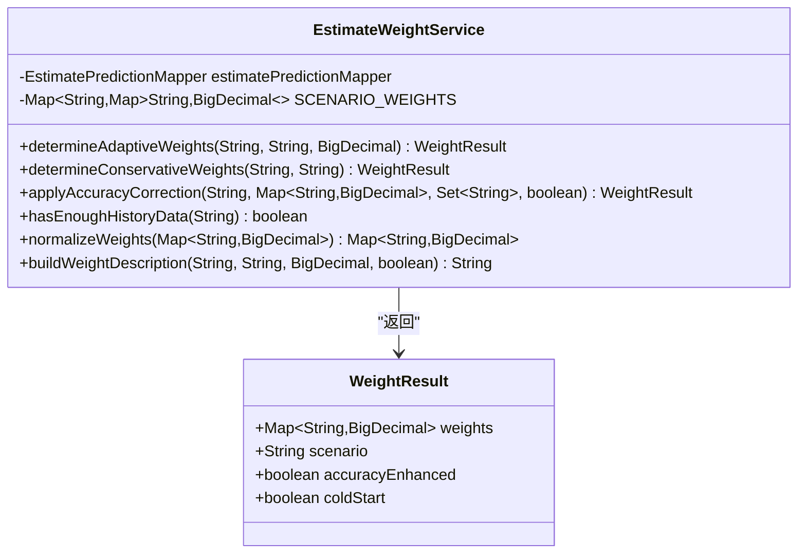

**类图来源**
- [EstimateWeightService.java:21-350](file://src/main/java/com/qoder/fund/service/EstimateWeightService.java#L21-L350)

**章节来源**
- [BatchEstimateService.java:1-265](file://src/main/java/com/qoder/fund/service/BatchEstimateService.java#L1-L265)
- [EstimateWeightService.java:1-350](file://src/main/java/com/qoder/fund/service/EstimateWeightService.java#L1-L350)

## 估值权重计算增强

### 场景化权重配置

系统根据不同的基金类型和市场环境，设置了专门的权重配置方案：

| 场景类型 | 数据源权重分配 | 特殊说明 |
|---------|---------------|----------|
| ETF实时 | 东方财富: 15% 新浪: 8% 腾讯: 7% 股票: 70% | ETF使用实时价格，股票权重最高 |
| 固收类 | 东方财富: 45% 新浪: 25% 腾讯: 25% 股票: 5% | 固收类以机构估值为主 |
| QDII | 东方财富: 40% 新浪: 25% 腾讯: 25% 股票: 10% | QDII海外估值准确性较低 |
| 权益高覆盖 | 东方财富: 30% 新浪: 18% 腾讯: 17% 股票: 35% | 重仓股覆盖率≥60% |
| 权益中覆盖 | 东方财富: 38% 新浪: 24% 腾讯: 23% 股票: 15% | 重仓股覆盖率30%-60% |
| 权益低覆盖 | 东方财富: 43% 新浪: 26% 腾讯: 26% 股票: 5% | 重仓股覆盖率<30% |

### 冷启动保护机制

对于新基金（无历史数据），系统采用保守权重策略：

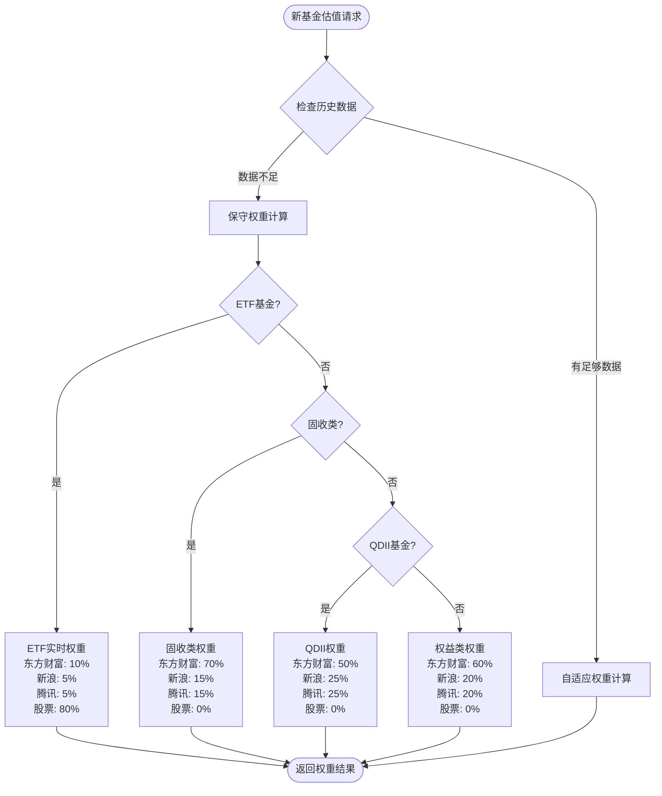

**流程图来源**
- [EstimateWeightService.java:138-182](file://src/main/java/com/qoder/fund/service/EstimateWeightService.java#L138-L182)

### 历史准确度修正

系统通过计算平均绝对误差（MAE）来动态修正权重：

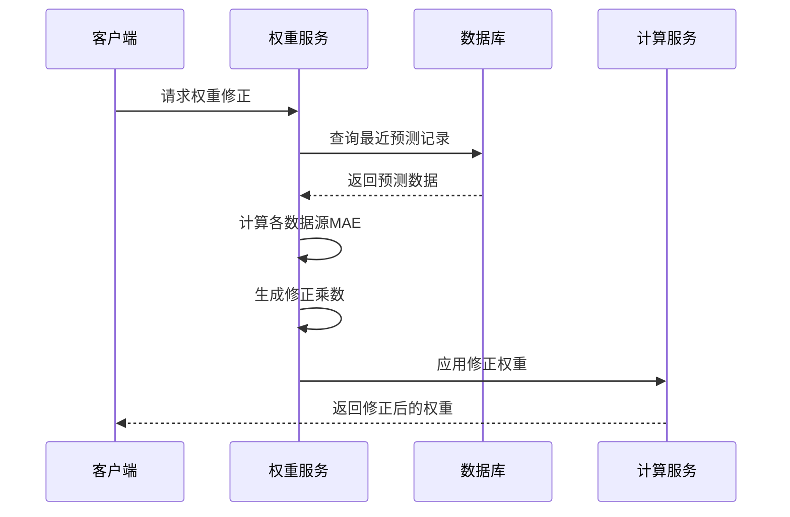

**序列图来源**
- [EstimateWeightService.java:207-293](file://src/main/java/com/qoder/fund/service/EstimateWeightService.java#L207-L293)

**章节来源**
- [EstimateWeightService.java:25-128](file://src/main/java/com/qoder/fund/service/EstimateWeightService.java#L25-L128)
- [EstimateWeightService.java:189-230](file://src/main/java/com/qoder/fund/service/EstimateWeightService.java#L189-L230)

## 股票估算覆盖率算法

### 覆盖率计算原理

股票估算覆盖率是衡量重仓股数据完整性的重要指标，直接影响估算精度。

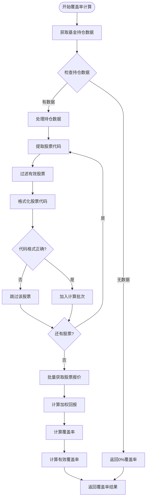

**流程图来源**
- [StockEstimateDataSource.java:53-191](file://src/main/java/com/qoder/fund/datasource/StockEstimateDataSource.java#L53-L191)

### 覆盖率计算公式

系统采用双重覆盖率计算方式：

1. **总覆盖率** = 可用持仓比例 ÷ 总持仓比例 × 100%
2. **有效覆盖率** = 实际获取行情比例 ÷ (总持仓比例 - 非港股通比例) × 100%

其中：
- 可用持仓比例 = 所有可获取行情的重仓股比例之和
- 总持仓比例 = 基金所有重仓股的原始比例之和
- 非港股通比例 = 跳过的美股、日股等非港股通标的比例

### ETF实时价格处理

对于ETF基金，系统优先使用二级市场实时交易价格：

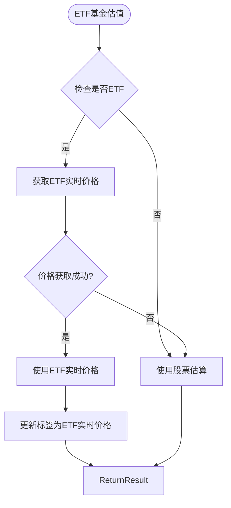

**流程图来源**
- [StockEstimateDataSource.java:196-237](file://src/main/java/com/qoder/fund/datasource/StockEstimateDataSource.java#L196-L237)

**章节来源**
- [StockEstimateDataSource.java:48-191](file://src/main/java/com/qoder/fund/datasource/StockEstimateDataSource.java#L48-L191)
- [StockEstimateDataSource.java:193-237](file://src/main/java/com/qoder/fund/datasource/StockEstimateDataSource.java#L193-L237)

## 数据流分析

### 多数据源聚合流程

系统通过数据聚合器实现多数据源的统一管理和降级处理：

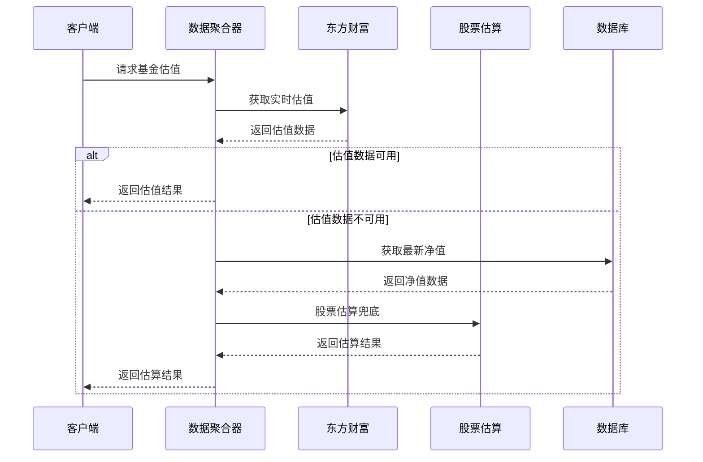

**序列图来源**
- [FundDataAggregator.java:108-128](file://src/main/java/com/qoder/fund/datasource/FundDataAggregator.java#L108-L128)

### 智能估值计算流程

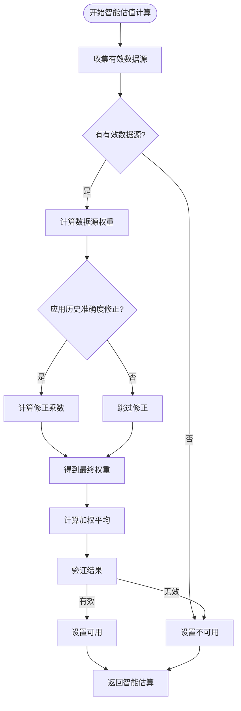

**流程图来源**
- [FundEstimateCalculator.java:34-82](file://src/main/java/com/qoder/fund/service/FundEstimateCalculator.java#L34-L82)

**章节来源**
- [FundDataAggregator.java:36-95](file://src/main/java/com/qoder/fund/datasource/FundDataAggregator.java#L36-L95)
- [FundEstimateCalculator.java:31-82](file://src/main/java/com/qoder/fund/service/FundEstimateCalculator.java#L31-L82)

## 性能优化策略

### 异步批量处理

系统采用异步并发处理提升性能：

- **线程池配置**：CPU核心数×2的固定线程池
- **分批处理**：净值查询每批10个，估值查询每批5个，多源估值每批3个
- **超时控制**：净值查询10秒，估值查询30秒，多源估值60秒

### 缓存策略

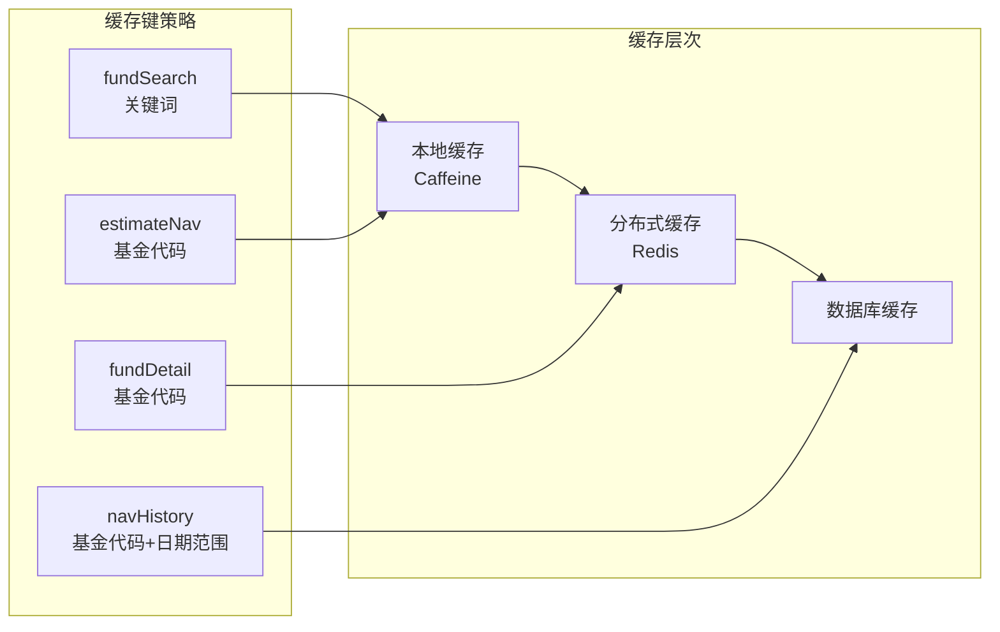

**缓存图来源**
- [application.yml:29-36](file://src/main/resources/application.yml#L29-L36)

### 熔断器模式

系统实现熔断器防止雪崩效应：

- **失败阈值**：连续3次失败触发熔断
- **恢复时间**：30秒后半开测试
- **降级策略**：熔断时返回空结果或使用备用数据源

**章节来源**
- [BatchEstimateService.java:24-34](file://src/main/java/com/qoder/fund/service/BatchEstimateService.java#L24-L34)
- [application.yml:29-36](file://src/main/resources/application.yml#L29-L36)

## 故障处理机制

### 多层降级策略

系统实现完整的故障转移机制：

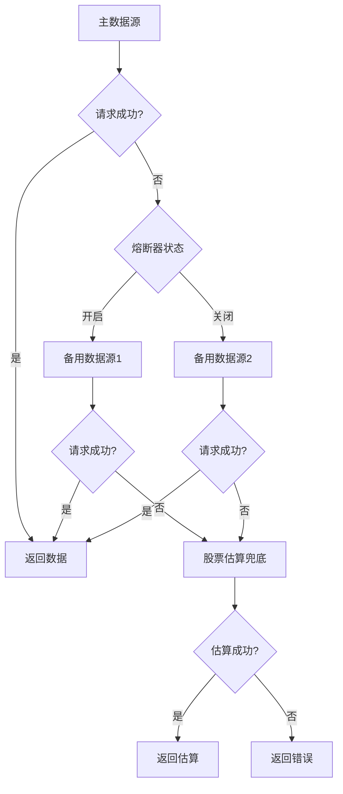

### 错误监控和日志

系统提供完整的错误追踪机制：

- **异常捕获**：所有外部API调用都有异常处理
- **日志记录**：关键错误和警告都会记录详细信息
- **性能监控**：记录每个步骤的执行时间和成功率

**章节来源**
- [FundDataAggregator.java:177-191](file://src/main/java/com/qoder/fund/datasource/FundDataAggregator.java#L177-L191)
- [StockEstimateDataSource.java:54-58](file://src/main/java/com/qoder/fund/datasource/StockEstimateDataSource.java#L54-L58)

## 总结

本项目通过以下关键技术实现了股票估算覆盖率的显著提升：

### 核心创新点

1. **场景化权重配置**：根据不同基金类型和市场环境动态调整数据源权重
2. **智能覆盖率计算**：精确计算重仓股覆盖率，提升估算精度
3. **历史准确度修正**：基于MAE计算动态修正权重，持续优化估算质量
4. **多层降级机制**：确保系统在各种故障情况下都能提供服务

### 技术优势

- **高性能**：异步并发处理，缓存优化，熔断器保护
- **高可用**：多数据源冗余，智能降级，故障转移
- **高精度**：自适应权重，历史修正，覆盖率优化
- **可观测性**：完整的日志记录，性能监控，错误追踪

### 应用价值

该系统为基金投资者提供了更加准确、可靠的估值信息服务，帮助用户做出更好的投资决策。通过持续的数据积累和算法优化，系统的估算精度将持续提升，为用户提供更优质的金融服务体验。