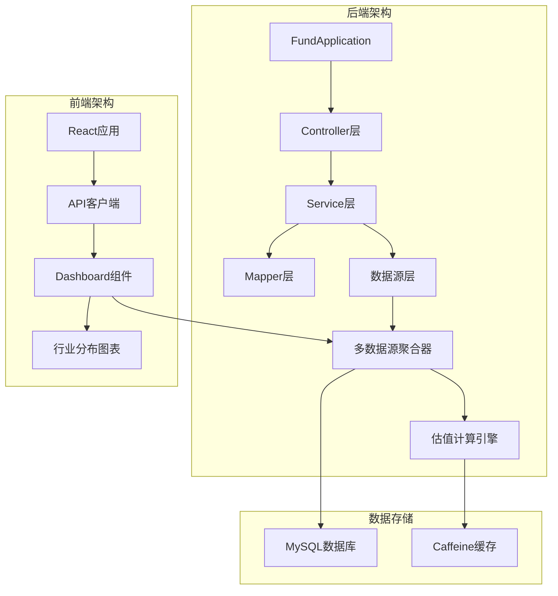
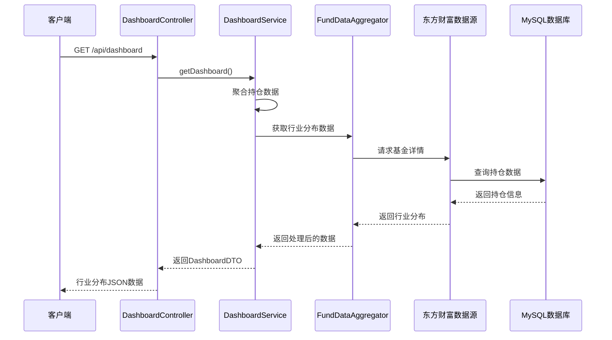
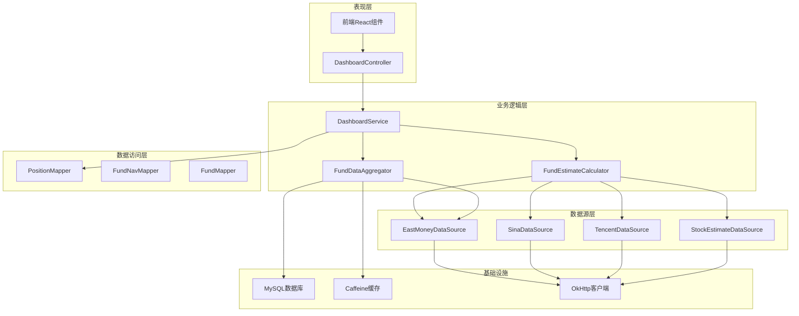
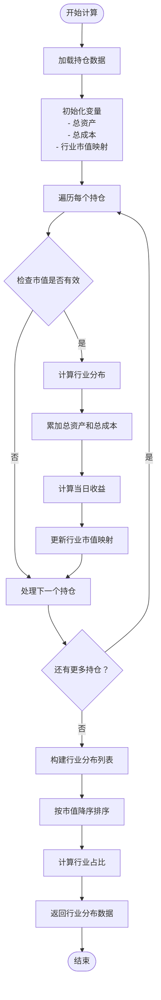
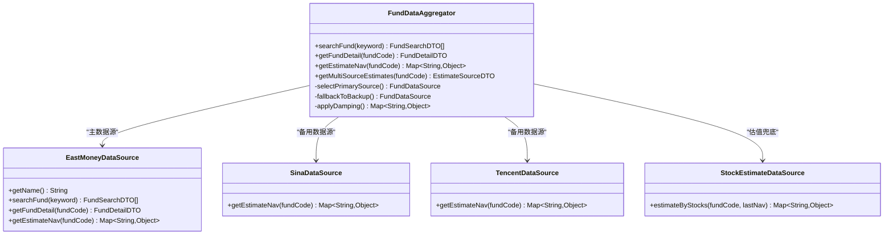
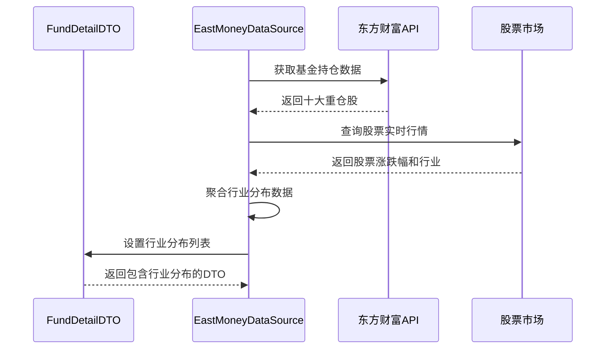
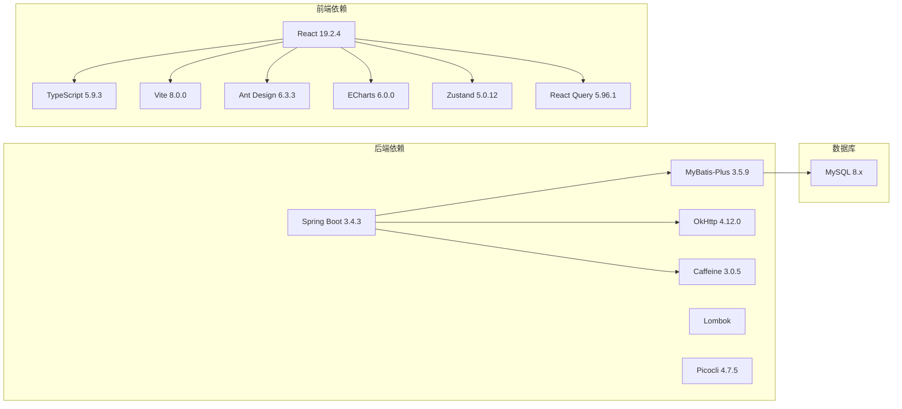

# 行业分布分析系统

<cite>
**本文档引用的文件**
- [README.md](file://README.md)
- [PRD.md](file://PRD.md)
- [application.yml](file://src/main/resources/application.yml)
- [pom.xml](file://pom.xml)
- [FundApplication.java](file://src/main/java/com/qoder/fund/FundApplication.java)
- [DashboardController.java](file://src/main/java/com/qoder/fund/controller/DashboardController.java)
- [DashboardService.java](file://src/main/java/com/qoder/fund/service/DashboardService.java)
- [EastMoneyDataSource.java](file://src/main/java/com/qoder/fund/datasource/EastMoneyDataSource.java)
- [FundDataAggregator.java](file://src/main/java/com/qoder/fund/datasource/FundDataAggregator.java)
- [FundEstimateCalculator.java](file://src/main/java/com/qoder/fund/service/FundEstimateCalculator.java)
- [DashboardDTO.java](file://src/main/java/com/qoder/fund/dto/DashboardDTO.java)
- [Position.java](file://src/main/java/com/qoder/fund/entity/Position.java)
- [PositionMapper.java](file://src/main/java/com/qoder/fund/mapper/PositionMapper.java)
- [package.json](file://fund-web/package.json)
</cite>

## 目录
1. [简介](#简介)
2. [项目结构](#项目结构)
3. [核心组件](#核心组件)
4. [架构概览](#架构概览)
5. [详细组件分析](#详细组件分析)
6. [依赖关系分析](#依赖关系分析)
7. [性能考虑](#性能考虑)
8. [故障排除指南](#故障排除指南)
9. [结论](#结论)

## 简介

行业分布分析系统是"基金管家"项目中的核心功能模块，专注于为用户提供基金投资组合的行业分布分析。该系统通过多数据源聚合、智能估值计算和实时数据更新，帮助投资者了解其投资组合在不同行业间的配置情况。

系统采用前后端分离架构，后端基于Spring Boot框架，前端使用React技术栈，实现了完整的行业分布分析功能，包括资产配置饼图展示、行业权重计算和实时更新机制。

## 项目结构

项目采用典型的MVC分层架构，主要分为后端Spring Boot应用和前端React应用两个部分：

**图表来源**
- [FundApplication.java:1-16](file://src/main/java/com/qoder/fund/FundApplication.java#L1-L16)
- [DashboardController.java:1-36](file://src/main/java/com/qoder/fund/controller/DashboardController.java#L1-L36)

**章节来源**
- [README.md:173-204](file://README.md#L173-L204)
- [pom.xml:1-163](file://pom.xml#L1-L163)

## 核心组件

### 行业分布分析核心流程

系统的核心功能围绕以下关键组件展开：

1. **DashboardService**: 负责行业分布数据的聚合和计算
2. **FundDataAggregator**: 多数据源聚合和估值计算
3. **EastMoneyDataSource**: 东方财富数据源适配器
4. **DashboardController**: API接口控制器
5. **DashboardDTO**: 数据传输对象

### 数据流处理

**图表来源**
- [DashboardController.java:18-21](file://src/main/java/com/qoder/fund/controller/DashboardController.java#L18-L21)
- [DashboardService.java:37-154](file://src/main/java/com/qoder/fund/service/DashboardService.java#L37-L154)
- [FundDataAggregator.java:69-95](file://src/main/java/com/qoder/fund/datasource/FundDataAggregator.java#L69-L95)

**章节来源**
- [DashboardService.java:49-126](file://src/main/java/com/qoder/fund/service/DashboardService.java#L49-L126)
- [DashboardDTO.java:22-23](file://src/main/java/com/qoder/fund/dto/DashboardDTO.java#L22-L23)

## 架构概览

系统采用分层架构设计，确保了良好的可维护性和扩展性：

**图表来源**
- [DashboardController.java:1-36](file://src/main/java/com/qoder/fund/controller/DashboardController.java#L1-L36)
- [DashboardService.java:1-472](file://src/main/java/com/qoder/fund/service/DashboardService.java#L1-L472)
- [FundDataAggregator.java:45-55](file://src/main/java/com/qoder/fund/datasource/FundDataAggregator.java#L45-L55)

## 详细组件分析

### DashboardService - 行业分布核心处理器

DashboardService是行业分布分析的核心组件，负责聚合和计算投资组合的行业分布数据。

#### 行业分布计算算法

**图表来源**
- [DashboardService.java:49-126](file://src/main/java/com/qoder/fund/service/DashboardService.java#L49-L126)

#### 关键计算逻辑

系统采用**按市值加权**的方式计算行业分布，确保分析结果能够准确反映投资组合的真实行业暴露程度。

**章节来源**
- [DashboardService.java:84-126](file://src/main/java/com/qoder/fund/service/DashboardService.java#L84-L126)

### FundDataAggregator - 多数据源聚合器

FundDataAggregator负责整合多个数据源的信息，提供统一的数据访问接口。

#### 数据源选择策略

**图表来源**
- [FundDataAggregator.java:45-55](file://src/main/java/com/qoder/fund/datasource/FundDataAggregator.java#L45-L55)
- [EastMoneyDataSource.java:26-46](file://src/main/java/com/qoder/fund/datasource/EastMoneyDataSource.java#L26-L46)

#### 智能估值计算

系统实现了复杂的估值计算机制，包括：

1. **多源数据验证**: 通过多个数据源交叉验证估值准确性
2. **权重动态调整**: 基于历史准确度数据动态调整各数据源权重
3. **智能综合估算**: 在数据源不可用时提供可靠的估算值

**章节来源**
- [FundDataAggregator.java:216-340](file://src/main/java/com/qoder/fund/datasource/FundDataAggregator.java#L216-L340)

### EastMoneyDataSource - 东方财富数据源

EastMoneyDataSource是系统的主要数据源，提供了丰富的基金数据和行业分布信息。

#### 行业分布数据提取

**图表来源**
- [EastMoneyDataSource.java:598-705](file://src/main/java/com/qoder/fund/datasource/EastMoneyDataSource.java#L598-L705)

#### 实时数据增强

系统通过实时股票行情API丰富持仓数据，实现：

1. **行业信息补充**: 为每只持仓股票添加所属行业标签
2. **实时涨跌幅**: 获取每只股票的最新涨跌幅数据
3. **行业分布聚合**: 基于持仓比例和实时涨跌幅计算行业加权收益

**章节来源**
- [EastMoneyDataSource.java:598-705](file://src/main/java/com/qoder/fund/datasource/EastMoneyDataSource.java#L598-L705)

### DashboardController - API接口层

DashboardController提供RESTful API接口，对外暴露行业分布分析功能。

#### 接口设计

| 接口路径 | 方法 | 功能描述 | 参数 |
|---------|------|----------|------|
| `/api/dashboard` | GET | 获取仪表板数据 | 无 |
| `/api/dashboard/profit-trend` | GET | 获取收益趋势 | days(默认7) |
| `/api/dashboard/profit-analysis` | GET | 获取收益分析 | days(默认30) |

**章节来源**
- [DashboardController.java:18-34](file://src/main/java/com/qoder/fund/controller/DashboardController.java#L18-L34)

## 依赖关系分析

系统采用了现代化的技术栈，确保了良好的性能和可维护性。

**图表来源**
- [pom.xml:20-105](file://pom.xml#L20-L105)
- [package.json:12-38](file://fund-web/package.json#L12-L38)

### 核心配置

系统的关键配置包括：

1. **数据库连接**: 使用MySQL 8.0，配置了连接池参数
2. **缓存策略**: 使用Caffeine本地缓存，提高数据访问性能
3. **API配置**: 配置了Actuator健康检查和监控端点

**章节来源**
- [application.yml:7-32](file://src/main/resources/application.yml#L7-L32)

## 性能考虑

系统在设计时充分考虑了性能优化，采用了多种策略来确保良好的用户体验：

### 缓存策略

- **多级缓存**: 使用Caffeine本地缓存和数据库缓存相结合
- **智能过期**: 配置了合理的缓存过期时间，平衡数据新鲜度和性能
- **缓存穿透防护**: 对空结果也进行缓存，防止重复请求

### 数据源优化

- **并发请求**: 支持多数据源并发请求，提高数据获取效率
- **熔断机制**: 实现了熔断器模式，防止数据源故障影响整体系统
- **降级策略**: 当主数据源不可用时，自动切换到备用数据源

### 前端性能

- **懒加载**: React组件支持懒加载，减少初始加载时间
- **状态管理**: 使用Zustand进行轻量级状态管理
- **图表优化**: ECharts图表支持虚拟滚动和数据压缩

## 故障排除指南

### 常见问题及解决方案

#### 数据源连接问题

**症状**: 行业分布数据无法获取或显示为空白

**排查步骤**:
1. 检查网络连接是否正常
2. 验证数据源API是否可达
3. 查看熔断器状态

**解决方案**:
- 检查防火墙设置
- 验证API密钥配置
- 查看系统日志获取详细错误信息

#### 性能问题

**症状**: 页面加载缓慢或响应超时

**排查步骤**:
1. 检查数据库连接池状态
2. 监控缓存命中率
3. 分析API响应时间

**解决方案**:
- 调整缓存配置
- 优化数据库查询
- 增加服务器资源

#### 数据不一致

**症状**: 行业分布数据与预期不符

**排查步骤**:
1. 检查数据源返回的数据格式
2. 验证行业分类规则
3. 确认计算逻辑的正确性

**解决方案**:
- 更新数据源适配器
- 调整行业分类映射
- 重新计算历史数据

**章节来源**
- [EastMoneyDataSource.java:50-88](file://src/main/java/com/qoder/fund/datasource/EastMoneyDataSource.java#L50-L88)
- [FundDataAggregator.java:342-351](file://src/main/java/com/qoder/fund/datasource/FundDataAggregator.java#L342-L351)

## 结论

行业分布分析系统通过精心设计的架构和算法，为用户提供了准确、实时的投资组合行业分布分析功能。系统的主要优势包括：

1. **多数据源聚合**: 通过多个数据源交叉验证，确保数据准确性
2. **智能计算算法**: 采用按市值加权的行业分布计算，反映真实的行业暴露
3. **高性能架构**: 结合缓存策略和并发优化，提供流畅的用户体验
4. **可扩展设计**: 模块化的架构设计便于功能扩展和维护

该系统不仅满足了当前的功能需求，还为未来的功能扩展奠定了坚实的基础。通过持续的优化和改进，系统将继续为用户提供更好的投资决策支持。