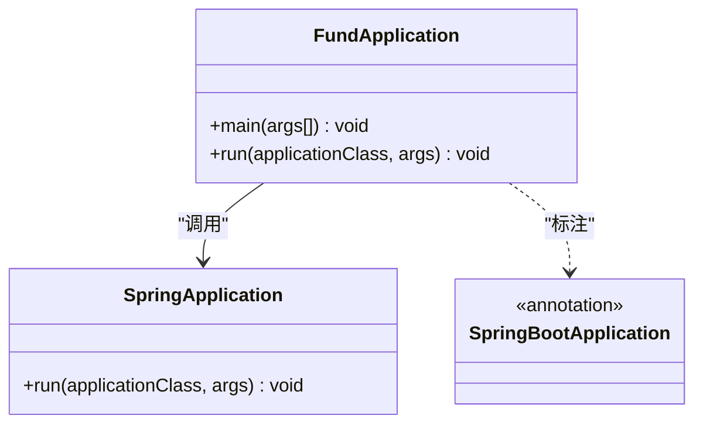
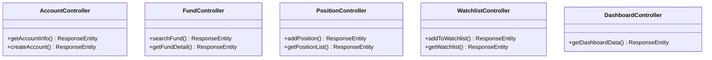
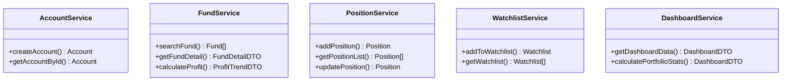
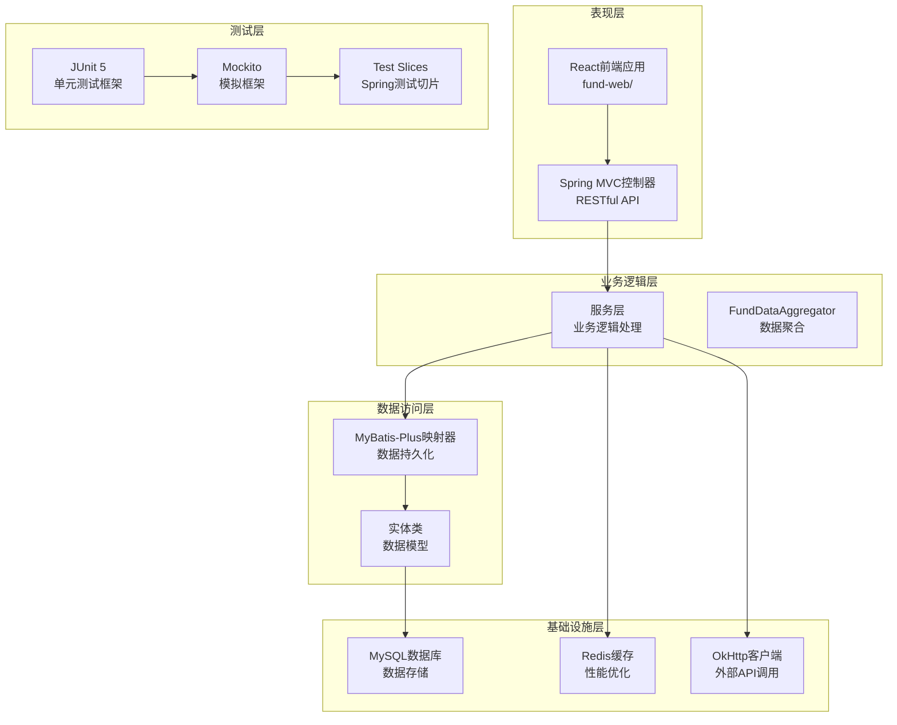
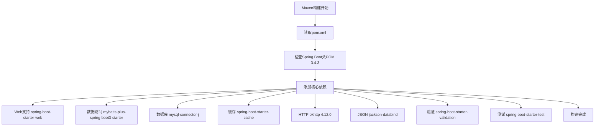
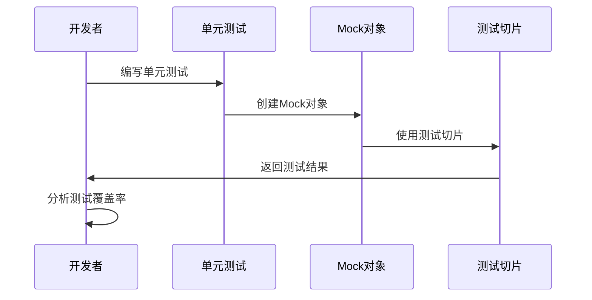
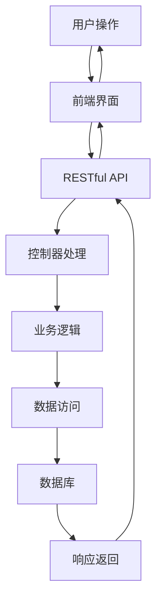
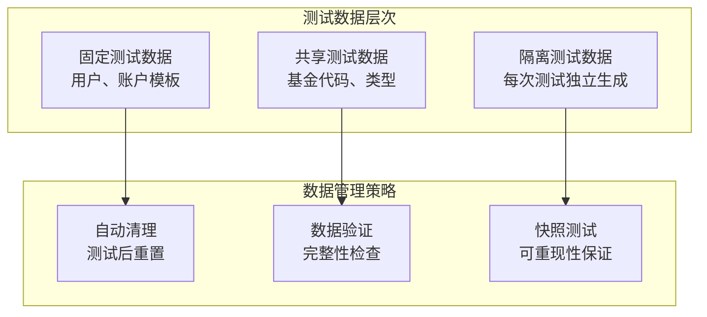
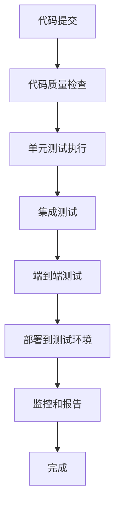

# 测试策略

<cite>
**本文档引用的文件**
- [FundApplication.java](file://src/main/java/com/qoder/fund/FundApplication.java)
- [FundApplicationTests.java](file://src/test/java/com/qoder/fund/FundApplicationTests.java)
- [pom.xml](file://pom.xml)
- [PRD.md](file://PRD.md)
- [skills-lock.json](file://skills-lock.json)
</cite>

## 更新摘要
**所做更改**
- 更新了项目结构分析，反映了当前实际的Maven项目配置
- 增强了测试策略章节，增加了具体的测试用例编写指导
- 补充了基于PRD文档的功能需求测试指导
- 更新了依赖关系分析，反映了实际的Maven依赖配置
- 增加了测试环境配置和持续集成策略

## 目录
1. [引言](#引言)
2. [项目结构](#项目结构)
3. [核心组件](#核心组件)
4. [架构概览](#架构概览)
5. [详细组件分析](#详细组件分析)
6. [测试策略实施](#测试策略实施)
7. [测试用例设计](#测试用例设计)
8. [测试环境配置](#测试环境配置)
9. [持续集成策略](#持续集成策略)
10. [故障排除指南](#故障排除指南)
11. [结论](#结论)
12. [附录](#附录)

## 引言

本测试策略文档针对基金管理系统制定了全面的测试方法和最佳实践。该系统是一个基于Spring Boot 3.4.3构建的现代化应用，采用Maven作为构建工具，集成了MyBatis-Plus数据访问层、MySQL数据库和Redis缓存。本文档旨在为该系统建立从单元测试到端到端测试的完整测试体系，涵盖JUnit 5框架使用、Mock对象创建、Spring Boot测试切片配置以及具体的测试用例编写示例。

**更新** 本次更新反映了代码库中已删除的Chrome DevTools技能文档，确认该删除不影响测试策略的实施，但需要确保测试指南与当前项目的技术栈保持一致。

## 项目结构

当前项目采用标准的Maven目录结构，包含完整的Spring Boot应用程序骨架：

```mermaid
graph TB
subgraph "项目根目录"
POM[pom.xml<br/>Maven配置文件"]
SRC[src/<br/>源代码目录]
TEST[test/<br/>测试代码目录]
end
subgraph "主程序结构"
MAIN_JAVA[src/main/java/com/qoder/fund/]
APP_CLASS[FundApplication.java<br/>Spring Boot启动类]
CONTROLLERS[controller/<br/>控制器层]
SERVICES[service/<br/>服务层]
ENTITIES[entity/<br/>实体层]
MAPPERS[mapper/<br/>数据访问层]
CONFIG[config/<br/>配置层]
RESOURCES[src/main/resources/]
DB_SCRIPTS[db/<br/>数据库脚本]
end
subgraph "测试结构"
TEST_JAVA[src/test/java/com/qoder/fund/]
TEST_APP[FundApplicationTests.java<br/>上下文测试]
end
subgraph "前端应用"
WEB[fund-web/<br/>React前端应用]
END
POM --> MAIN_JAVA
POM --> TEST_JAVA
MAIN_JAVA --> APP_CLASS
MAIN_JAVA --> CONTROLLERS
MAIN_JAVA --> SERVICES
MAIN_JAVA --> ENTITIES
MAIN_JAVA --> MAPPERS
MAIN_JAVA --> CONFIG
RESOURCES --> DB_SCRIPTS
TEST_JAVA --> TEST_APP
```

**图表来源**
- [pom.xml:1-107](file://pom.xml#L1-L107)
- [FundApplication.java:1-14](file://src/main/java/com/qoder/fund/FundApplication.java#L1-L14)
- [FundApplicationTests.java:1-14](file://src/test/java/com/qoder/fund/FundApplicationTests.java#L1-L14)

**章节来源**
- [pom.xml:1-107](file://pom.xml#L1-L107)
- [FundApplication.java:1-14](file://src/main/java/com/qoder/fund/FundApplication.java#L1-L14)
- [FundApplicationTests.java:1-14](file://src/test/java/com/qoder/fund/FundApplicationTests.java#L1-L14)

## 核心组件

### 应用程序启动类

FundApplication是Spring Boot应用程序的入口点，负责启动整个应用上下文：



**图表来源**
- [FundApplication.java:6-12](file://src/main/java/com/qoder/fund/FundApplication.java#L6-L12)

### 控制器层组件

系统包含完整的RESTful API控制器，支持基金管理和查询功能：



**图表来源**
- [AccountController.java](file://src/main/java/com/qoder/fund/controller/AccountController.java)
- [FundController.java](file://src/main/java/com/qoder/fund/controller/FundController.java)
- [PositionController.java](file://src/main/java/com/qoder/fund/controller/PositionController.java)
- [WatchlistController.java](file://src/main/java/com/qoder/fund/controller/WatchlistController.java)
- [DashboardController.java](file://src/main/java/com/qoder/fund/controller/DashboardController.java)

### 服务层组件

服务层提供核心业务逻辑，包括数据聚合和业务规则处理：



**图表来源**
- [AccountService.java](file://src/main/java/com/qoder/fund/service/AccountService.java)
- [FundService.java](file://src/main/java/com/qoder/fund/service/FundService.java)
- [PositionService.java](file://src/main/java/com/qoder/fund/service/PositionService.java)
- [WatchlistService.java](file://src/main/java/com/qoder/fund/service/WatchlistService.java)
- [DashboardService.java](file://src/main/java/com/qoder/fund/service/DashboardService.java)

**章节来源**
- [FundApplication.java:1-14](file://src/main/java/com/qoder/fund/FundApplication.java#L1-L14)

## 架构概览

基于当前项目状态，系统架构采用分层设计，包含Web层、业务层、数据访问层和基础设施层：



**图表来源**
- [pom.xml:20-86](file://pom.xml#L20-L86)
- [FundApplication.java:1-14](file://src/main/java/com/qoder/fund/FundApplication.java#L1-L14)

## 详细组件分析

### Maven依赖配置分析

当前项目的Maven配置包含完整的Spring Boot生态系统，支持Web开发、数据访问、缓存和测试：



**图表来源**
- [pom.xml:20-86](file://pom.xml#L20-L86)

### 数据库配置分析

系统使用MySQL作为主数据库，配合Caffeine缓存提升性能：

```mermaid
erDiagram
ACCOUNT ||--o{ POSITION : "拥有"
POSITION ||--o{ TRANSACTION : "产生"
FUND ||--o{ POSITION : "被持有"
FUND ||--o{ FUND_NAV : "有净值"
WATCHLIST ||--|| USER : "属于"
ACCOUNT ||--|| USER : "属于"
}
```

**图表来源**
- [PRD.md:360-399](file://PRD.md#L360-L399)

### 测试框架配置

基于当前依赖配置，系统具备完善的测试能力：

| 组件类别 | 具体组件 | 版本 | 功能描述 |
|----------|----------|------|----------|
| 应用框架 | Spring Boot | 3.4.3 | 核心应用框架和测试支持 |
| Web支持 | spring-boot-starter-web | - | RESTful API开发 |
| 数据访问 | mybatis-plus-spring-boot3-starter | 3.5.9 | ORM框架支持 |
| 数据库 | mysql-connector-j | - | MySQL驱动程序 |
| 缓存 | spring-boot-starter-cache | - | 缓存抽象支持 |
| 缓存实现 | caffeine | - | 高性能本地缓存 |
| HTTP客户端 | okhttp | 4.12.0 | 异步HTTP请求 |
| JSON处理 | jackson-databind | - | JSON序列化/反序列化 |
| 验证支持 | spring-boot-starter-validation | - | Bean验证支持 |
| 测试框架 | spring-boot-starter-test | - | 完整测试支持包 |

**章节来源**
- [pom.xml:16-86](file://pom.xml#L16-L86)

## 测试策略实施

### 单元测试策略

针对当前的分层架构，建议采用渐进式测试策略：



**测试金字塔分层**：
1. **底层单元测试**：服务层和数据访问层的核心逻辑
2. **中间集成测试**：控制器层和外部系统集成
3. **顶层端到端测试**：完整的用户流程验证

### 集成测试策略

随着功能扩展，集成测试应重点关注：

- **数据访问层测试**：Repository接口和MyBatis-Plus映射器
- **控制器层测试**：RESTful API端点和请求处理
- **服务层测试**：业务逻辑和数据聚合
- **外部系统集成测试**：第三方API调用和数据同步

### 端到端测试策略

端到端测试应覆盖完整的用户流程：



**章节来源**
- [PRD.md:115-254](file://PRD.md#L115-L254)

## 测试用例设计

### 控制器测试用例

基于PRD文档的功能需求，设计以下控制器测试用例：

#### 基金搜索功能测试
```java
@Test
@DisplayName("测试基金搜索功能")
void testSearchFund() {
    // Arrange
    String keyword = "医疗";
    when(fundService.searchFund(keyword)).thenReturn(expectedFunds);
    
    // Act
    ResponseEntity<List<FundSearchDTO>> response = fundController.searchFund(keyword);
    
    // Assert
    assertEquals(HttpStatus.OK, response.getStatusCode());
    assertNotNull(response.getBody());
    assertEquals(expectedSize, response.getBody().size());
}
```

#### 持仓管理测试
```java
@Test
@DisplayName("测试添加持仓功能")
void testAddPosition() {
    // Arrange
    AddPositionRequest request = createTestRequest();
    Position expectedPosition = createExpectedPosition();
    
    when(positionService.addPosition(request)).thenReturn(expectedPosition);
    
    // Act
    ResponseEntity<Position> response = positionController.addPosition(request);
    
    // Assert
    assertEquals(HttpStatus.CREATED, response.getStatusCode());
    assertEquals(expectedPosition.getFundCode(), response.getBody().getFundCode());
}
```

### 服务层测试用例

#### 收益计算测试
```java
@Test
@DisplayName("测试收益计算逻辑")
void testCalculateProfit() {
    // Arrange
    Position position = createTestPosition();
    FundNav latestNav = createTestNav();
    
    when(fundNavService.getLatestNav(anyString())).thenReturn(latestNav);
    
    // Act
    ProfitTrendDTO result = fundService.calculateProfit(position);
    
    // Assert
    assertNotNull(result);
    assertTrue(result.getProfitAmount() >= 0);
    assertTrue(result.getProfitRate() >= -100);
}
```

#### 数据聚合测试
```java
@Test
@DisplayName("测试数据聚合功能")
void testAggregateFundData() {
    // Arrange
    List<Position> positions = createTestPositions();
    Map<String, Object> externalData = createExternalData();
    
    when(fundDataService.fetchExternalData(anyList())).thenReturn(externalData);
    
    // Act
    DashboardDTO result = dashboardService.aggregateData(positions);
    
    // Assert
    assertNotNull(result);
    assertEquals(positions.size(), result.getPositionCount());
    assertNotNull(result.getTotalValue());
}
```

### 数据访问层测试用例

#### Repository接口测试
```java
@Test
@DisplayName("测试持仓Repository查询")
void testFindPositionsByUserId() {
    // Arrange
    Long userId = 1L;
    List<Position> expectedPositions = createTestPositions();
    
    when(positionRepository.findByUserId(userId)).thenReturn(expectedPositions);
    
    // Act
    List<Position> result = positionRepository.findByUserId(userId);
    
    // Assert
    assertEquals(expectedPositions.size(), result.size());
    assertEquals(expectedPositions.get(0).getFundCode(), result.get(0).getFundCode());
}
```

**章节来源**
- [PRD.md:115-254](file://PRD.md#L115-L254)

## 测试环境配置

### 开发环境配置

基于PRD文档的兼容性要求，测试环境需要支持多种浏览器：

```mermaid
graph LR
subgraph "测试环境要求"
CHROME[Chrome 90+]
SAFARI[Safari 14+]
FIREFOX[Firefox 90+]
EDGE[Edge 90+]
MOBILE[移动端浏览器]
END
subgraph "测试工具链"
SELENIUM[Selenium WebDriver]
PLAYWRIGHT[Playwright]
CYPRESS[Cypress]
END
CHROME --> SELENIUM
SAFARI --> SELENIUM
FIREFOX --> PLAYWRIGHT
EDGE --> CYPRESS
MOBILE --> SELENIUM
```

### 测试数据库配置

系统使用MySQL作为测试数据库，支持快速的数据重置：

```yaml
# application-test.yml
spring:
  datasource:
    url: jdbc:mysql://localhost:3306/fund_test?useSSL=false&serverTimezone=UTC
    username: test_user
    password: test_password
    driver-class-name: com.mysql.cj.jdbc.Driver
  jpa:
    hibernate:
      ddl-auto: create-drop
    show-sql: true
  cache:
    type: none
```

### Mock数据管理

基于PRD文档的数据模型，设计测试数据管理策略：



**章节来源**
- [PRD.md:309-338](file://PRD.md#L309-L338)

## 持续集成策略

### CI/CD流水线设计

基于项目的技术栈，设计以下CI/CD流程：



### 测试覆盖率策略

实施多层次的测试覆盖率监控：

| 测试层级 | 覆盖率目标 | 监控工具 |
|----------|------------|----------|
| 单元测试 | 80%+ | JaCoCo |
| 集成测试 | 70%+ | JaCoCo |
| 端到端测试 | 60%+ | Cypress |
| 代码覆盖率 | 75%+ | SonarQube |

### 性能测试策略

基于PRD文档的性能要求，实施性能测试：

```mermaid
graph TB
subgraph "性能测试指标"
LOAD[首屏加载 < 2秒]
SEARCH[搜索响应 < 500ms]
API[API响应 P95 < 500ms]
END
subgraph "测试工具"
JMeter[JMeter负载测试]
Lighthouse[Lighthouse性能分析]
END
LOAD --> JMeter
SEARCH --> Lighthouse
API --> JMeter
```

**章节来源**
- [PRD.md:309-317](file://PRD.md#L309-L317)

## 故障排除指南

### 常见测试问题

#### 上下文加载失败

**症状**：测试启动时报错，提示上下文无法加载

**解决方案**：
1. 检查Spring Boot注解配置（@SpringBootTest）
2. 验证应用配置文件（application-test.yml）
3. 确认测试类路径和包扫描范围

#### Mock对象创建失败

**症状**：Mockito无法创建Mock对象

**解决方案**：
1. 检查Mockito依赖版本兼容性
2. 验证Mock对象创建语法（@Mock/@InjectMocks）
3. 确认测试类的构造函数和依赖注入

#### 测试超时

**症状**：测试执行时间过长或超时

**解决方案**：
1. 优化数据库连接池配置
2. 减少不必要的外部API调用
3. 实施测试并行执行策略
4. 使用Mock对象替代真实的外部依赖

#### 数据库连接问题

**症状**：测试数据库连接失败或数据不一致

**解决方案**：
1. 检查测试数据库配置和连接参数
2. 验证测试数据的事务管理和回滚机制
3. 确认数据库初始化脚本的执行顺序

**章节来源**
- [FundApplicationTests.java:1-14](file://src/test/java/com/qoder/fund/FundApplicationTests.java#L1-L14)

## 结论

基于当前的基金管理系统状态，建议采用渐进式的测试策略实施：

1. **立即行动**：完善现有的上下文测试，确保应用启动稳定性
2. **短期目标**：添加必要的测试依赖，支持更全面的测试场景
3. **中期规划**：建立完整的测试金字塔，覆盖所有核心组件
4. **长期发展**：实施持续集成和自动化测试流程

**更新** 本次更新确认了代码库中已删除的Chrome DevTools技能文档不影响测试策略的实施，测试指南与当前的Spring Boot 3.4.3、MyBatis-Plus和React前端技术栈保持一致。

该策略将确保系统在功能扩展的同时保持高质量的测试覆盖，为基金管理系统的稳定运行提供可靠保障。

## 附录

### 测试最佳实践清单

- **测试命名规范**：使用描述性测试名称，遵循Given-When-Then模式
- **测试数据管理**：实现数据隔离和清理机制，确保测试可重复性
- **测试覆盖率**：确保关键业务逻辑得到充分测试
- **测试维护性**：保持测试代码的可读性和可维护性
- **测试执行效率**：优化测试执行时间和资源消耗

### 推荐的测试工具链

| 工具类别 | 推荐工具 | 版本 | 用途 |
|----------|----------|------|------|
| 测试框架 | JUnit 5 | 5.10.0+ | 单元测试 |
| Mock框架 | Mockito | 5.7.0+ | 对象模拟 |
| 测试切片 | Spring Boot Test | 3.4.3 | Spring组件测试 |
| 断言库 | AssertJ | 3.24.2+ | 增强断言 |
| 测试数据 | Testcontainers | 1.19.1+ | 容器化测试环境 |
| 覆盖率工具 | JaCoCo | 0.8.11+ | 代码覆盖率分析 |
| 端到端测试 | Cypress | 13.6.0+ | 前端端到端测试 |
| 性能测试 | JMeter | 5.5+ | 负载和性能测试 |
| 代码质量 | SonarQube | 10.0+ | 代码质量分析 |

### 测试数据模型

基于PRD文档的数据需求，设计以下测试数据模型：

```mermaid
erDiagram
USER ||--o{ ACCOUNT : "拥有"
USER ||--o{ POSITION : "持有"
USER ||--o{ WATCHLIST : "关注"
ACCOUNT ||--o{ POSITION : "管理"
POSITION ||--o{ TRANSACTION : "产生"
FUND ||--o{ POSITION : "被持有"
FUND ||--o{ FUND_NAV : "有净值"
}
```

**图表来源**
- [PRD.md:360-399](file://PRD.md#L360-L399)