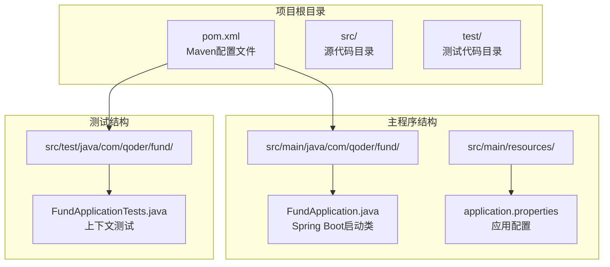
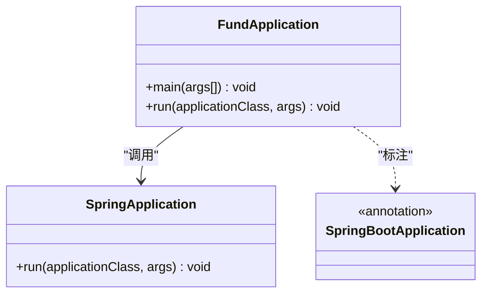
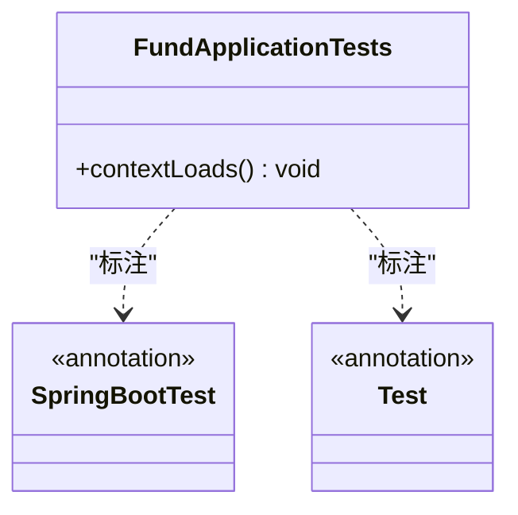
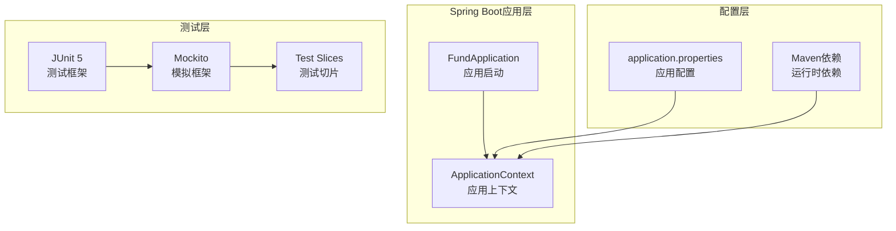
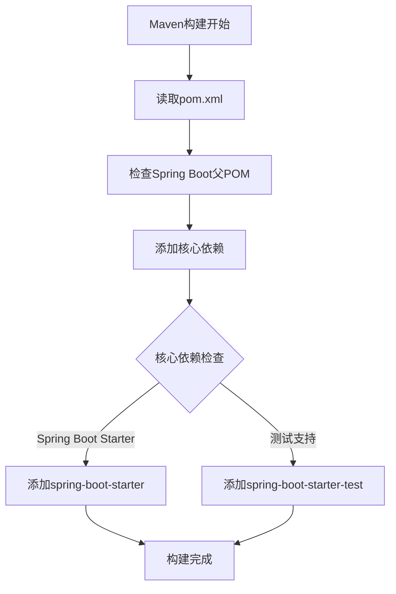
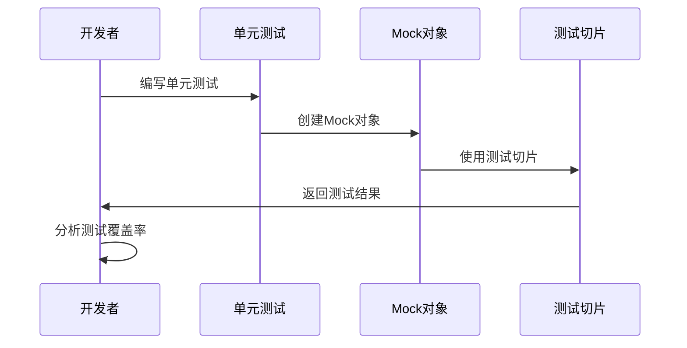
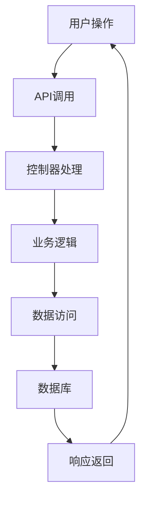
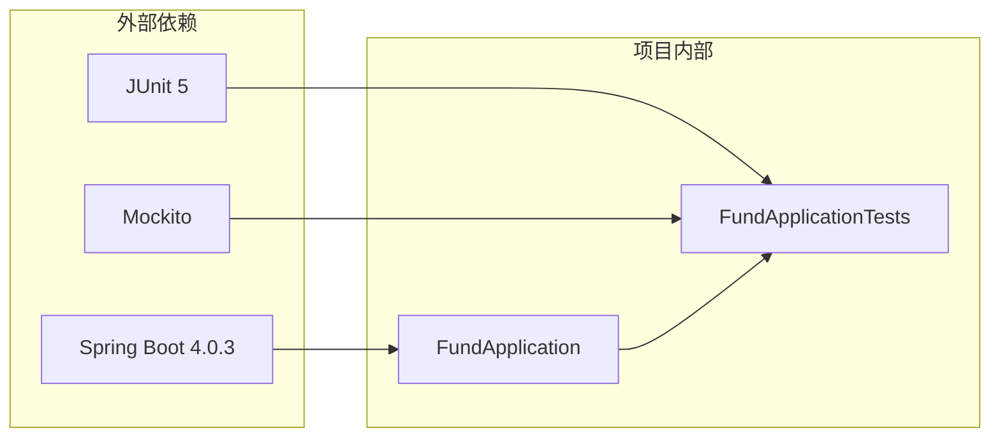
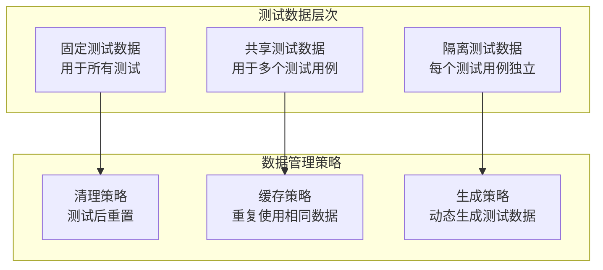

# 测试策略

<cite>
**本文档引用的文件**
- [FundApplication.java](file://src/main/java/com/qoder/fund/FundApplication.java)
- [FundApplicationTests.java](file://src/test/java/com/qoder/fund/FundApplicationTests.java)
- [application.properties](file://src/main/resources/application.properties)
- [pom.xml](file://pom.xml)
</cite>

## 目录
1. [引言](#引言)
2. [项目结构](#项目结构)
3. [核心组件](#核心组件)
4. [架构概览](#架构概览)
5. [详细组件分析](#详细组件分析)
6. [依赖关系分析](#依赖关系分析)
7. [性能考虑](#性能考虑)
8. [故障排除指南](#故障排除指南)
9. [结论](#结论)
10. [附录](#附录)

## 引言

本测试策略文档针对基金管理系统制定了全面的测试方法和最佳实践。该系统是一个基于Spring Boot 4.0.3构建的基础应用，当前仅包含基本的启动类和上下文加载测试。本文档旨在为该系统建立从单元测试到端到端测试的完整测试体系，涵盖JUnit 5框架使用、Mock对象创建、Spring Boot测试切片配置以及具体的测试用例编写示例。

## 项目结构

当前项目采用标准的Maven目录结构，包含最小化的Spring Boot应用程序骨架：

**图表来源**
- [pom.xml:1-55](file://pom.xml#L1-L55)
- [FundApplication.java:1-14](file://src/main/java/com/qoder/fund/FundApplication.java#L1-L14)
- [FundApplicationTests.java:1-14](file://src/test/java/com/qoder/fund/FundApplicationTests.java#L1-L14)

**章节来源**
- [pom.xml:1-55](file://pom.xml#L1-L55)
- [FundApplication.java:1-14](file://src/main/java/com/qoder/fund/FundApplication.java#L1-L14)
- [FundApplicationTests.java:1-14](file://src/test/java/com/qoder/fund/FundApplicationTests.java#L1-L14)

## 核心组件

### 应用程序启动类

FundApplication是Spring Boot应用程序的入口点，负责启动整个应用上下文：

**图表来源**
- [FundApplication.java:6-12](file://src/main/java/com/qoder/fund/FundApplication.java#L6-L12)

### 基础测试套件

当前项目包含一个简单的上下文测试，验证Spring Boot应用能够正确启动：

**图表来源**
- [FundApplicationTests.java:6-12](file://src/test/java/com/qoder/fund/FundApplicationTests.java#L6-L12)

**章节来源**
- [FundApplication.java:1-14](file://src/main/java/com/qoder/fund/FundApplication.java#L1-L14)
- [FundApplicationTests.java:1-14](file://src/test/java/com/qoder/fund/FundApplicationTests.java#L1-L14)

## 架构概览

基于当前项目状态，系统架构相对简单，主要由Spring Boot框架支撑：

**图表来源**
- [pom.xml:32-42](file://pom.xml#L32-L42)
- [application.properties:1-2](file://src/main/resources/application.properties#L1-L2)

## 详细组件分析

### Maven依赖配置分析

当前项目的Maven配置相对精简，主要包含Spring Boot基础依赖和测试支持：

**图表来源**
- [pom.xml:32-42](file://pom.xml#L32-L42)

### 测试框架配置

基于当前依赖配置，系统具备以下测试能力：

| 组件 | 版本 | 功能 |
|------|------|------|
| Spring Boot | 4.0.3 | 应用框架和测试支持 |
| JUnit 5 | 随Spring Boot版本 | 单元测试框架 |
| Mockito | 随Spring Boot版本 | Mock对象创建 |
| Testcontainers | 可选 | 容器化测试环境 |

**章节来源**
- [pom.xml:29-42](file://pom.xml#L29-L42)

### 测试策略实施

#### 单元测试策略

对于当前的基础应用，建议采用渐进式测试策略：

#### 集成测试策略

随着功能扩展，集成测试应重点关注：

- 数据访问层测试
- 控制器层测试  
- 服务层测试
- 外部系统集成测试

#### 端到端测试策略

端到端测试应覆盖完整的用户流程：

## 依赖关系分析

### 当前依赖关系

**图表来源**
- [pom.xml:32-42](file://pom.xml#L32-L42)
- [FundApplication.java:1-14](file://src/main/java/com/qoder/fund/FundApplication.java#L1-L14)
- [FundApplicationTests.java:1-14](file://src/test/java/com/qoder/fund/FundApplicationTests.java#L1-L14)

### 依赖优化建议

基于当前项目状态，建议的依赖增强：

1. **添加Web支持**：用于控制器测试
2. **添加数据访问支持**：用于Repository测试
3. **添加安全测试支持**：用于认证授权测试
4. **添加测试工具**：如Testcontainers

**章节来源**
- [pom.xml:1-55](file://pom.xml#L1-L55)

## 性能考虑

### 测试执行性能

对于当前基础应用，测试性能主要受以下因素影响：

- Spring Boot应用启动时间
- 测试数据库连接
- Mock对象创建开销
- 测试并行执行策略

### 测试数据管理性能

建议采用分层测试数据管理策略：

## 故障排除指南

### 常见测试问题

#### 上下文加载失败

**症状**：测试启动时报错，提示上下文无法加载

**解决方案**：
1. 检查Spring Boot注解配置
2. 验证应用配置文件
3. 确认测试类路径正确

#### Mock对象创建失败

**症状**：Mockito无法创建Mock对象

**解决方案**：
1. 检查Mockito依赖版本
2. 验证Mock对象创建语法
3. 确认测试类导入正确

#### 测试超时

**症状**：测试执行时间过长

**解决方案**：
1. 优化数据库连接池配置
2. 减少不必要的Mock对象创建
3. 实施测试并行执行策略

**章节来源**
- [FundApplicationTests.java:9-11](file://src/test/java/com/qoder/fund/FundApplicationTests.java#L9-L11)

## 结论

基于当前的基金管理系统状态，建议采用渐进式的测试策略实施：

1. **立即行动**：完善现有的上下文测试，确保应用启动稳定性
2. **短期目标**：添加必要的测试依赖，支持更全面的测试场景
3. **中期规划**：建立完整的测试金字塔，覆盖所有核心组件
4. **长期发展**：实施持续集成和自动化测试流程

该策略将确保系统在功能扩展的同时保持高质量的测试覆盖，为基金管理系统的稳定运行提供可靠保障。

## 附录

### 测试最佳实践清单

- **测试命名规范**：使用描述性测试名称
- **测试数据管理**：实现数据隔离和清理机制
- **测试覆盖率**：确保关键业务逻辑得到充分测试
- **测试维护性**：保持测试代码的可读性和可维护性
- **测试执行效率**：优化测试执行时间和资源消耗

### 推荐的测试工具链

| 工具类别 | 推荐工具 | 用途 |
|----------|----------|------|
| 测试框架 | JUnit 5 | 单元测试 |
| Mock框架 | Mockito | 对象模拟 |
| 测试切片 | Spring Boot Test | Spring组件测试 |
| 断言库 | AssertJ | 增强断言 |
| 测试数据 | Testcontainers | 容器化测试环境 |
| 覆盖率工具 | JaCoCo | 代码覆盖率分析 |