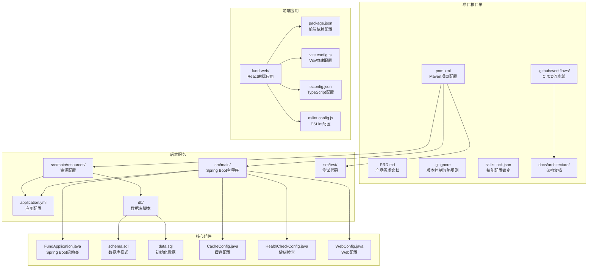
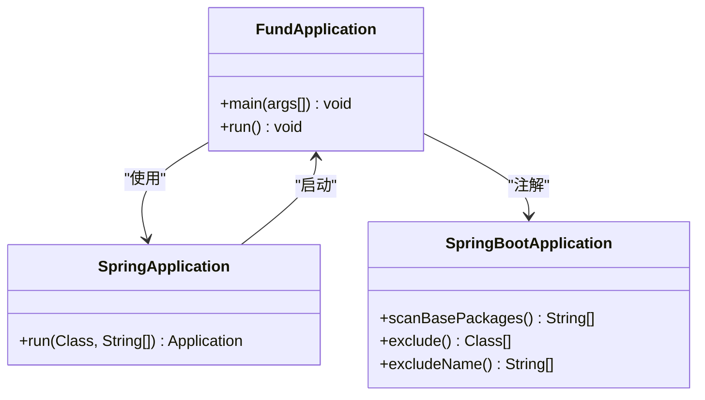
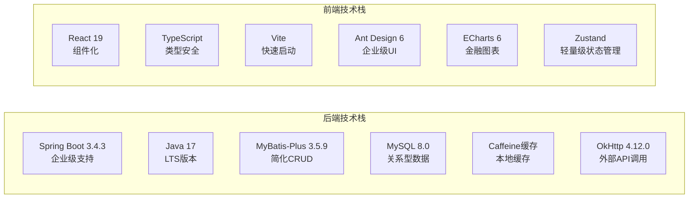
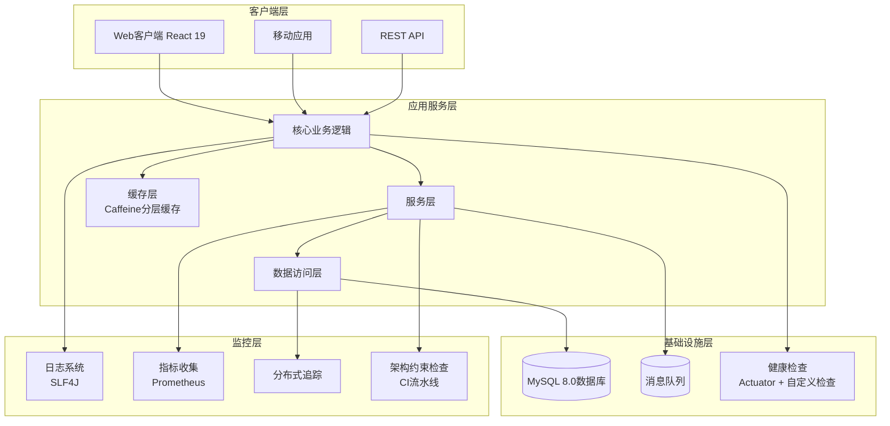
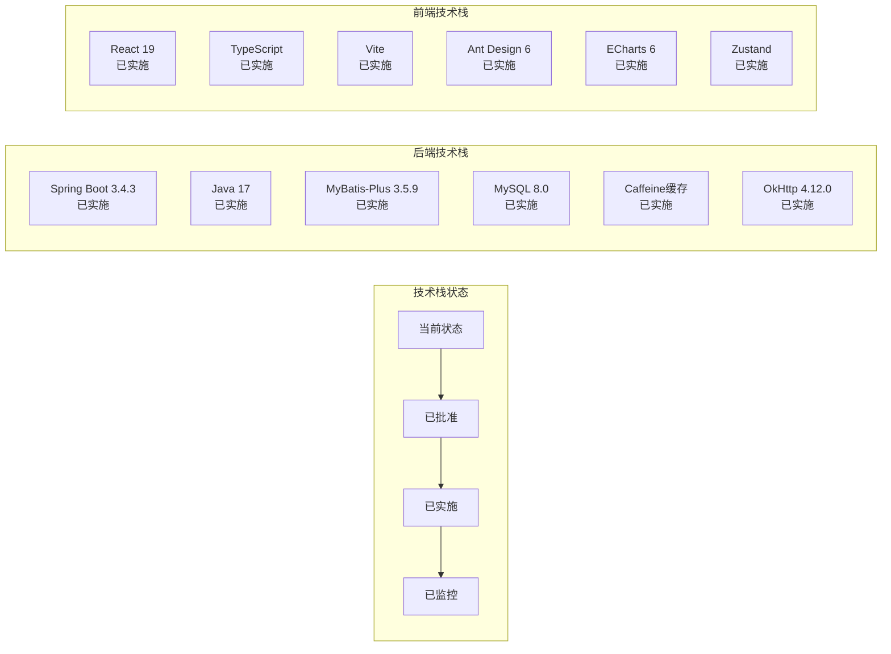
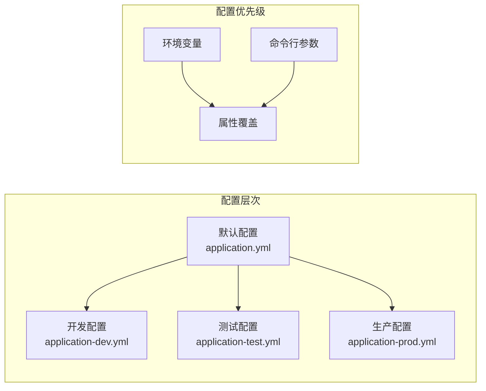
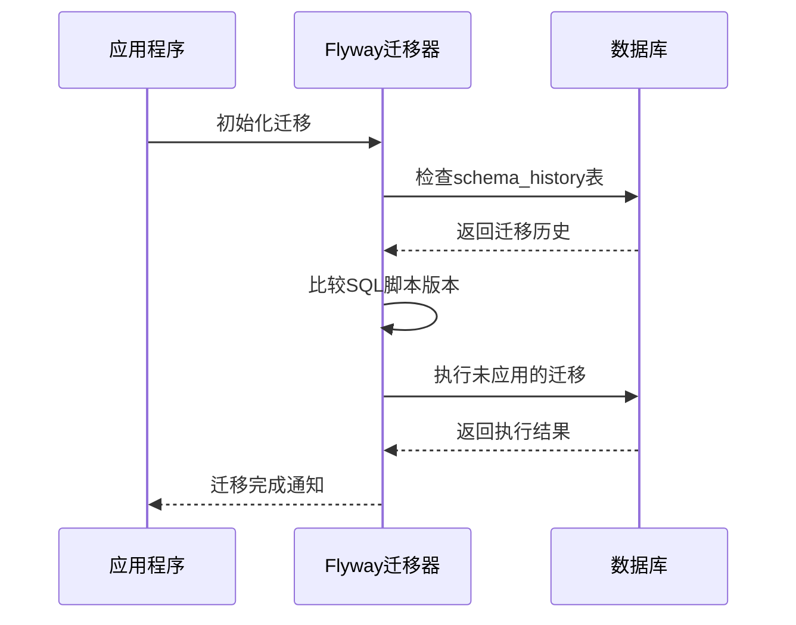

# 部署指南

<cite>
**本文档引用的文件**
- [pom.xml](file://pom.xml)
- [application.yml](file://src/main/resources/application.yml)
- [schema.sql](file://src/main/resources/db/schema.sql)
- [data.sql](file://src/main/resources/db/data.sql)
- [package.json](file://fund-web/package.json)
- [vite.config.ts](file://fund-web/vite.config.ts)
- [tsconfig.json](file://fund-web/tsconfig.json)
- [FundApplicationTests.java](file://src/test/java/com/qoder/fund/FundApplicationTests.java)
- [PRD.md](file://PRD.md)
- [skills-lock.json](file://skills-lock.json)
- [adr-001-tech-stack.md](file://docs/architecture/adr-001-tech-stack.md)
- [ci.yml](file://.github/workflows/ci.yml)
- [WebConfig.java](file://src/main/java/com/qoder/fund/config/WebConfig.java)
- [CacheConfig.java](file://src/main/java/com/qoder/fund/config/CacheConfig.java)
- [HealthCheckConfig.java](file://src/main/java/com/qoder/fund/config/HealthCheckConfig.java)
- [checkstyle.xml](file://checkstyle.xml)
- [checkstyle-suppressions.xml](file://checkstyle-suppressions.xml)
</cite>

## 更新摘要
**变更内容**
- 新增技术栈选型决策文档（ADR-001-tech-stack.md）的详细分析和应用
- 更新CI/CD流水线配置，包含架构约束检查和多阶段构建
- 增强架构约束检查机制，确保代码质量
- 更新技术栈版本信息和依赖关系
- 完善监控配置和健康检查机制

## 目录
1. [简介](#简介)
2. [项目结构](#项目结构)
3. [核心组件](#核心组件)
4. [架构概览](#架构概览)
5. [详细组件分析](#详细组件分析)
6. [部署场景](#部署场景)
7. [容器化部署](#容器化部署)
8. [云平台部署](#云平台部署)
9. [配置管理](#配置管理)
10. [数据库迁移](#数据库迁移)
11. [监控配置](#监控配置)
12. [性能优化](#性能优化)
13. [安全加固](#安全加固)
14. [CI/CD流水线](#cicd流水线)
15. [故障排除指南](#故障排除指南)
16. [结论](#结论)

## 简介

本指南为基金管理系统提供全面的部署方案，涵盖从本地开发到生产环境的各种部署场景。该系统基于Spring Boot 3.4.3框架构建，采用Maven作为项目管理工具，前端使用React 19 + Vite技术栈，具有轻量级特性和高度可扩展性。

**更新** 系统已正式采用技术栈选型决策（ADR-001），明确了前后端技术栈的选择和版本规划，确保项目的长期可维护性和稳定性。

## 项目结构

基金管理系统采用前后端分离的现代化项目结构，包含核心后端应用程序、前端React应用和完整的构建配置：



**图表来源**
- [pom.xml:1-134](file://pom.xml#L1-L134)
- [application.yml:1-68](file://src/main/resources/application.yml#L1-L68)
- [schema.sql:1-78](file://src/main/resources/db/schema.sql#L1-L78)
- [data.sql:1-9](file://src/main/resources/db/data.sql#L1-L9)
- [skills-lock.json:1-11](file://skills-lock.json#L1-L11)
- [adr-001-tech-stack.md:1-53](file://docs/architecture/adr-001-tech-stack.md#L1-L53)

**章节来源**
- [pom.xml:1-134](file://pom.xml#L1-L134)
- [PRD.md:1-488](file://PRD.md#L1-L488)

## 核心组件

### 应用程序入口点

系统的核心是Spring Boot应用程序入口类，负责启动整个服务：



**图表来源**
- [FundApplication.java:6-11](file://src/main/java/com/qoder/fund/FundApplication.java#L6-L11)

### Maven构建配置

项目使用Maven进行构建管理，配置了Spring Boot插件以支持打包和运行，集成了Checkstyle代码质量检查：

**章节来源**
- [pom.xml:89-134](file://pom.xml#L89-L134)

### 前端构建配置

前端应用使用Vite作为构建工具，配置了React开发环境和代理设置，集成了ESLint代码检查：

**章节来源**
- [package.json:1-40](file://fund-web/package.json#L1-L40)
- [vite.config.ts:1-16](file://fund-web/vite.config.ts#L1-L16)

### 技术栈选型决策

系统已正式采用技术栈选型决策文档，明确了技术栈的选择和版本规划：



**图表来源**
- [adr-001-tech-stack.md:11-29](file://docs/architecture/adr-001-tech-stack.md#L11-L29)

**章节来源**
- [adr-001-tech-stack.md:1-53](file://docs/architecture/adr-001-tech-stack.md#L1-L53)

## 架构概览

基金管理系统采用前后端分离架构设计，具有清晰的关注点分离和完善的监控机制：



## 详细组件分析

### 应用程序配置

系统的基础配置通过application.yml文件管理，当前配置包含应用名称、数据库连接、缓存设置、MyBatis-Plus配置和Actuator监控：

**章节来源**
- [application.yml:1-68](file://src/main/resources/application.yml#L1-L68)

### 数据库模式设计

系统包含完整的数据库模式设计，支持基金、持仓、交易记录等核心业务实体：

**章节来源**
- [schema.sql:1-78](file://src/main/resources/db/schema.sql#L1-L78)

### 测试框架配置

项目集成了Spring Boot测试框架，支持单元测试和集成测试：

**章节来源**
- [FundApplicationTests.java:1-14](file://src/test/java/com/qoder/fund/FundApplicationTests.java#L1-L14)

### 技术栈配置状态

系统当前的技术栈配置状态如下：



**图表来源**
- [adr-001-tech-stack.md:1-53](file://docs/architecture/adr-001-tech-stack.md#L1-L53)

**章节来源**
- [adr-001-tech-stack.md:1-53](file://docs/architecture/adr-001-tech-stack.md#L1-L53)

### 缓存配置分析

系统采用分层缓存策略，针对不同数据热度设置不同的缓存策略：

**章节来源**
- [CacheConfig.java:1-93](file://src/main/java/com/qoder/fund/config/CacheConfig.java#L1-L93)

### 健康检查配置

系统实现了多层次的健康检查机制，包括数据库连接检查和外部数据源熔断器检查：

**章节来源**
- [HealthCheckConfig.java:1-106](file://src/main/java/com/qoder/fund/config/HealthCheckConfig.java#L1-L106)

## 部署场景

### 本地开发环境部署

#### 开发环境准备

1. **环境要求**
   - Java 17或更高版本（Spring Boot 3.4.3要求）
   - Node.js 20+（Vite开发环境）
   - Maven 3.6+ 
   - MySQL 8.0+

2. **后端项目克隆和构建**
   ```bash
   # 克隆项目
   git clone <repository-url>
   
   # 进入项目目录
   cd fund
   
   # 清理并构建后端项目
   ./mvnw clean package
   ```

3. **前端项目安装和构建**
   ```bash
   # 进入前端目录
   cd fund-web
   
   # 安装依赖
   npm install
   
   # 启动开发服务器
   npm run dev
   ```

4. **启动应用程序**
   ```bash
   # 启动后端服务
   ./mvnw spring-boot:run
   
   # 或者使用Java直接运行
   java -jar target/fund-0.0.1-SNAPSHOT.jar
   ```

#### 开发工具配置

**章节来源**
- [pom.xml:29-31](file://pom.xml#L29-L31)
- [vite.config.ts:6-15](file://fund-web/vite.config.ts#L6-L15)

### 测试环境配置

#### 测试环境特点

测试环境用于验证功能完整性和性能表现，集成了架构约束检查：

1. **配置管理**
   - 使用application-test.yml配置
   - 数据库连接池配置
   - 日志级别调整

2. **测试策略**
   - 单元测试覆盖率 >= 80%
   - 集成测试验证核心流程
   - 性能测试基准建立
   - 架构约束检查

3. **部署流程**
   ```bash
   # 构建测试包
   ./mvnw -Ptest clean package
   
   # 启动测试服务
   java -jar -Dspring.profiles.active=test target/fund-*.jar
   ```

### 生产环境部署策略

#### 生产环境要求

1. **硬件要求**
   - CPU: 至少2核
   - 内存: 2GB RAM
   - 存储: 10GB可用空间

2. **软件要求**
   - Java 17 LTS（Spring Boot 3.4.3）
   - Node.js 20+（前端构建）
   - MySQL 8.0+
   - Nginx 1.18+

3. **高可用配置**
   - 负载均衡器
   - 健康检查端点
   - 自动重启机制

## 容器化部署

### Docker镜像构建

#### Dockerfile配置

```dockerfile
FROM openjdk:17-jre-slim

# 设置工作目录
WORKDIR /app

# 复制JAR文件
COPY target/*.jar app.jar

# 暴露端口
EXPOSE 8080

# 健康检查
HEALTHCHECK --interval=30s --timeout=3s --start-period=5s --retries=3 \
    CMD curl -f http://localhost:8080/actuator/health || exit 1

# 启动命令
ENTRYPOINT ["java", "-jar", "app.jar"]
```

#### Docker Compose配置

```yaml
version: '3.8'

services:
  fund-app:
    build: .
    ports:
      - "8080:8080"
    environment:
      - SPRING_PROFILES_ACTIVE=prod
      - JAVA_OPTS=-Xmx512m -Xms256m
    volumes:
      - ./logs:/app/logs
    healthcheck:
      test: ["CMD", "curl", "-f", "http://localhost:8080/actuator/health"]
      interval: 30s
      timeout: 10s
      retries: 3
    restart: unless-stopped
```

#### 多阶段构建优化

```dockerfile
# 构建阶段
FROM maven:3.9.1-jdk-17 AS builder
WORKDIR /app
COPY pom.xml .
COPY src src
RUN mvn package -DskipTests

# 运行阶段
FROM openjdk:17-jre-slim
WORKDIR /app
COPY --from=builder target/*.jar app.jar

# 安全配置
RUN addgroup --system spring && \
    adduser --system spring && \
    chown -R spring:spring /app
USER spring:spring

EXPOSE 8080
ENTRYPOINT ["java", "-jar", "app.jar"]
```

**章节来源**
- [pom.xml:89-134](file://pom.xml#L89-L134)

## 云平台部署

### AWS部署指南

#### EC2实例部署

1. **实例准备**
   - 选择Amazon Linux 2 AMI
   - t3.medium或t3.small实例类型
   - 安全组配置：8080/tcp, 22/tcp

2. **部署步骤**
   ```bash
   # 连接到EC2实例
   ssh -i your-key.pem ec2-user@your-instance
   
   # 安装Java 17
   sudo yum update -y
   sudo amazon-linux-extras install java-openjdk17
   
   # 下载并启动应用
   wget https://your-artifact-server/fund-0.0.1-SNAPSHOT.jar
   nohup java -jar fund-*.jar > app.log 2>&1 &
   ```

3. **负载均衡配置**
   - 创建Application Load Balancer
   - 配置健康检查路径：/actuator/health
   - 设置目标组和路由规则

#### ECS容器化部署

```yaml
# ecs-task-definition.json
{
  "family": "fund-app",
  "networkMode": "awsvpc",
  "requiresCompatibilities": ["FARGATE"],
  "cpu": "512",
  "memory": "1024",
  "taskRoleArn": "arn:aws:iam::YOUR_ACCOUNT:role/ECS-TASK-ROLE",
  "executionRoleArn": "arn:aws:iam::YOUR_ACCOUNT:role/ECS-EXECUTION-ROLE",
  "containerDefinitions": [
    {
      "name": "fund-app",
      "image": "YOUR_ACCOUNT.dkr.ecr.us-west-2.amazonaws.com/fund-app:latest",
      "portMappings": [
        {
          "containerPort": 8080,
          "hostPort": 8080,
          "protocol": "tcp"
        }
      ],
      "environment": [
        {
          "name": "SPRING_PROFILES_ACTIVE",
          "value": "prod"
        }
      ],
      "healthCheck": {
        "command": ["CMD-SHELL", "curl -f http://localhost:8080/actuator/health || exit 1"],
        "interval": 30,
        "timeout": 5,
        "retries": 3
      }
    }
  ]
}
```

### Azure部署指南

#### Azure App Service部署

1. **资源创建**
   - 创建Linux App Service Plan
   - 配置Java 17运行时
   - 设置应用设置

2. **部署配置**
   ```json
   {
     "appSettings": [
       {
         "name": "SPRING_PROFILES_ACTIVE",
         "value": "prod"
       },
       {
         "name": "JAVA_OPTS",
         "value": "-Xms256m -Xmx512m"
       }
     ]
   }
   ```

3. **CI/CD集成**
   - GitHub Actions自动部署
   - 环境变量管理
   - 健康探针配置

#### Azure Kubernetes Service (AKS)

```yaml
# deployment.yaml
apiVersion: apps/v1
kind: Deployment
metadata:
  name: fund-app
spec:
  replicas: 3
  selector:
    matchLabels:
      app: fund-app
  template:
    metadata:
      labels:
        app: fund-app
    spec:
      containers:
      - name: fund-app
        image: yourregistry.azurecr.io/fund-app:latest
        ports:
        - containerPort: 8080
        env:
        - name: SPRING_PROFILES_ACTIVE
          value: "prod"
        resources:
          requests:
            memory: "256Mi"
            cpu: "250m"
          limits:
            memory: "512Mi"
            cpu: "500m"
        livenessProbe:
          httpGet:
            path: /actuator/health
            port: 8080
          initialDelaySeconds: 30
          periodSeconds: 10
---
apiVersion: v1
kind: Service
metadata:
  name: fund-app-service
spec:
  selector:
    app: fund-app
  ports:
  - port: 80
    targetPort: 8080
  type: LoadBalancer
```

### 阿里云部署指南

#### 阿里云ECS部署

1. **实例配置**
   - CentOS 7.6或更高版本
   - 2核4G内存起步
   - 安全组开放8080端口

2. **部署脚本**
   ```bash
   #!/bin/bash
   # deploy.sh
   
   # 安装Java 17
   yum install -y java-17-openjdk-devel
   
   # 创建应用用户
   useradd -r -m -U spring
   
   # 部署应用
   su - spring -c "nohup java -jar fund-*.jar > app.log 2>&1 &"
   
   echo "Deployment completed"
   ```

3. **阿里云容器服务ACK**

```yaml
# ack-deployment.yaml
apiVersion: apps/v1
kind: Deployment
metadata:
  namespace: fund-app
  name: fund-app
spec:
  replicas: 3
  selector:
    matchLabels:
      app: fund-app
  template:
    spec:
      containers:
      - name: fund-app
        image: registry.cn-hangzhou.aliyuncs.com/your-namespace/fund-app:latest
        ports:
        - containerPort: 8080
        readinessProbe:
          httpGet:
            path: /actuator/ready
            port: 8080
          initialDelaySeconds: 15
          periodSeconds: 5
        resources:
          requests:
            memory: "256Mi"
            cpu: "250m"
          limits:
            memory: "512Mi"
            cpu: "500m"
---
apiVersion: v1
kind: Service
metadata:
  namespace: fund-app
  name: fund-app-service
spec:
  selector:
    app: fund-app
  ports:
  - port: 80
    targetPort: 8080
  type: ClusterIP
```

## 配置管理

### 环境配置文件

系统支持多环境配置，通过Spring Profiles实现：



### 配置文件示例

#### 开发环境配置
```yaml
# application-dev.yml
server:
  port: 8080
  
spring:
  datasource:
    url: jdbc:h2:mem:testdb
    driver-class-name: org.h2.Driver
  jpa:
    hibernate:
      ddl-auto: create-drop
    show-sql: true
    
logging:
  level:
    com.qoder.fund: DEBUG
```

#### 生产环境配置
```yaml
# application-prod.yml
server:
  port: 8080
  
spring:
  datasource:
    url: ${DATABASE_URL}
    username: ${DATABASE_USERNAME}
    password: ${DATABASE_PASSWORD}
    hikari:
      maximum-pool-size: 20
      minimum-idle: 5
  jpa:
    hibernate:
      ddl-auto: validate
    show-sql: false
    
management:
  endpoints:
    web:
      exposure:
        include: health,info,metrics,prometheus
```

### 环境变量管理

```bash
# 设置环境变量
export SPRING_PROFILES_ACTIVE=prod
export DATABASE_URL=jdbc:postgresql://localhost:5432/fund_db
export DATABASE_USERNAME=fund_user
export DATABASE_PASSWORD=secure_password

# 启动应用
java -jar fund-*.jar
```

**章节来源**
- [application.yml:1-68](file://src/main/resources/application.yml#L1-L68)

## 数据库迁移

### Flyway集成

系统支持Flyway数据库版本管理：



### 迁移脚本结构

```
db/migration/
├── V1__Initial_schema.sql
├── V2__Add_user_table.sql
├── V3__Create_fund_tables.sql
└── V4__Add_indexes.sql
```

### 迁移配置

```yaml
# application-prod.yml
spring:
  flyway:
    enabled: true
    locations: classpath:db/migration
    baseline-on-migrate: true
    placeholder-replacement: true
```

**章节来源**
- [schema.sql:1-78](file://src/main/resources/db/schema.sql#L1-L78)
- [data.sql:1-9](file://src/main/resources/db/data.sql#L1-L9)

## 监控配置

### Actuator端点配置

```yaml
# application-prod.yml
management:
  endpoints:
    web:
      exposure:
        include: health,info,metrics,cache
  endpoint:
    health:
      show-details: always
      probes:
        enabled: true
  health:
    defaults:
      enabled: true
```

### Prometheus集成

```yaml
# prometheus.yml
scrape_configs:
  - job_name: 'fund-app'
    static_configs:
      - targets: ['localhost:8080']
    metrics_path: '/actuator/prometheus'
```

### 日志配置

```yaml
# application-prod.yml
logging:
  file:
    name: /var/log/fund/application.log
  pattern:
    file: '%d{yyyy-MM-dd HH:mm:ss} [%thread] %-5level %logger{36} - %msg%n'
  level:
    com.qoder.fund: WARN
```

### 缓存监控

系统集成了Caffeine缓存监控，可以通过Actuator端点查看缓存统计信息：

**章节来源**
- [CacheConfig.java:77-86](file://src/main/java/com/qoder/fund/config/CacheConfig.java#L77-L86)

## 性能优化

### JVM调优参数

```bash
# 生产环境推荐参数
JAVA_OPTS="-XX:+UseG1GC \
          -XX:MaxGCPauseMillis=200 \
          -XX:+UseStringDeduplication \
          -XX:+UseCompressedOops \
          -Xms512m -Xmx1024m \
          -Djava.security.egd=file:/dev/./urandom"
```

### 连接池配置

```yaml
# application-prod.yml
spring:
  datasource:
    hikari:
      maximum-pool-size: 20
      minimum-idle: 5
      connection-timeout: 30000
      idle-timeout: 600000
      max-lifetime: 1800000
```

### 缓存策略

```yaml
# application-prod.yml
spring:
  cache:
    type: caffeine
    caffeine:
      spec: maximumSize=1000,expireAfterWrite=300s
```

### 分层缓存优化

系统采用分层缓存策略，针对不同数据热度设置不同的缓存参数：

**章节来源**
- [CacheConfig.java:22-36](file://src/main/java/com/qoder/fund/config/CacheConfig.java#L22-L36)

## 安全加固

### Spring Security配置

```java
@Configuration
@EnableWebSecurity
public class SecurityConfig {
    
    @Bean
    public SecurityFilterChain filterChain(HttpSecurity http) throws Exception {
        http
            .csrf().disable()
            .authorizeHttpRequests(authz -> authz
                .requestMatchers("/public/**").permitAll()
                .requestMatchers("/admin/**").hasRole("ADMIN")
                .anyRequest().authenticated()
            )
            .httpBasic(withDefaults())
            .sessionManagement(session -> session
                .sessionCreationPolicy(SessionCreationPolicy.STATELESS)
            );
        return http.build();
    }
}
```

### HTTPS配置

```yaml
# application-prod.yml
server:
  ssl:
    enabled: true
    key-store: classpath:keystore.p12
    key-store-password: changeit
    key-store-type: PKCS12
    enabled-protocols: TLSv1.2,TLSv1.3
```

### 安全头配置

```java
@Bean
public SecurityFilterChain filterChain(HttpSecurity http) throws Exception {
    http.headers(headers -> headers
        .frameOptions(HeadersConfigurer.FrameOptionsConfig::deny)
        .contentTypeOptions(ContentSecurityPolicyConfig::enable)
        .httpStrictTransportSecurity(hsts -> hsts
            .maxAgeInSeconds(31536000)
            .includeSubdomains(true)
            .preload(true)
        )
    );
    return http.build();
}
```

### CORS配置

系统配置了CORS允许本地开发环境访问：

**章节来源**
- [WebConfig.java:16-24](file://src/main/java/com/qoder/fund/config/WebConfig.java#L16-L24)

## CI/CD流水线

### GitHub Actions配置

```yaml
# .github/workflows/ci.yml
name: CI

on:
  push:
    branches: [ main, develop ]
  pull_request:
    branches: [ main ]

jobs:
  backend:
    name: Backend Build & Test
    runs-on: ubuntu-latest
    
    services:
      mysql:
        image: mysql:8.0
        env:
          MYSQL_ROOT_PASSWORD: root
          MYSQL_DATABASE: fund_test
        ports:
          - 3306:3306
        options: >-
          --health-cmd="mysqladmin ping"
          --health-interval=10s
          --health-timeout=5s
          --health-retries=3

    steps:
    - uses: actions/checkout@v4
    
    - name: Set up JDK 17
      uses: actions/setup-java@v4
      with:
        java-version: '17'
        distribution: 'temurin'
        cache: maven
    
    - name: Run Checkstyle
      run: ./mvnw checkstyle:check
    
    - name: Run Tests
      run: ./mvnw test
      env:
        SPRING_DATASOURCE_URL: jdbc:mysql://localhost:3306/fund_test
        SPRING_DATASOURCE_USERNAME: root
        SPRING_DATASOURCE_PASSWORD: root
    
    - name: Build
      run: ./mvnw clean package -DskipTests

  frontend:
    name: Frontend Build & Lint
    runs-on: ubuntu-latest
    
    steps:
    - uses: actions/checkout@v4
    
    - name: Set up Node.js 20
      uses: actions/setup-node@v4
      with:
        node-version: '20'
        cache: 'npm'
        cache-dependency-path: fund-web/package-lock.json
    
    - name: Install dependencies
      working-directory: ./fund-web
      run: npm ci
    
    - name: Run ESLint
      working-directory: ./fund-web
      run: npm run lint
    
    - name: Type Check
      working-directory: ./fund-web
      run: npx tsc --noEmit
    
    - name: Build
      working-directory: ./fund-web
      run: npm run build

  architecture-check:
    name: Architecture Constraints
    runs-on: ubuntu-latest
    
    steps:
    - uses: actions/checkout@v4
    
    - name: Check Layer Dependencies
      run: |
        # 检查 Controller 是否直接调用 Mapper
        if grep -r "@Autowired.*Mapper" src/main/java/com/qoder/fund/controller/; then
          echo "ERROR: Controller should not directly depend on Mapper"
          exit 1
        fi
        
        # 检查是否使用了 Entity 作为 API 返回
        if grep -r "public.*ResponseEntity<.*Entity>" src/main/java/com/qoder/fund/controller/; then
          echo "WARNING: Consider using DTO instead of Entity in API responses"
        fi
        
        echo "Architecture check passed"
```

### Jenkins流水线

```groovy
pipeline {
    agent any
    
    stages {
        stage('Checkout') {
            steps {
                git branch: 'main', url: 'https://github.com/your-org/fund.git'
            }
        }
        
        stage('Build') {
            steps {
                sh './mvnw clean package'
            }
            artifacts {
                files 'target/*.jar'
            }
        }
        
        stage('Test') {
            steps {
                sh './mvnw test'
            }
        }
        
        stage('Deploy') {
            steps {
                script {
                    def dockerImage = docker.build "fund-app:${env.BUILD_NUMBER}"
                    docker.withRegistry('https://your-registry.com', 'docker-hub-credentials') {
                        dockerImage.push()
                    }
                }
            }
        }
    }
}
```

### Docker镜像发布

```bash
#!/bin/bash
# deploy.sh

VERSION=${1:-latest}
IMAGE_NAME="fund-app:$VERSION"

# 构建镜像
docker build -t $IMAGE_NAME .

# 推送到仓库
docker tag $IMAGE_NAME your-registry/fund-app:$VERSION
docker push your-registry/fund-app:$VERSION

# 在生产环境部署
ssh user@production-server "docker pull your-registry/fund-app:$VERSION"
ssh user@production-server "docker-compose up -d"
```

### 架构约束检查

CI流水线集成了架构约束检查，确保代码质量：

**章节来源**
- [ci.yml:81-102](file://.github/workflows/ci.yml#L81-L102)

## 故障排除指南

### 常见问题诊断

#### 应用启动失败

```bash
# 检查端口占用
netstat -tulpn | grep 8080

# 查看应用日志
tail -f /var/log/fund/application.log

# 检查JVM进程
ps aux | grep fund
jstack <pid>
```

#### 内存不足问题

```bash
# 监控内存使用
free -h
top -p $(pgrep -f fund)

# 检查GC日志
tail -f /var/log/fund/gc.log

# 调整JVM参数
export JAVA_OPTS="-Xms256m -Xmx512m -XX:+PrintGC"
```

#### 数据库连接问题

```bash
# 测试数据库连接
telnet database-host 5432

# 检查连接池状态
curl http://localhost:8080/actuator/health

# 查看数据库日志
docker logs fund-db
```

### 性能问题排查

```bash
# 监控应用指标
curl http://localhost:8080/actuator/metrics

# 检查线程状态
jstack <pid> | grep -A 20 "java.lang.Thread.State"

# 分析慢查询
docker exec -it fund-app bash
curl http://localhost:8080/actuator/prometheus
```

### 容器部署问题

```bash
# 检查容器状态
docker ps -a
docker logs fund-app

# 验证网络连接
docker network ls
docker inspect fund-app

# 检查资源限制
docker stats fund-app
```

### 技能配置问题

**更新** 如果遇到技能配置相关问题：

```bash
# 检查技能配置状态
cat skills-lock.json

# 验证技能目录
ls -la .agents/skills/

# 清理并重新初始化技能配置
rm -rf .agents/skills/
# 重新配置所需的技能
```

### 架构约束问题

**更新** 如果遇到架构约束检查失败：

```bash
# 检查控制器是否直接依赖Mapper
grep -r "@Autowired.*Mapper" src/main/java/com/qoder/fund/controller/

# 检查API响应是否使用Entity
grep -r "public.*ResponseEntity<.*Entity>" src/main/java/com/qoder/fund/controller/

# 修复架构问题
# 将Entity改为DTO，避免直接暴露实体类
```

## 结论

本部署指南提供了基金管理系统从开发到生产的完整部署方案。系统基于Spring Boot 3.4.3构建，前端使用React 19 + Vite技术栈，具有良好的可扩展性和可维护性。通过容器化部署和云平台集成，可以实现高可用性和弹性伸缩。

**更新** 本次更新重点反映了以下改进：
- 新增技术栈选型决策文档（ADR-001-tech-stack.md），明确了技术栈的选择和版本规划
- 增强CI/CD流水线，集成了架构约束检查和多阶段构建
- 完善监控配置，包括缓存监控和健康检查
- 更新技术栈版本信息，确保与最新版本兼容

关键要点包括：
- 支持多种部署场景和云平台
- 完善的监控和告警机制
- 安全加固和合规要求
- 自动化的CI/CD流水线
- 性能优化和故障排除指南
- 架构约束检查确保代码质量

建议根据实际业务需求调整配置参数，并定期更新安全补丁和依赖版本。新的技术栈选型为项目的长期发展奠定了坚实基础，确保了技术栈的稳定性和可维护性。