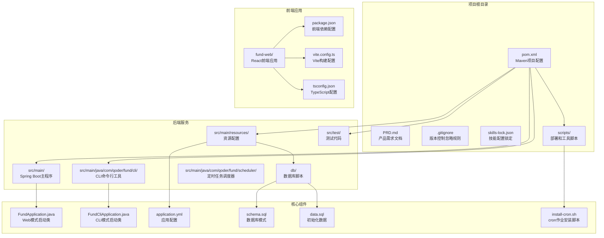
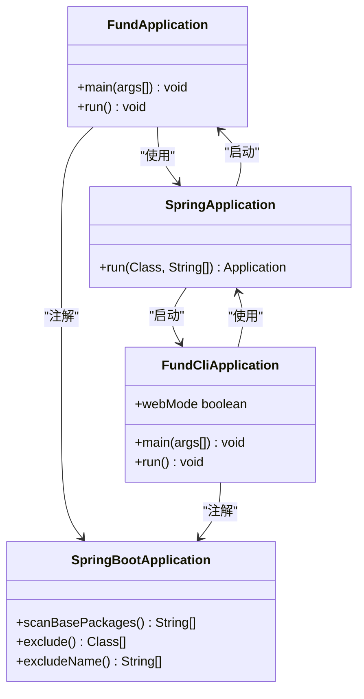
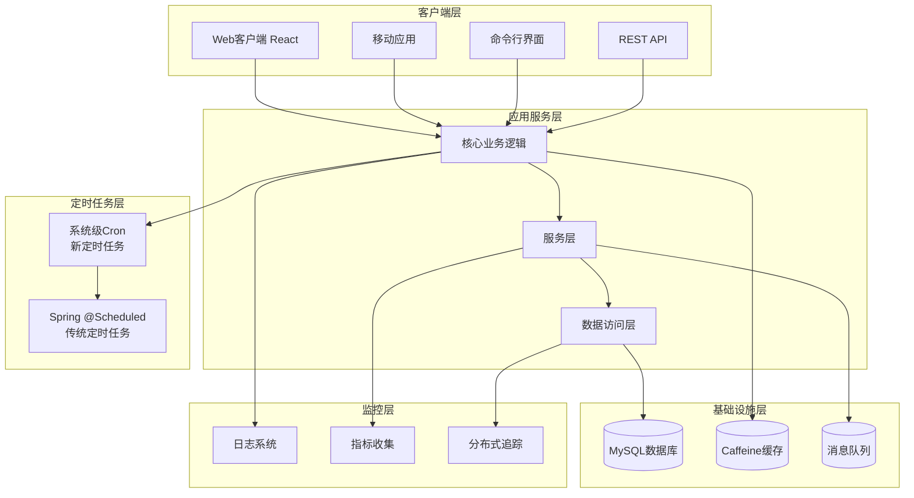
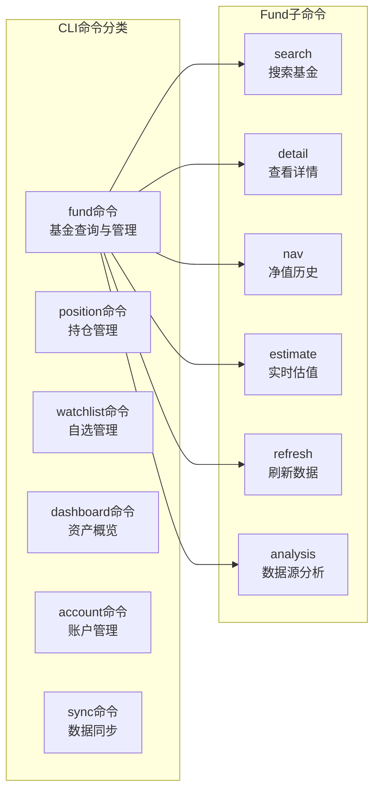
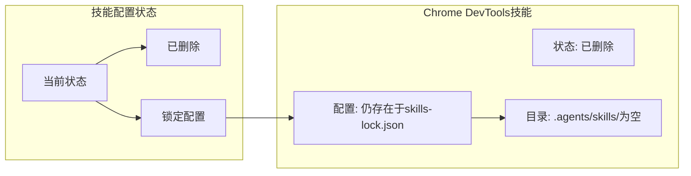
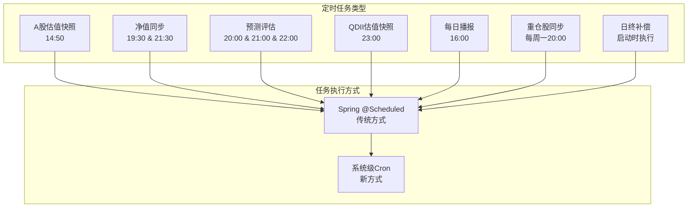
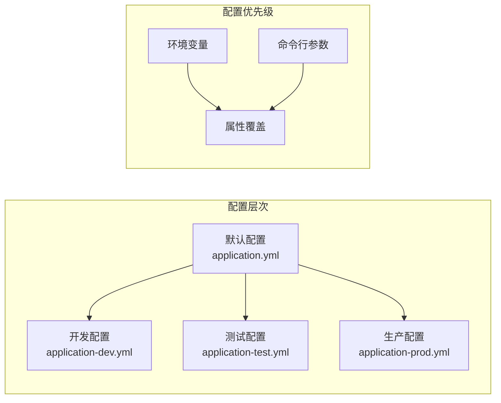
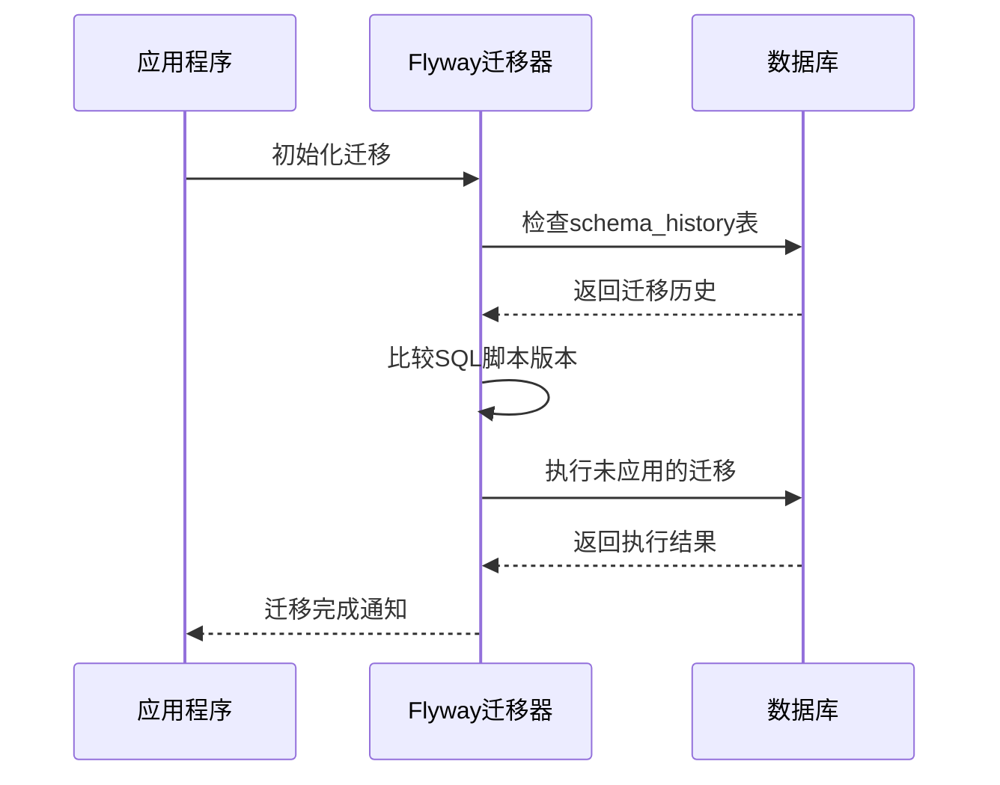

# 部署指南

<cite>
**本文档引用的文件**
- [pom.xml](file://pom.xml)
- [FundCliApplication.java](file://src/main/java/com/qoder/fund/cli/FundCliApplication.java)
- [FundCommand.java](file://src/main/java/com/qoder/fund/cli/FundCommand.java)
- [application.yml](file://src/main/resources/application.yml)
- [schema.sql](file://src/main/resources/db/schema.sql)
- [data.sql](file://src/main/resources/db/data.sql)
- [package.json](file://fund-web/package.json)
- [vite.config.ts](file://fund-web/vite.config.ts)
- [tsconfig.json](file://fund-web/tsconfig.json)
- [FundApplicationTests.java](file://src/test/java/com/qoder/fund/FundApplicationTests.java)
- [PRD.md](file://PRD.md)
- [skills-lock.json](file://skills-lock.json)
- [install-cron.sh](file://scripts/install-cron.sh)
- [pre-commit.sh](file://scripts/pre-commit.sh)
- [setup-harness.sh](file://scripts/setup-harness.sh)
- [FundDataSyncScheduler.java](file://src/main/java/com/qoder/fund/scheduler/FundDataSyncScheduler.java)
</cite>

## 更新摘要
**变更内容**
- 新增CLI和Web双模式部署支持
- 更新双JAR打包配置说明
- 新增CLI部署和使用指南
- 增强容器化部署选项
- 完善云平台部署策略
- 新增系统级cron作业安装脚本
- 替代Spring @Scheduled注解的定时任务方案
- 增强定时任务的可靠性和自动化程度

## 目录
1. [简介](#简介)
2. [项目结构](#项目结构)
3. [核心组件](#核心组件)
4. [架构概览](#架构概览)
5. [详细组件分析](#详细组件分析)
6. [部署场景](#部署场景)
7. [容器化部署](#容器化部署)
8. [云平台部署](#云平台部署)
9. [配置管理](#配置管理)
10. [数据库迁移](#数据库迁移)
11. [监控配置](#监控配置)
12. [性能优化](#性能优化)
13. [安全加固](#安全加固)
14. [定时任务管理](#定时任务管理)
15. [CI/CD流水线](#cicd流水线)
16. [故障排除指南](#故障排除指南)
17. [结论](#结论)

## 简介

本指南为基金管理系统提供全面的部署方案，涵盖从本地开发到生产环境的各种部署场景。该系统基于Spring Boot框架构建，采用Maven作为项目管理工具，前端使用React + Vite技术栈，具有轻量级特性和高度可扩展性。

**更新** 系统现已支持CLI和Web双模式部署，通过双JAR打包配置实现单一代码库的多模式运行能力。新增的cron作业安装脚本（scripts/install-cron.sh）提供了系统级的定时任务自动化部署能力，替代了原有的Spring @Scheduled注解方式，增强了任务调度的可靠性和自动化程度。

## 项目结构

基金管理系统采用前后端分离的现代化项目结构，包含核心后端应用程序、前端React应用、CLI命令行工具和完整的构建配置：



**图表来源**
- [pom.xml:1-174](file://pom.xml#L1-L174)
- [FundCliApplication.java:1-185](file://src/main/java/com/qoder/fund/cli/FundCliApplication.java#L1-L185)
- [application.yml:1-68](file://src/main/resources/application.yml#L1-L68)
- [schema.sql:1-96](file://src/main/resources/db/schema.sql#L1-L96)
- [data.sql:1-9](file://src/main/resources/db/data.sql#L1-L9)
- [skills-lock.json:1-11](file://skills-lock.json#L1-L11)
- [install-cron.sh:1-82](file://scripts/install-cron.sh#L1-L82)

**章节来源**
- [pom.xml:1-174](file://pom.xml#L1-L174)
- [PRD.md:1-488](file://PRD.md#L1-L488)

## 核心组件

### 应用程序入口点

系统提供两种运行模式的入口点：



**图表来源**
- [FundApplication.java:6-11](file://src/main/java/com/qoder/fund/FundApplication.java#L6-L11)
- [FundCliApplication.java:51-75](file://src/main/java/com/qoder/fund/cli/FundCliApplication.java#L51-L75)

### 双JAR打包配置

项目使用Maven配置了双模式打包，生成web和cli两种不同类型的JAR包：

**章节来源**
- [pom.xml:107-164](file://pom.xml#L107-L164)

### 前端构建配置

前端应用使用Vite作为构建工具，配置了React开发环境和代理设置：

**章节来源**
- [package.json:1-39](file://fund-web/package.json#L1-L39)
- [vite.config.ts:1-16](file://fund-web/vite.config.ts#L1-L16)

## 架构概览

基金管理系统采用前后端分离架构设计，支持CLI和Web双模式运行：



## 详细组件分析

### 应用程序配置

系统的基础配置通过application.yml文件管理，当前配置包含应用名称、数据库连接、缓存设置和MyBatis-Plus配置：

**章节来源**
- [application.yml:1-68](file://src/main/resources/application.yml#L1-L68)

### 数据库模式设计

系统包含完整的数据库模式设计，支持基金、持仓、交易记录等核心业务实体：

**章节来源**
- [schema.sql:1-96](file://src/main/resources/db/schema.sql#L1-L96)

### 测试框架配置

项目集成了Spring Boot测试框架，支持单元测试和集成测试：

**章节来源**
- [FundApplicationTests.java:1-14](file://src/test/java/com/qoder/fund/FundApplicationTests.java#L1-L14)

### CLI命令行工具

系统提供完整的命令行工具，支持多种操作命令：



**图表来源**
- [FundCommand.java:14-29](file://src/main/java/com/qoder/fund/cli/FundCommand.java#L14-L29)

**章节来源**
- [FundCommand.java:1-250](file://src/main/java/com/qoder/fund/cli/FundCommand.java#L1-L250)

### 技能配置状态

系统当前的技能配置状态如下：



**图表来源**
- [skills-lock.json:1-11](file://skills-lock.json#L1-L11)

**章节来源**
- [skills-lock.json:1-11](file://skills-lock.json#L1-L11)

### 定时任务调度器

系统包含完整的定时任务调度功能，支持多种数据同步和评估任务：



**图表来源**
- [FundDataSyncScheduler.java:224-697](file://src/main/java/com/qoder/fund/scheduler/FundDataSyncScheduler.java#L224-L697)

**章节来源**
- [FundDataSyncScheduler.java:1-725](file://src/main/java/com/qoder/fund/scheduler/FundDataSyncScheduler.java#L1-L725)

## 部署场景

### 本地开发环境部署

#### 开发环境准备

1. **环境要求**
   - Java 17或更高版本
   - Node.js 16+
   - Maven 3.6+ 
   - MySQL 8.0+

2. **后端项目克隆和构建**
   ```bash
   # 克隆项目
   git clone <repository-url>
   
   # 进入项目目录
   cd fund
   
   # 清理并构建后端项目（生成双JAR）
   ./mvnw clean package
   ```

3. **前端项目安装和构建**
   ```bash
   # 进入前端目录
   cd fund-web
   
   # 安装依赖
   npm install
   
   # 启动开发服务器
   npm run dev
   ```

4. **启动应用程序**
   ```bash
   # Web模式启动
   ./mvnw spring-boot:run
   
   # 或者使用Java直接运行Web模式
   java -jar target/fund-*-web.jar
   
   # CLI模式启动
   java -jar target/fund-*-cli.jar
   
   # Web模式启动（显式指定）
   java -jar target/fund-*-cli.jar --web
   ```

#### 开发工具配置

**章节来源**
- [pom.xml:29-31](file://pom.xml#L29-L31)
- [vite.config.ts:6-15](file://fund-web/vite.config.ts#L6-L15)

### 测试环境配置

#### 测试环境特点

测试环境用于验证功能完整性和性能表现：

1. **配置管理**
   - 使用application-test.yml配置
   - 数据库连接池配置
   - 日志级别调整

2. **测试策略**
   - 单元测试覆盖率 >= 80%
   - 集成测试验证核心流程
   - 性能测试基准建立

3. **部署流程**
   ```bash
   # 构建测试包
   ./mvnw -Ptest clean package
   
   # 启动测试服务（Web模式）
   java -jar -Dspring.profiles.active=test target/fund-*-web.jar
   
   # 启动测试服务（CLI模式）
   java -jar -Dspring.profiles.active=test target/fund-*-cli.jar
   ```

### 生产环境部署策略

#### 生产环境要求

1. **硬件要求**
   - CPU: 至少2核
   - 内存: 2GB RAM
   - 存储: 10GB可用空间

2. **软件要求**
   - Java 17 LTS
   - Node.js 16+
   - MySQL 8.0+
   - Nginx 1.18+

3. **高可用配置**
   - 负载均衡器
   - 健康检查端点
   - 自动重启机制

#### 双模式部署选项

**Web模式部署**
```bash
# 启动Web服务
java -jar target/fund-*-web.jar

# 指定配置文件
java -jar -Dspring.config.location=classpath:/,file:./config/ target/fund-*-web.jar

# 指定环境
java -jar -Dspring.profiles.active=prod target/fund-*-web.jar
```

**CLI模式部署**
```bash
# 启动CLI工具
java -jar target/fund-*-cli.jar

# 使用CLI命令
java -jar target/fund-*-cli.jar fund search 白酒
java -jar target/fund-*-cli.jar position list --json
java -jar target/fund-*-cli.jar dashboard --no-color
```

## 容器化部署

### Docker镜像构建

#### Dockerfile配置

```dockerfile
FROM openjdk:17-jre-slim

# 设置工作目录
WORKDIR /app

# 复制JAR文件
COPY target/*.jar app.jar

# 暴露端口
EXPOSE 8080

# 健康检查
HEALTHCHECK --interval=30s --timeout=3s --start-period=5s --retries=3 \
    CMD curl -f http://localhost:8080/actuator/health || exit 1

# 启动命令
ENTRYPOINT ["java", "-jar", "app.jar"]
```

#### Docker Compose配置

```yaml
version: '3.8'

services:
  fund-app:
    build: .
    ports:
      - "8080:8080"
    environment:
      - SPRING_PROFILES_ACTIVE=prod
      - JAVA_OPTS=-Xmx512m -Xms256m
    volumes:
      - ./logs:/app/logs
    healthcheck:
      test: ["CMD", "curl", "-f", "http://localhost:8080/actuator/health"]
      interval: 30s
      timeout: 10s
      retries: 3
    restart: unless-stopped
```

#### 多阶段构建优化

```dockerfile
# 构建阶段
FROM maven:3.9.1-jdk-17 AS builder
WORKDIR /app
COPY pom.xml .
COPY src src
RUN mvn package -DskipTests

# 运行阶段
FROM openjdk:17-jre-slim
WORKDIR /app
COPY --from=builder target/*.jar app.jar

# 安全配置
RUN addgroup --system spring && \
    adduser --system spring && \
    chown -R spring:spring /app
USER spring:spring

EXPOSE 8080
ENTRYPOINT ["java", "-jar", "app.jar"]
```

#### 双模式容器部署

```dockerfile
# Dockerfile - 双模式部署
FROM openjdk:17-jre-slim

# 设置工作目录
WORKDIR /app

# 复制JAR文件
COPY target/fund-*-web.jar web.jar
COPY target/fund-*-cli.jar cli.jar

# 暴露端口
EXPOSE 8080

# 健康检查
HEALTHCHECK --interval=30s --timeout=3s --start-period=5s --retries=3 \
    CMD curl -f http://localhost:8080/actuator/health || exit 1

# 启动命令（默认Web模式）
ENTRYPOINT ["sh", "-c", "java -jar ${MODE:-web} == 'cli' ? 'cli.jar' : 'web.jar'"]
```

**章节来源**
- [pom.xml:107-164](file://pom.xml#L107-L164)

## 云平台部署

### AWS部署指南

#### EC2实例部署

1. **实例准备**
   - 选择Amazon Linux 2 AMI
   - t3.medium或t3.small实例类型
   - 安全组配置：8080/tcp, 22/tcp

2. **部署步骤**
   ```bash
   # 连接到EC2实例
   ssh -i your-key.pem ec2-user@your-instance
   
   # 安装Java 17
   sudo yum update -y
   sudo amazon-linux-extras install java-openjdk17
   
   # 下载并启动应用
   wget https://your-artifact-server/fund-*-web.jar
   nohup java -jar fund-*-web.jar > app.log 2>&1 &
   ```

3. **负载均衡配置**
   - 创建Application Load Balancer
   - 配置健康检查路径：/actuator/health
   - 设置目标组和路由规则

#### ECS容器化部署

```yaml
# ecs-task-definition.json
{
  "family": "fund-app",
  "networkMode": "awsvpc",
  "requiresCompatibilities": ["FARGATE"],
  "cpu": "512",
  "memory": "1024",
  "taskRoleArn": "arn:aws:iam::YOUR_ACCOUNT:role/ECS-TASK-ROLE",
  "executionRoleArn": "arn:aws:iam::YOUR_ACCOUNT:role/ECS-EXECUTION-ROLE",
  "containerDefinitions": [
    {
      "name": "fund-app",
      "image": "YOUR_ACCOUNT.dkr.ecr.us-west-2.amazonaws.com/fund-app:latest",
      "portMappings": [
        {
          "containerPort": 8080,
          "hostPort": 8080,
          "protocol": "tcp"
        }
      ],
      "environment": [
        {
          "name": "SPRING_PROFILES_ACTIVE",
          "value": "prod"
        }
      ],
      "healthCheck": {
        "command": ["CMD-SHELL", "curl -f http://localhost:8080/actuator/health || exit 1"],
        "interval": 30,
        "timeout": 5,
        "retries": 3
      }
    }
  ]
}
```

### Azure部署指南

#### Azure App Service部署

1. **资源创建**
   - 创建Linux App Service Plan
   - 配置Java 17运行时
   - 设置应用设置

2. **部署配置**
   ```json
   {
     "appSettings": [
       {
         "name": "SPRING_PROFILES_ACTIVE",
         "value": "prod"
       },
       {
         "name": "JAVA_OPTS",
         "value": "-Xms256m -Xmx512m"
       }
     ]
   }
   ```

3. **CI/CD集成**
   - GitHub Actions自动部署
   - 环境变量管理
   - 健康探针配置

#### Azure Kubernetes Service (AKS)

```yaml
# deployment.yaml
apiVersion: apps/v1
kind: Deployment
metadata:
  name: fund-app
spec:
  replicas: 3
  selector:
    matchLabels:
      app: fund-app
  template:
    metadata:
      labels:
        app: fund-app
    spec:
      containers:
      - name: fund-app
        image: yourregistry.azurecr.io/fund-app:latest
        ports:
        - containerPort: 8080
        env:
        - name: SPRING_PROFILES_ACTIVE
          value: "prod"
        resources:
          requests:
            memory: "256Mi"
            cpu: "250m"
          limits:
            memory: "512Mi"
            cpu: "500m"
        livenessProbe:
          httpGet:
            path: /actuator/health
            port: 8080
          initialDelaySeconds: 30
          periodSeconds: 10
---
apiVersion: v1
kind: Service
metadata:
  name: fund-app-service
spec:
  selector:
    app: fund-app
  ports:
  - port: 80
    targetPort: 8080
  type: LoadBalancer
```

### 阿里云部署指南

#### 阿里云ECS部署

1. **实例配置**
   - CentOS 7.6或更高版本
   - 2核4G内存起步
   - 安全组开放8080端口

2. **部署脚本**
   ```bash
   #!/bin/bash
   # deploy.sh
   
   # 安装Java 17
   yum install -y java-17-openjdk-devel
   
   # 创建应用用户
   useradd -r -m -U spring
   
   # 部署应用
   su - spring -c "nohup java -jar fund-*-web.jar > app.log 2>&1 &"
   
   echo "Deployment completed"
   ```

3. **阿里云容器服务ACK**

```yaml
# ack-deployment.yaml
apiVersion: apps/v1
kind: Deployment
metadata:
  namespace: fund-app
  name: fund-app
spec:
  replicas: 3
  selector:
    matchLabels:
      app: fund-app
  template:
    spec:
      containers:
      - name: fund-app
        image: registry.cn-hangzhou.aliyuncs.com/your-namespace/fund-app:latest
        ports:
        - containerPort: 8080
        readinessProbe:
          httpGet:
            path: /actuator/ready
            port: 8080
          initialDelaySeconds: 15
          periodSeconds: 5
        resources:
          requests:
            memory: "256Mi"
            cpu: "250m"
          limits:
            memory: "512Mi"
            cpu: "500m"
---
apiVersion: v1
kind: Service
metadata:
  namespace: fund-app
  name: fund-app-service
spec:
  selector:
    app: fund-app
  ports:
  - port: 80
    targetPort: 8080
  type: ClusterIP
```

## 配置管理

### 环境配置文件

系统支持多环境配置，通过Spring Profiles实现：



### 配置文件示例

#### 开发环境配置
```yaml
# application-dev.yml
server:
  port: 8080
  
spring:
  datasource:
    url: jdbc:h2:mem:testdb
    driver-class-name: org.h2.Driver
  jpa:
    hibernate:
      ddl-auto: create-drop
    show-sql: true
    
logging:
  level:
    com.qoder.fund: DEBUG
```

#### 生产环境配置
```yaml
# application-prod.yml
server:
  port: 8080
  
spring:
  datasource:
    url: ${DATABASE_URL}
    username: ${DATABASE_USERNAME}
    password: ${DATABASE_PASSWORD}
    hikari:
      maximum-pool-size: 20
      minimum-idle: 5
  jpa:
    hibernate:
      ddl-auto: validate
    show-sql: false
    
management:
  endpoints:
    web:
      exposure:
        include: health,info,metrics,prometheus
```

### 环境变量管理

```bash
# 设置环境变量
export SPRING_PROFILES_ACTIVE=prod
export DATABASE_URL=jdbc:postgresql://localhost:5432/fund_db
export DATABASE_USERNAME=fund_user
export DATABASE_PASSWORD=secure_password

# 启动应用
java -jar fund-*-web.jar
```

**章节来源**
- [application.yml:1-68](file://src/main/resources/application.yml#L1-L68)

## 数据库迁移

### Flyway集成

系统支持Flyway数据库版本管理：



### 迁移脚本结构

```
db/migration/
├── V1__Initial_schema.sql
├── V2__Add_user_table.sql
├── V3__Create_fund_tables.sql
└── V4__Add_indexes.sql
```

### 迁移配置

```yaml
# application-prod.yml
spring:
  flyway:
    enabled: true
    locations: classpath:db/migration
    baseline-on-migrate: true
    placeholder-replacement: true
```

**章节来源**
- [schema.sql:1-96](file://src/main/resources/db/schema.sql#L1-L96)
- [data.sql:1-9](file://src/main/resources/db/data.sql#L1-L9)

## 监控配置

### Actuator端点配置

```yaml
# application-prod.yml
management:
  endpoints:
    web:
      exposure:
        include: health,info,metrics,prometheus
  endpoint:
    health:
      show-details: always
      probes:
        enabled: true
  health:
    db:
      enabled: true
    redis:
      enabled: true
```

### Prometheus集成

```yaml
# prometheus.yml
scrape_configs:
  - job_name: 'fund-app'
    static_configs:
      - targets: ['localhost:8080']
    metrics_path: '/actuator/prometheus'
```

### 日志配置

```yaml
# application-prod.yml
logging:
  file:
    name: /var/log/fund/application.log
  pattern:
    file: '%d{yyyy-MM-dd HH:mm:ss} [%thread] %-5level %logger{36} - %msg%n'
  level:
    com.qoder.fund: WARN
```

## 性能优化

### JVM调优参数

```bash
# 生产环境推荐参数
JAVA_OPTS="-XX:+UseG1GC \
          -XX:MaxGCPauseMillis=200 \
          -XX:+UseStringDeduplication \
          -XX:+UseCompressedOops \
          -Xms512m -Xmx1024m \
          -Djava.security.egd=file:/dev/./urandom"
```

### 连接池配置

```yaml
# application-prod.yml
spring:
  datasource:
    hikari:
      maximum-pool-size: 20
      minimum-idle: 5
      connection-timeout: 30000
      idle-timeout: 600000
      max-lifetime: 1800000
```

### 缓存策略

```yaml
# application-prod.yml
spring:
  cache:
    type: caffeine
    caffeine:
      spec: maximumSize=1000,expireAfterWrite=300s
```

## 安全加固

### Spring Security配置

```java
@Configuration
@EnableWebSecurity
public class SecurityConfig {
    
    @Bean
    public SecurityFilterChain filterChain(HttpSecurity http) throws Exception {
        http
            .csrf().disable()
            .authorizeHttpRequests(authz -> authz
                .requestMatchers("/public/**").permitAll()
                .requestMatchers("/admin/**").hasRole("ADMIN")
                .anyRequest().authenticated()
            )
            .httpBasic(withDefaults())
            .sessionManagement(session -> session
                .sessionCreationPolicy(SessionCreationPolicy.STATELESS)
            );
        return http.build();
    }
}
```

### HTTPS配置

```yaml
# application-prod.yml
server:
  ssl:
    enabled: true
    key-store: classpath:keystore.p12
    key-store-password: changeit
    key-store-type: PKCS12
    enabled-protocols: TLSv1.2,TLSv1.3
```

### 安全头配置

```java
@Bean
public SecurityFilterChain filterChain(HttpSecurity http) throws Exception {
    http.headers(headers -> headers
        .frameOptions(HeadersConfigurer.FrameOptionsConfig::deny)
        .contentTypeOptions(ContentSecurityPolicyConfig::enable)
        .httpStrictTransportSecurity(hsts -> hsts
            .maxAgeInSeconds(31536000)
            .includeSubdomains(true)
            .preload(true)
        )
    );
    return http.build();
}
```

## 定时任务管理

### cron作业安装脚本

**更新** 新增系统级cron作业安装脚本，提供更可靠的定时任务自动化部署能力：

```bash
#!/bin/bash
# 安装cron作业
./scripts/install-cron.sh

# 查看当前cron作业
crontab -l

# 卸载所有cron作业
crontab -r

# 查看cron日志
tail -f logs/cron.log
```

### cron作业配置

系统级cron作业配置包含以下任务：

```bash
# 交易日任务:
# 14:50 - A股估值快照 (sync estimate)
# 16:00 - 每日播报 (dashboard broadcast --json)
# 19:30 - 净值同步 (sync nav)
# 20:00 - 预测评估 (sync evaluate)
# 21:30 - 净值补充 (sync nav)
# 23:00 - QDII估值快照 (sync estimate --qdii)

# 每日任务:
# 16:00 - 每日播报 (dashboard broadcast --json)
```

### 定时任务迁移策略

**更新** 从Spring @Scheduled迁移到系统级cron的优势：

1. **可靠性增强**
   - 系统级cron不受应用进程影响
   - 更好的错误恢复机制
   - 独立的日志记录

2. **灵活性提升**
   - 支持复杂的调度表达式
   - 更精细的时间控制
   - 系统级权限管理

3. **维护便利**
   - 集中式任务管理
   - 简化的部署流程
   - 自动化的备份和恢复

### 定时任务监控

```bash
# 监控cron作业状态
crontab -l

# 查看cron日志
tail -f logs/cron.log

# 检查CLI作业执行
grep "fund.*SNAPSHOT-cli.jar" logs/cron.log

# 验证任务执行时间
date
```

**章节来源**
- [install-cron.sh:1-82](file://scripts/install-cron.sh#L1-L82)
- [FundDataSyncScheduler.java:224-697](file://src/main/java/com/qoder/fund/scheduler/FundDataSyncScheduler.java#L224-L697)

## CI/CD流水线

### GitHub Actions配置

```yaml
# .github/workflows/ci-cd.yml
name: CI/CD Pipeline

on:
  push:
    branches: [ main, develop ]
  pull_request:
    branches: [ main ]

jobs:
  build:
    runs-on: ubuntu-latest
    
    steps:
    - uses: actions/checkout@v4
    
    - name: Set up JDK 17
      uses: actions/setup-java@v4
      with:
        java-version: '17'
        distribution: 'temurin'
        
    - name: Setup Maven
      uses: stCarolas/setup-maven@v5
      
    - name: Run Tests
      run: mvn test
      
    - name: Build Packages
      run: mvn package
      
    - name: Upload Artifacts
      uses: actions/upload-artifact@v3
      with:
        name: fund-app
        path: target/fund-*-*.jar
        
  deploy:
    needs: build
    runs-on: ubuntu-latest
    if: github.ref == 'refs/heads/main'
    
    steps:
    - name: Download Artifact
      uses: actions/download-artifact@v3
      
    - name: Deploy to Production
      run: |
        scp fund-*-web.jar user@production-server:/opt/fund/
        ssh user@production-server "sudo systemctl restart fund-app"
```

### Jenkins流水线

```groovy
pipeline {
    agent any
    
    stages {
        stage('Checkout') {
            steps {
                git branch: 'main', url: 'https://github.com/your-org/fund.git'
            }
        }
        
        stage('Build') {
            steps {
                sh './mvnw clean package'
            }
            artifacts {
                files 'target/*.jar'
            }
        }
        
        stage('Test') {
            steps {
                sh './mvnw test'
            }
        }
        
        stage('Deploy') {
            steps {
                script {
                    def dockerImage = docker.build "fund-app:${env.BUILD_NUMBER}"
                    docker.withRegistry('https://your-registry.com', 'docker-hub-credentials') {
                        dockerImage.push()
                    }
                }
            }
        }
    }
}
```

### Docker镜像发布

```bash
#!/bin/bash
# deploy.sh

VERSION=${1:-latest}
IMAGE_NAME="fund-app:$VERSION"

# 构建镜像
docker build -t $IMAGE_NAME .

# 推送到仓库
docker tag $IMAGE_NAME your-registry/fund-app:$VERSION
docker push your-registry/fund-app:$VERSION

# 在生产环境部署
ssh user@production-server "docker pull your-registry/fund-app:$VERSION"
ssh user@production-server "docker-compose up -d"
```

## 故障排除指南

### 常见问题诊断

#### 应用启动失败

```bash
# 检查端口占用
netstat -tulpn | grep 8080

# 查看应用日志
tail -f /var/log/fund/application.log

# 检查JVM进程
ps aux | grep fund
jstack <pid>
```

#### 内存不足问题

```bash
# 监控内存使用
free -h
top -p $(pgrep -f fund)

# 检查GC日志
tail -f /var/log/fund/gc.log

# 调整JVM参数
export JAVA_OPTS="-Xms256m -Xmx512m -XX:+PrintGC"
```

#### 数据库连接问题

```bash
# 测试数据库连接
telnet database-host 5432

# 检查连接池状态
curl http://localhost:8080/actuator/health

# 查看数据库日志
docker logs fund-db
```

### 性能问题排查

```bash
# 监控应用指标
curl http://localhost:8080/actuator/metrics

# 检查线程状态
jstack <pid> | grep -A 20 "java.lang.Thread.State"

# 分析慢查询
docker exec -it fund-app bash
curl http://localhost:8080/actuator/prometheus
```

### 容器部署问题

```bash
# 检查容器状态
docker ps -a
docker logs fund-app

# 验证网络连接
docker network ls
docker inspect fund-app

# 检查资源限制
docker stats fund-app
```

### CLI模式问题

**更新** 如果遇到CLI模式相关问题：

```bash
# 检查CLI模式启动
java -jar target/fund-*-cli.jar --help

# 检查Web模式启动
java -jar target/fund-*-cli.jar --web

# 检查具体命令
java -jar target/fund-*-cli.jar fund --help

# 检查环境变量
export SPRING_PROFILES_ACTIVE=prod
export DB_USERNAME=your_username
export DB_PASSWORD=your_password
```

### 技能配置问题

**更新** 如果遇到技能配置相关问题：

```bash
# 检查技能配置状态
cat skills-lock.json

# 验证技能目录
ls -la .agents/skills/

# 清理并重新初始化技能配置
rm -rf .agents/skills/
# 重新配置所需的技能
```

### cron作业问题

**更新** 如果遇到cron作业相关问题：

```bash
# 检查cron服务状态
sudo systemctl status cron

# 查看cron日志
sudo tail -f /var/log/syslog | grep CRON

# 检查crontab配置
crontab -l

# 重新安装cron作业
./scripts/install-cron.sh

# 验证作业执行
grep "fund.*SNAPSHOT-cli.jar" /var/log/syslog

# 检查CLI作业日志
tail -f logs/cron.log
```

### 定时任务迁移问题

**更新** 如果遇到定时任务迁移相关问题：

```bash
# 检查Spring @Scheduled任务
curl http://localhost:8080/actuator/scheduledtasks

# 验证cron作业配置
crontab -l

# 检查CLI作业执行
grep "sync.*estimate\|sync.*nav\|dashboard.*broadcast" logs/cron.log

# 重新安装cron作业
./scripts/install-cron.sh

# 验证系统级任务
sudo systemctl status cron
```

## 结论

本部署指南提供了基金管理系统从开发到生产的完整部署方案。系统基于Spring Boot构建，前端使用React + Vite技术栈，现已支持CLI和Web双模式部署，通过双JAR打包配置实现单一代码库的多模式运行能力。

**更新** 关键新特性包括：
- 支持CLI和Web双模式部署
- 双JAR打包配置（web和cli）
- CLI命令行工具完整功能
- Web模式和CLI模式的灵活切换
- 增强的容器化部署选项
- 新增系统级cron作业安装脚本
- 替代Spring @Scheduled注解的定时任务方案
- 增强定时任务的可靠性和自动化程度

建议根据实际业务需求调整配置参数，并定期更新安全补丁和依赖版本。对于生产环境，强烈建议使用系统级cron作业安装脚本，以获得更好的任务调度可靠性和维护便利性。