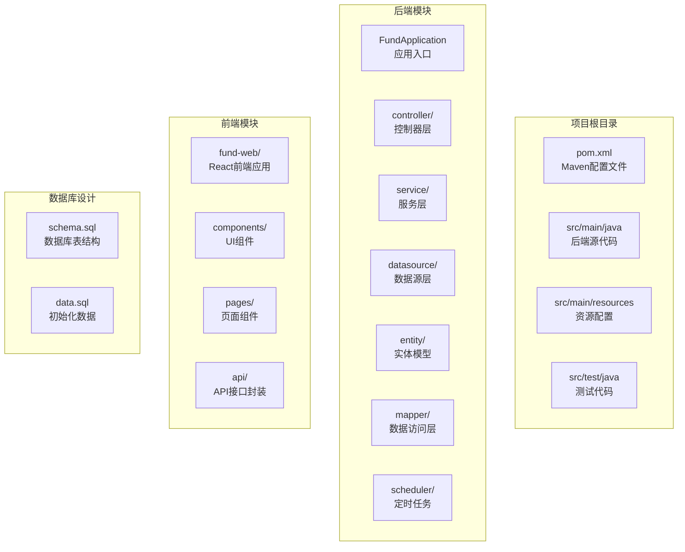
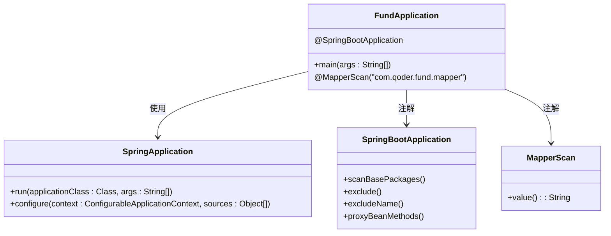
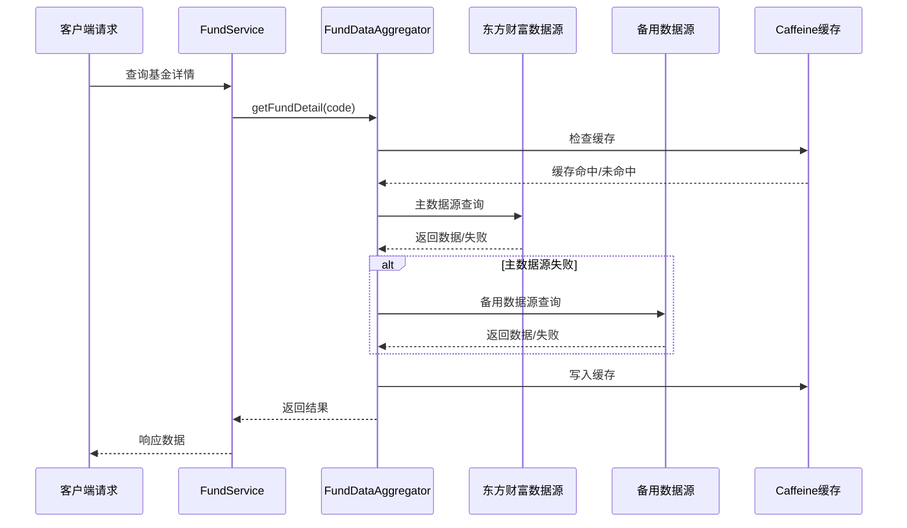
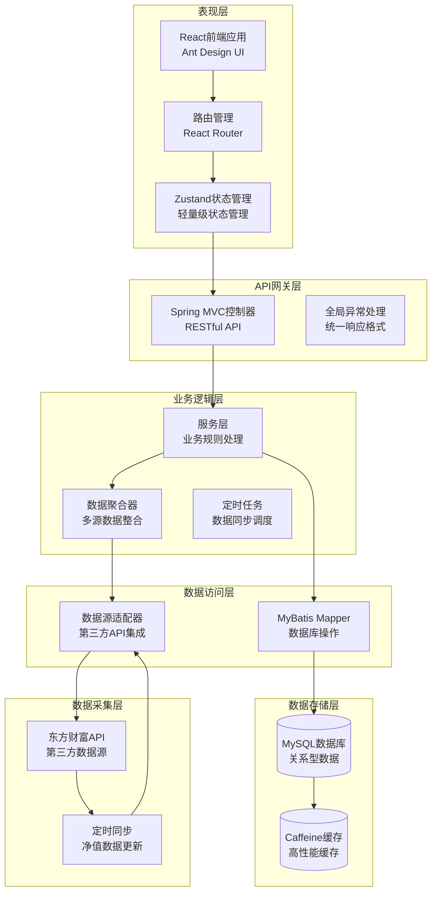
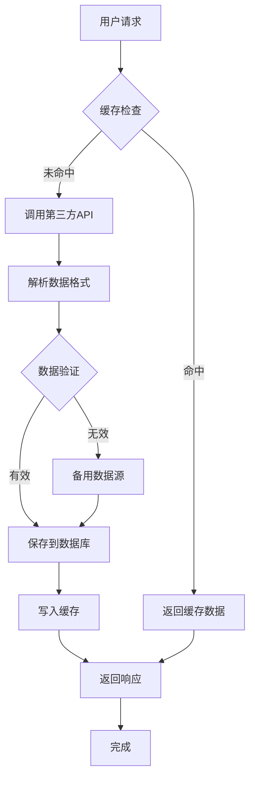
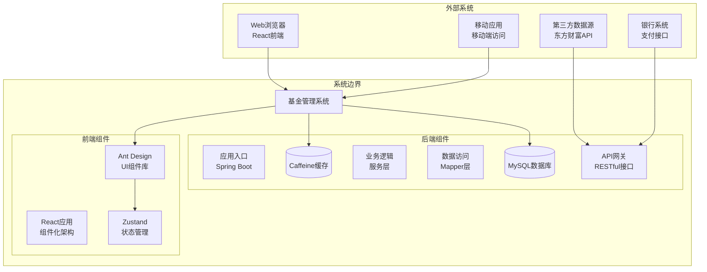
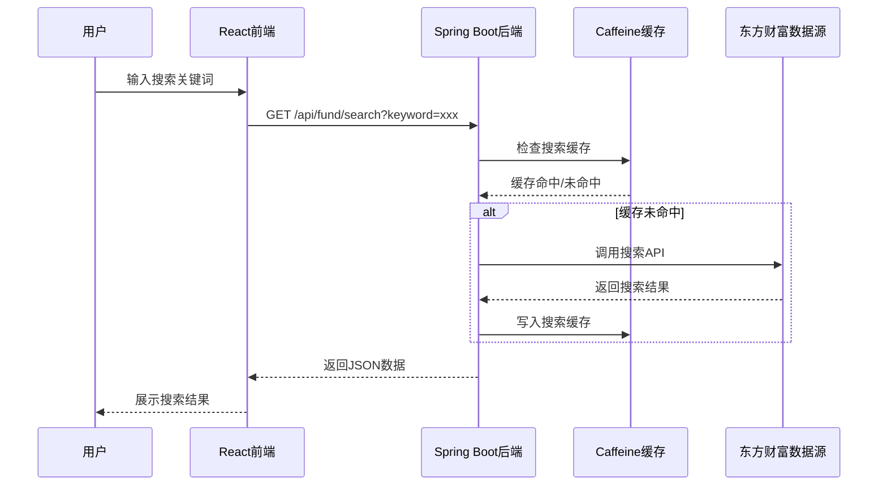
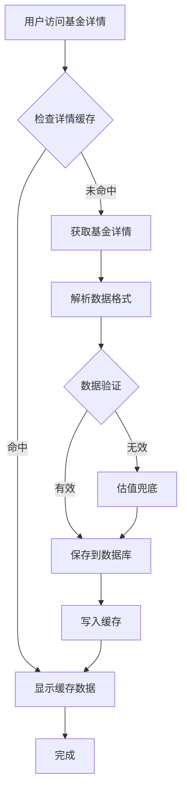

# 项目概述

<cite>
**本文档引用的文件**
- [pom.xml](file://pom.xml)
- [FundApplication.java](file://src/main/java/com/qoder/fund/FundApplication.java)
- [FundController.java](file://src/main/java/com/qoder/fund/controller/FundController.java)
- [FundService.java](file://src/main/java/com/qoder/fund/service/FundService.java)
- [EastMoneyDataSource.java](file://src/main/java/com/qoder/fund/datasource/EastMoneyDataSource.java)
- [FundDataAggregator.java](file://src/main/java/com/qoder/fund/datasource/FundDataAggregator.java)
- [FundDataSyncScheduler.java](file://src/main/java/com/qoder/fund/scheduler/FundDataSyncScheduler.java)
- [application.yml](file://src/main/resources/application.yml)
- [schema.sql](file://src/main/resources/db/schema.sql)
- [package.json](file://fund-web/package.json)
- [App.tsx](file://fund-web/src/App.tsx)
- [PRD.md](file://PRD.md)
</cite>

## 更新摘要
**变更内容**
- 更新项目架构以反映完整的Spring Boot + React微服务式金融管理平台
- 新增前后端分离架构的详细说明
- 添加数据源聚合和定时同步机制的完整描述
- 更新技术栈以包含React前端和Ant Design UI库
- 新增完整的数据库设计和实体关系说明
- 添加PRD产品需求文档的架构映射

## 目录
1. [项目简介](#项目简介)
2. [项目结构](#项目结构)
3. [核心组件](#核心组件)
4. [架构概览](#架构概览)
5. [技术栈详解](#技术栈详解)
6. [设计理念](#设计理念)
7. [系统边界说明](#系统边界说明)
8. [使用场景示例](#使用场景示例)
9. [开发指南](#开发指南)
10. [总结](#总结)

## 项目简介

本项目是一个基于Spring Boot和React构建的完整基金管理系统，定位为"一站式基金数据聚合管理工具"。项目采用前后端分离的微服务式架构，专注于为个人投资者提供基金数据展示、持仓管理、收益分析和投资决策辅助功能。

### 项目目标
- 构建现代化的金融管理平台，支持多类型基金产品的全生命周期管理
- 实现数据驱动的投资决策支持系统，提供专业级收益分析和风险评估
- 建立可扩展的微服务架构，支持未来功能扩展和业务增长
- 提供优秀的用户体验，支持Web端和移动端访问

## 项目结构

项目采用标准的Maven多模块架构，包含后端Spring Boot服务和前端React应用：



**图表来源**
- [pom.xml:1-107](file://pom.xml#L1-L107)
- [FundApplication.java:1-16](file://src/main/java/com/qoder/fund/FundApplication.java#L1-L16)
- [package.json:1-39](file://fund-web/package.json#L1-L39)

**章节来源**
- [pom.xml:1-107](file://pom.xml#L1-L107)
- [FundApplication.java:1-16](file://src/main/java/com/qoder/fund/FundApplication.java#L1-L16)
- [package.json:1-39](file://fund-web/package.json#L1-L39)

## 核心组件

### 应用启动器组件

FundApplication是整个系统的入口点，负责初始化Spring Boot应用程序上下文并启用MyBatis Mapper扫描。



**图表来源**
- [FundApplication.java:7-8](file://src/main/java/com/qoder/fund/FundApplication.java#L7-L8)

### 数据源聚合组件

FundDataAggregator实现了多数据源聚合和缓存机制，提供主数据源查询失败时的降级处理。



**图表来源**
- [FundDataAggregator.java:42-59](file://src/main/java/com/qoder/fund/datasource/FundDataAggregator.java#L42-L59)
- [EastMoneyDataSource.java:78-100](file://src/main/java/com/qoder/fund/datasource/EastMoneyDataSource.java#L78-L100)

**章节来源**
- [FundApplication.java:1-16](file://src/main/java/com/qoder/fund/FundApplication.java#L1-L16)
- [FundDataAggregator.java:1-198](file://src/main/java/com/qoder/fund/datasource/FundDataAggregator.java#L1-L198)

## 架构概览

### 完整微服务架构

项目采用前后端分离的微服务架构，包含数据采集、业务处理、数据存储和前端展示四个主要层次：



**图表来源**
- [FundController.java:15-45](file://src/main/java/com/qoder/fund/controller/FundController.java#L15-L45)
- [FundService.java:18-64](file://src/main/java/com/qoder/fund/service/FundService.java#L18-L64)
- [EastMoneyDataSource.java:26-37](file://src/main/java/com/qoder/fund/datasource/EastMoneyDataSource.java#L26-L37)
- [FundDataSyncScheduler.java:26-58](file://src/main/java/com/qoder/fund/scheduler/FundDataSyncScheduler.java#L26-L58)

### 数据流架构

系统采用事件驱动的数据流架构，支持实时数据更新和历史数据查询：



**图表来源**
- [FundDataAggregator.java:34-59](file://src/main/java/com/qoder/fund/datasource/FundDataAggregator.java#L34-L59)
- [EastMoneyDataSource.java:45-75](file://src/main/java/com/qoder/fund/datasource/EastMoneyDataSource.java#L45-L75)

## 技术栈详解

### 后端技术栈

#### Spring Boot 3.4.3
- **现代化框架**：支持Java 17特性，提供更好的性能和安全性
- **自动配置**：简化配置过程，快速启动开发环境
- **生产就绪**：内置监控、健康检查、指标收集等企业级功能

#### MyBatis-Plus 3.5.9
- **增强ORM功能**：提供通用Mapper和条件构造器
- **代码生成**：支持自动生成实体类和Mapper接口
- **分页插件**：内置分页功能，简化分页查询

#### MySQL 8.0 + Caffeine缓存
- **关系型数据库**：支持JSON字段存储复杂数据结构
- **高性能缓存**：提供本地缓存，减少数据库压力

#### OkHttp 4.12.0
- **HTTP客户端**：支持异步请求和连接池管理
- **网络优化**：提供连接复用和超时控制

### 前端技术栈

#### React 19.2.4 + TypeScript
- **组件化开发**：支持函数式组件和Hooks
- **类型安全**：提供完整的TypeScript支持
- **性能优化**：React 19引入的新特性提升开发体验

#### Ant Design 6.3.3
- **企业级UI组件**：提供丰富的金融行业组件
- **主题定制**：支持品牌色彩定制
- **国际化支持**：内置中文本地化

#### Vite 8.0.0
- **快速开发**：提供极速的开发服务器和热更新
- **构建优化**：支持ESM和模块联邦

#### 其他核心依赖
- **Axios**：HTTP客户端库，支持拦截器
- **React Router DOM**：客户端路由管理
- **Zustand**：轻量级状态管理
- **ECharts**：专业金融数据可视化

**章节来源**
- [pom.xml:20-87](file://pom.xml#L20-L87)
- [package.json:12-37](file://fund-web/package.json#L12-L37)
- [application.yml:18-37](file://src/main/resources/application.yml#L18-L37)

## 设计理念

### 微服务架构原则

项目遵循以下设计原则：
- **单一职责**：每个模块专注于特定的业务领域
- **松耦合**：通过清晰的接口定义实现模块间解耦
- **高内聚**：相关功能集中在同一模块中
- **可测试性**：易于编写单元测试和集成测试

### 金融系统设计特征

- **数据准确性**：通过多数据源聚合和验证确保数据质量
- **实时性**：支持盘中估值和定时同步机制
- **安全性**：内置安全防护和权限控制
- **可扩展性**：支持水平扩展和垂直扩展

### 前后端分离架构

- **独立开发**：前后端可以独立开发和部署
- **技术栈分离**：后端专注业务逻辑，前端专注用户体验
- **API标准化**：提供清晰的RESTful API接口
- **状态管理**：前端使用Zustand实现轻量级状态管理

## 系统边界说明

### 完整系统边界



**图表来源**
- [FundApplication.java:9-13](file://src/main/java/com/qoder/fund/FundApplication.java#L9-L13)
- [App.tsx:21-39](file://fund-web/src/App.tsx#L21-L39)

### 功能边界定义

- **核心功能**：基金搜索、详情展示、持仓管理、收益分析
- **辅助功能**：自选管理、交易记录、资产配置、报表生成
- **集成接口**：第三方数据源、银行系统、支付接口
- **管理功能**：用户管理、权限控制、系统监控、数据备份

## 使用场景示例

### 基金搜索场景



**图表来源**
- [FundController.java:22-28](file://src/main/java/com/qoder/fund/controller/FundController.java#L22-L28)
- [FundDataAggregator.java:34-37](file://src/main/java/com/qoder/fund/datasource/FundDataAggregator.java#L34-L37)
- [EastMoneyDataSource.java:45-75](file://src/main/java/com/qoder/fund/datasource/EastMoneyDataSource.java#L45-L75)

### 基金详情展示场景



**图表来源**
- [FundService.java:31-33](file://src/main/java/com/qoder/fund/service/FundService.java#L31-L33)
- [FundDataAggregator.java:44-59](file://src/main/java/com/qoder/fund/datasource/FundDataAggregator.java#L44-L59)

## 开发指南

### 环境要求

- **Java版本**：Java 17或更高版本
- **数据库**：MySQL 8.0或更高版本
- **前端依赖**：Node.js 16+，npm 8+
- **内存要求**：至少4GB RAM
- **磁盘空间**：至少1GB可用空间
- **网络连接**：需要访问Maven中央仓库和第三方API

### 项目构建

```bash
# 克隆项目
git clone <repository-url>
cd fund

# 后端构建
cd fund
./mvnw clean install

# 前端构建
cd fund-web
npm install
npm run build

# 运行应用程序
# 后端
./mvnw spring-boot:run

# 前端
cd fund-web
npm run dev
```

### 数据库初始化

```sql
-- 创建数据库
CREATE DATABASE fund_manager CHARACTER SET utf8mb4 COLLATE utf8mb4_unicode_ci;

-- 初始化表结构
mysql -u username -p fund_manager < src/main/resources/db/schema.sql

-- 初始化测试数据
mysql -u username -p fund_manager < src/main/resources/db/data.sql
```

### 开发最佳实践

- **代码规范**：遵循Spring Boot和React官方编码规范
- **依赖管理**：定期更新依赖版本，关注安全漏洞
- **测试覆盖**：保持单元测试和集成测试覆盖率
- **文档维护**：及时更新项目文档和API文档
- **性能监控**：关注缓存命中率和数据库查询性能

## 总结

本项目为基金管理系统提供了一个完整的技术解决方案，采用前后端分离的微服务架构，集成了Spring Boot后端和React前端技术栈。项目不仅建立了现代化的开发环境，还实现了完整的金融数据处理流程，包括多数据源聚合、缓存机制、定时同步等功能。

### 当前成就
- 成功建立Spring Boot 3.4.3 + React 19.2.4的完整技术栈
- 实现多数据源聚合和缓存机制，支持高并发访问
- 建立完整的数据库设计和实体关系模型
- 开发完整的前端应用，支持现代化的用户界面
- 实现定时数据同步机制，确保数据实时性

### 技术特色
- **微服务架构**：前后端分离，模块化设计
- **数据驱动**：多数据源聚合，实时数据更新
- **性能优化**：缓存机制，数据库索引优化
- **用户体验**：现代化UI设计，响应式布局
- **可扩展性**：模块化架构，支持功能扩展

### 下一步发展方向
- 完善用户认证和授权机制
- 增强数据分析和可视化功能
- 开发移动端应用
- 集成更多第三方数据源
- 建立完整的监控和日志系统
- 实现消息推送和通知功能

这个项目代表了现代金融系统开发的先进实践，为构建稳定、可扩展、用户友好的基金管理系统奠定了坚实基础。