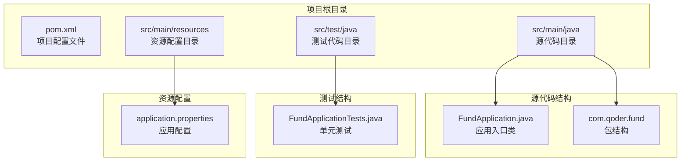
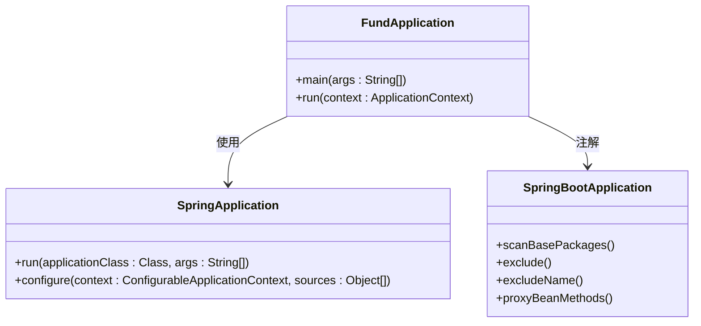
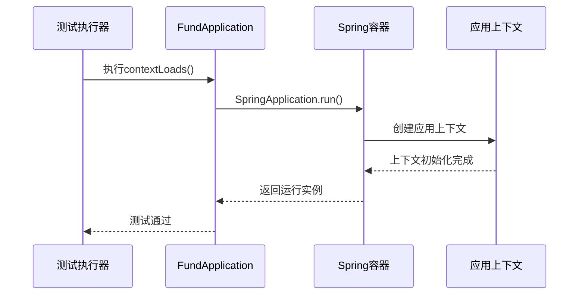
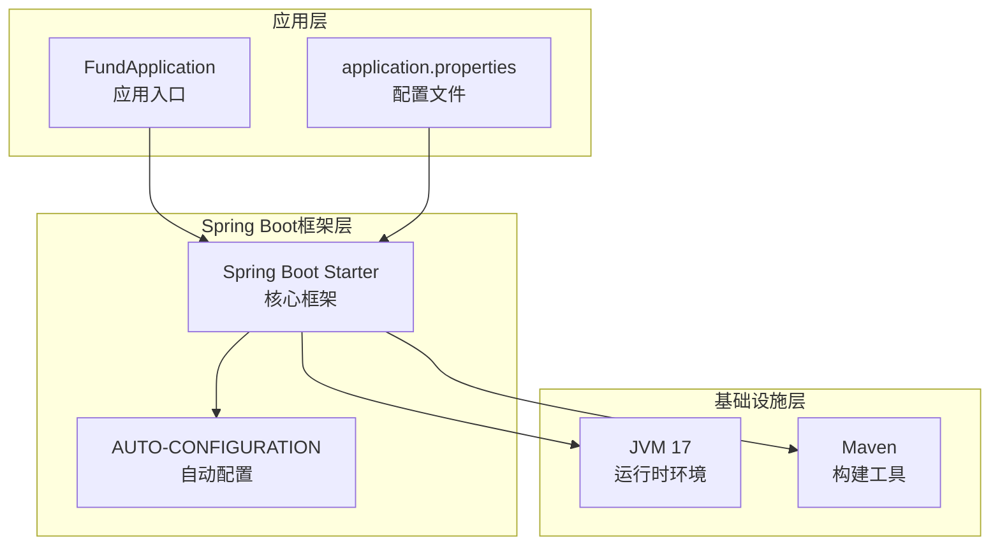
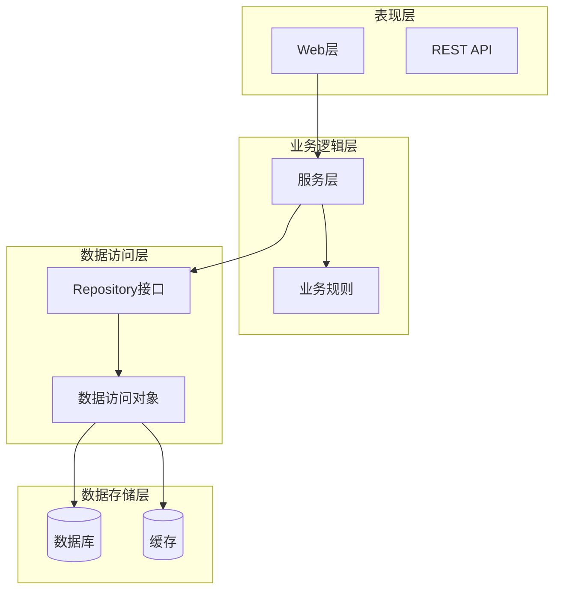
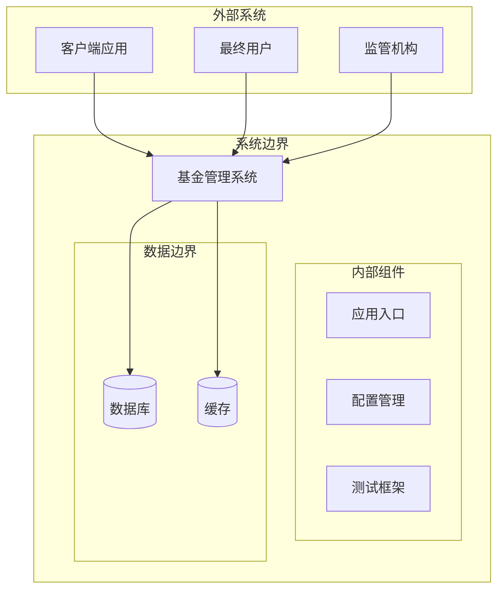
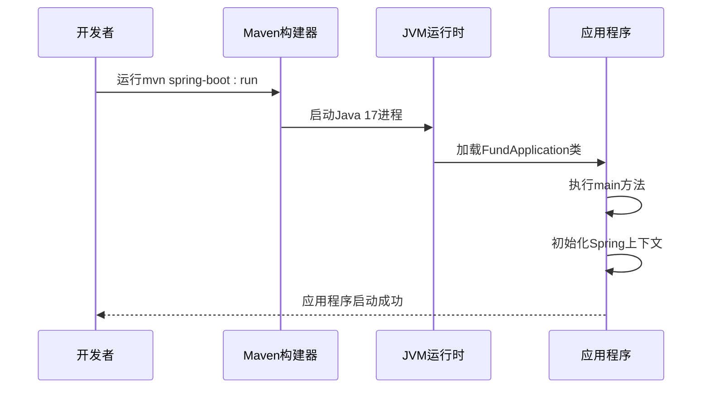
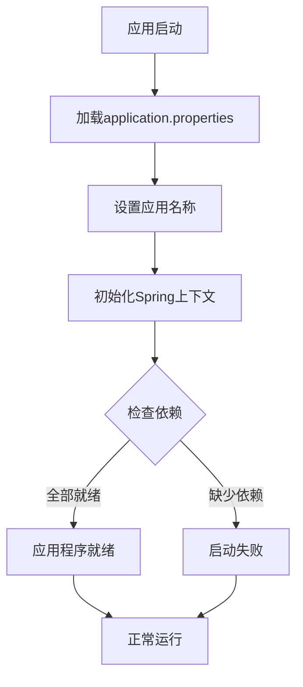

# 项目概述

<cite>
**本文档引用的文件**
- [pom.xml](file://pom.xml)
- [FundApplication.java](file://src/main/java/com/qoder/fund/FundApplication.java)
- [FundApplicationTests.java](file://src/test/java/com/qoder/fund/FundApplicationTests.java)
- [application.properties](file://src/main/resources/application.properties)
</cite>

## 目录
1. [项目简介](#项目简介)
2. [项目结构](#项目结构)
3. [核心组件](#核心组件)
4. [架构概览](#架构概览)
5. [技术栈详解](#技术栈详解)
6. [设计理念](#设计理念)
7. [系统边界说明](#系统边界说明)
8. [使用场景示例](#使用场景示例)
9. [开发指南](#开发指南)
10. [总结](#总结)

## 项目简介

本项目是一个基于Spring Boot框架构建的基金管理系统原型项目。该项目旨在为金融系统提供一个现代化、可扩展的基金管理系统解决方案。当前版本是一个基础的Spring Boot应用程序骨架，为后续的功能扩展奠定了坚实的技术基础。

### 项目目标
- 提供企业级的基金管理系统基础设施
- 支持多类型基金产品的管理
- 实现合规的财务数据处理流程
- 构建可扩展的微服务架构基础

## 项目结构

项目采用标准的Maven目录结构，遵循Spring Boot的最佳实践：



**图表来源**
- [pom.xml:1-55](file://pom.xml#L1-L55)
- [FundApplication.java:1-14](file://src/main/java/com/qoder/fund/FundApplication.java#L1-L14)

**章节来源**
- [pom.xml:1-55](file://pom.xml#L1-L55)
- [FundApplication.java:1-14](file://src/main/java/com/qoder/fund/FundApplication.java#L1-L14)

## 核心组件

### 应用启动器组件

FundApplication是整个系统的入口点，负责初始化Spring Boot应用程序上下文。



**图表来源**
- [FundApplication.java:6-13](file://src/main/java/com/qoder/fund/FundApplication.java#L6-L13)

### 测试组件

项目包含基础的单元测试配置，确保应用程序能够正确启动。



**图表来源**
- [FundApplicationTests.java:6-12](file://src/test/java/com/qoder/fund/FundApplicationTests.java#L6-L12)

**章节来源**
- [FundApplication.java:1-14](file://src/main/java/com/qoder/fund/FundApplication.java#L1-L14)
- [FundApplicationTests.java:1-14](file://src/test/java/com/qoder/fund/FundApplicationTests.java#L1-L14)

## 架构概览

### 当前架构状态

目前项目处于初始阶段，采用单模块架构设计：



**图表来源**
- [pom.xml:29-36](file://pom.xml#L29-L36)
- [application.properties:1-2](file://src/main/resources/application.properties#L1-L2)

### 预期架构演进

随着功能需求的增长，系统将演进为多模块架构：



## 技术栈详解

### Spring Boot 4.0.3

选择Spring Boot作为核心框架的原因：
- **快速开发**：提供开箱即用的配置和自动装配
- **生产就绪**：内置监控、健康检查、指标收集等功能
- **生态系统**：丰富的starter和第三方集成支持
- **现代化**：支持最新的Java特性

### Java 17 LTS

Java 17作为技术选型的优势：
- **长期支持**：获得5年的安全更新和技术支持
- **性能优化**：JIT编译器和垃圾回收器的持续改进
- **语言特性**：模式匹配、密封类等现代语言特性
- **生态兼容**：与Spring Boot 4.0.3完美兼容

### Maven构建系统

Maven作为构建工具的选择理由：
- **依赖管理**：自动化的依赖解析和版本控制
- **生命周期**：标准化的构建流程管理
- **插件生态**：丰富的插件支持开发、测试、部署
- **团队协作**：统一的项目结构和构建约定

**章节来源**
- [pom.xml:5-10](file://pom.xml#L5-L10)
- [pom.xml:29-31](file://pom.xml#L29-L31)

## 设计理念

### 微服务架构原则

项目遵循以下设计原则：
- **单一职责**：每个模块专注于特定的业务领域
- **松耦合**：通过清晰的接口定义实现模块间解耦
- **高内聚**：相关功能集中在同一模块中
- **可测试性**：易于编写单元测试和集成测试

### 企业级应用特征

- **可扩展性**：支持水平扩展和垂直扩展
- **可靠性**：具备容错机制和故障恢复能力
- **安全性**：内置安全防护和权限控制
- **可观测性**：提供完整的监控和日志记录

## 系统边界说明

### 当前系统边界



**图表来源**
- [FundApplication.java:6-13](file://src/main/java/com/qoder/fund/FundApplication.java#L6-L13)

### 功能边界定义

- **核心功能**：基金产品管理、交易处理、风险评估
- **辅助功能**：报告生成、审计日志、合规检查
- **集成接口**：银行系统对接、第三方数据源
- **管理功能**：用户管理、权限控制、系统监控

## 使用场景示例

### 基础启动场景



**图表来源**
- [FundApplication.java:9-11](file://src/main/java/com/qoder/fund/FundApplication.java#L9-L11)

### 配置管理场景



**图表来源**
- [application.properties:1-2](file://src/main/resources/application.properties#L1-L2)

## 开发指南

### 环境要求

- **Java版本**：Java 17或更高版本
- **内存要求**：至少2GB RAM
- **磁盘空间**：至少500MB可用空间
- **网络连接**：需要访问Maven中央仓库

### 项目构建

```bash
# 克隆项目
git clone <repository-url>
cd fund

# 构建项目
./mvnw clean install

# 运行应用程序
./mvnw spring-boot:run

# 运行测试
./mvnw test
```

### 开发最佳实践

- **代码规范**：遵循Spring Boot官方编码规范
- **依赖管理**：定期更新依赖版本
- **测试覆盖**：保持单元测试覆盖率
- **文档维护**：及时更新项目文档

## 总结

本项目为基金管理系统提供了一个坚实的技术基础。虽然当前版本相对简单，但已经建立了现代化的Spring Boot架构和完整的开发环境。通过遵循微服务架构原则和企业级应用设计标准，项目为未来的功能扩展和业务发展做好了充分准备。

### 当前成就
- 成功建立Spring Boot 4.0.3 + Java 17的技术栈
- 完成基础的项目结构和配置
- 建立了完整的开发和测试环境
- 准备好扩展到复杂的金融业务场景

### 下一步发展方向
- 添加核心业务功能模块
- 集成数据库和缓存层
- 实现用户认证和授权机制
- 建立完整的监控和日志系统
- 开发API文档和前端界面

这个项目代表了现代金融系统开发的一个良好开端，为构建稳定、可扩展的基金管理系统奠定了坚实基础。