# 项目结构详解

<cite>
**本文档引用的文件**
- [pom.xml](file://pom.xml)
- [FundApplication.java](file://src/main/java/com/qoder/fund/FundApplication.java)
- [application.yml](file://src/main/resources/application.yml)
- [schema.sql](file://src/main/resources/db/schema.sql)
- [data.sql](file://src/main/resources/db/data.sql)
- [FundController.java](file://src/main/java/com/qoder/fund/controller/FundController.java)
- [FundService.java](file://src/main/java/com/qoder/fund/service/FundService.java)
- [Fund.java](file://src/main/java/com/qoder/fund/entity/Fund.java)
- [package.json](file://fund-web/package.json)
- [vite.config.ts](file://fund-web/vite.config.ts)
- [PRD.md](file://PRD.md)
- [FundApplicationTests.java](file://src/test/java/com/qoder/fund/FundApplicationTests.java)
- [.gitignore](file://.gitignore)
- [maven-wrapper.properties](file://.mvn/wrapper/maven-wrapper.properties)
</cite>

## 目录
1. [引言](#引言)
2. [项目结构概览](#项目结构概览)
3. [双端架构设计](#双端架构设计)
4. [后端模块分析](#后端模块分析)
5. [前端模块分析](#前端模块分析)
6. [数据库设计](#数据库设计)
7. [核心组件分析](#核心组件分析)
8. [架构设计原则](#架构设计原则)
9. [依赖管理与构建配置](#依赖管理与构建配置)
10. [测试策略与集成](#测试策略与集成)
11. [代码组织规范](#代码组织规范)
12. [Spring Boot约定优于配置理念](#spring-boot约定优于配置理念)
13. [最佳实践建议](#最佳实践建议)
14. [总结](#总结)

## 引言

本基金管理系统是一个基于Spring Boot的现代化双端架构项目，采用前后端分离的设计模式。项目采用Maven多模块结构，后端使用Spring Boot + MyBatis-Plus，前端使用React + TypeScript + Vite，实现了完整的基金数据管理与查询功能。项目展现了现代Web应用开发的最佳实践，为后续的功能扩展和团队协作奠定了坚实基础。

## 项目结构概览

该项目采用标准的Maven多模块项目结构，实现了前后端分离的双端架构设计：

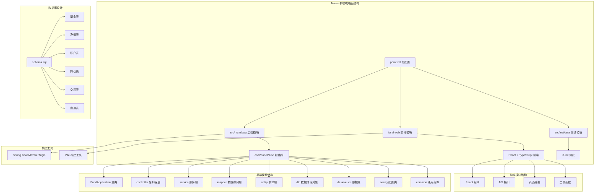

**图表来源**
- [pom.xml:1-107](file://pom.xml#L1-L107)
- [FundApplication.java:1-16](file://src/main/java/com/qoder/fund/FundApplication.java#L1-L16)
- [package.json:1-39](file://fund-web/package.json#L1-L39)

**章节来源**
- [pom.xml:1-107](file://pom.xml#L1-L107)
- [FundApplication.java:1-16](file://src/main/java/com/qoder/fund/FundApplication.java#L1-L16)
- [package.json:1-39](file://fund-web/package.json#L1-L39)

## 双端架构设计

### 整体架构模式

项目采用前后端分离的双端架构，通过RESTful API进行通信：

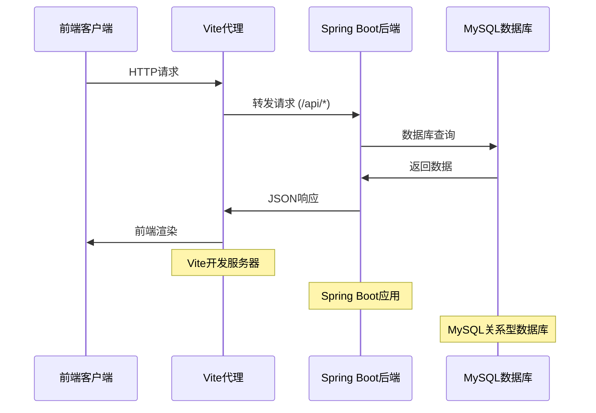

**图表来源**
- [vite.config.ts:8-14](file://fund-web/vite.config.ts#L8-L14)
- [application.yml:12-17](file://src/main/resources/application.yml#L12-L17)

### 技术栈对比

| 层级 | 技术选型 | 版本 | 说明 |
|------|----------|------|------|
| 前端框架 | React | 19.2.4 | 组件化开发，类型安全 |
| 前端构建 | Vite | 8.0.0 | 快速开发体验 |
| 前端状态 | Zustand | 5.0.12 | 轻量级状态管理 |
| 前端UI | Ant Design | 6.3.3 | 企业级组件库 |
| 前端图表 | ECharts | 6.0.0 | 金融数据可视化 |
| 后端框架 | Spring Boot | 3.4.3 | 自动配置，快速开发 |
| 数据库 | MySQL | 8.0+ | 关系型数据库 |
| ORM框架 | MyBatis-Plus | 3.5.9 | 简化数据访问层 |

**章节来源**
- [package.json:12-37](file://fund-web/package.json#L12-L37)
- [pom.xml:20-87](file://pom.xml#L20-L87)

## 后端模块分析

### 包结构设计

后端模块采用了标准的分层架构设计，遵循了Spring Boot的最佳实践：

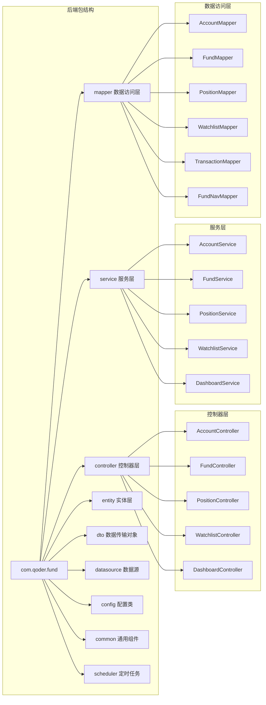

**图表来源**
- [FundController.java:15-46](file://src/main/java/com/qoder/fund/controller/FundController.java#L15-L46)
- [FundService.java:18-65](file://src/main/java/com/qoder/fund/service/FundService.java#L18-L65)

### 核心业务组件

#### FundController - 基金管理控制器

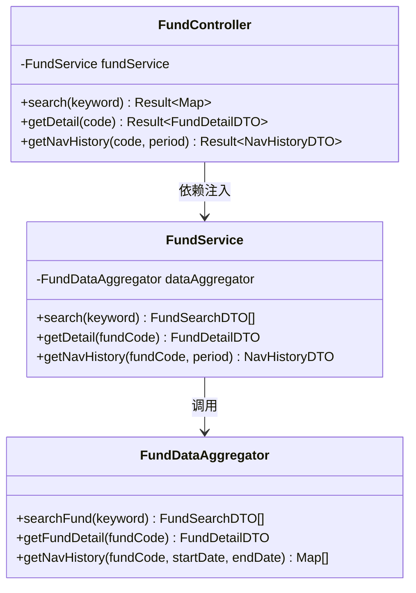

**图表来源**
- [FundController.java:15-46](file://src/main/java/com/qoder/fund/controller/FundController.java#L15-L46)
- [FundService.java:18-65](file://src/main/java/com/qoder/fund/service/FundService.java#L18-L65)

**章节来源**
- [FundController.java:1-46](file://src/main/java/com/qoder/fund/controller/FundController.java#L1-L46)
- [FundService.java:1-65](file://src/main/java/com/qoder/fund/service/FundService.java#L1-L65)

## 前端模块分析

### 前端技术栈

前端模块基于React 19和TypeScript，采用了现代化的开发工具链：

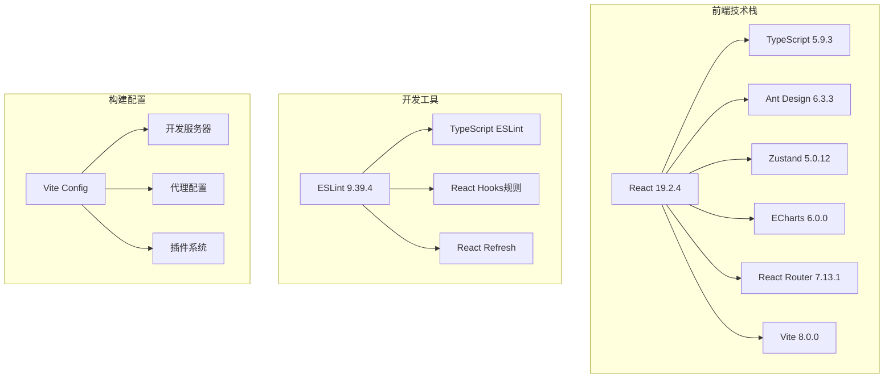

**图表来源**
- [package.json:12-37](file://fund-web/package.json#L12-L37)
- [vite.config.ts:1-16](file://fund-web/vite.config.ts#L1-16)

### 前端模块结构

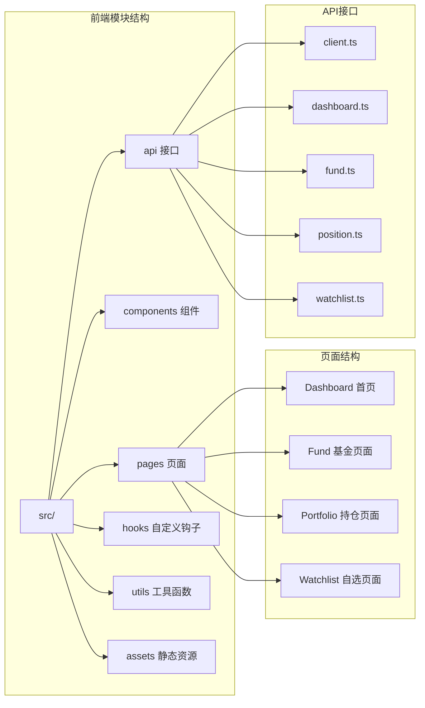

**图表来源**
- [package.json:12-37](file://fund-web/package.json#L12-L37)

**章节来源**
- [package.json:1-39](file://fund-web/package.json#L1-L39)
- [vite.config.ts:1-16](file://fund-web/vite.config.ts#L1-L16)

## 数据库设计

### 数据库架构

项目使用MySQL作为数据存储，采用了规范化的关系型数据库设计：

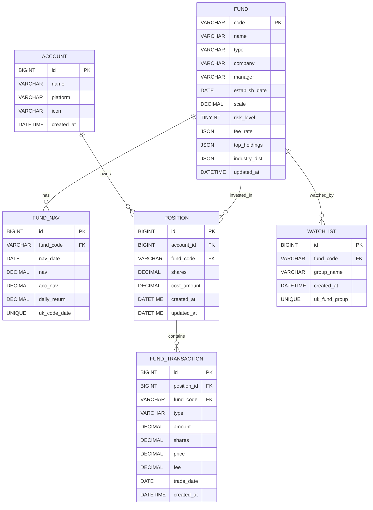

**图表来源**
- [schema.sql:1-78](file://src/main/resources/db/schema.sql#L1-L78)

### 核心数据模型

#### Fund 实体类映射

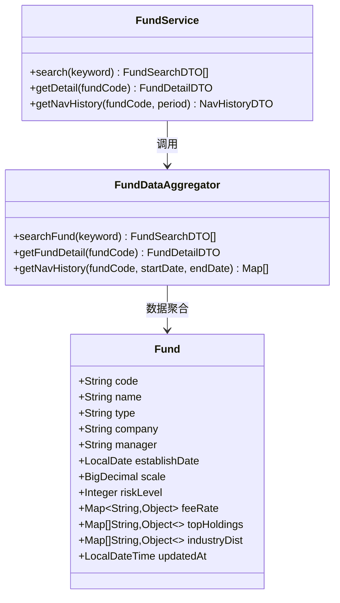

**图表来源**
- [Fund.java:16-42](file://src/main/java/com/qoder/fund/entity/Fund.java#L16-L42)
- [FundService.java:31-63](file://src/main/java/com/qoder/fund/service/FundService.java#L31-L63)

**章节来源**
- [schema.sql:1-78](file://src/main/resources/db/schema.sql#L1-L78)
- [Fund.java:1-42](file://src/main/java/com/qoder/fund/entity/Fund.java#L1-L42)

## 核心组件分析

### FundApplication主类

FundApplication是整个Spring Boot应用的入口点，体现了Spring Boot的自动配置特性：

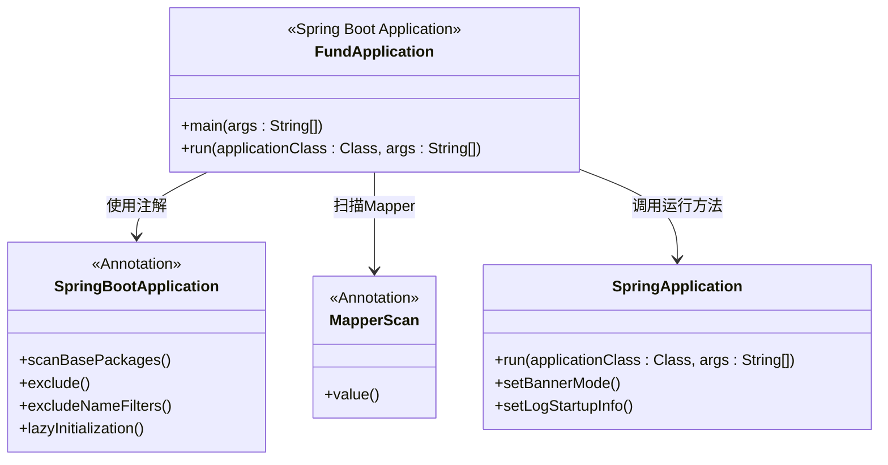

**图表来源**
- [FundApplication.java:7-8](file://src/main/java/com/qoder/fund/FundApplication.java#L7-L8)

该主类具有以下特点：
- 使用`@SpringBootApplication`注解实现自动配置扫描
- 通过`@MapperScan`注解扫描MyBatis Mapper接口
- 通过静态main方法启动Spring Boot应用
- 默认扫描当前包及其子包的所有组件

**章节来源**
- [FundApplication.java:1-16](file://src/main/java/com/qoder/fund/FundApplication.java#L1-L16)

### 配置文件管理

项目采用Spring Boot的配置文件管理机制，支持多种配置格式：

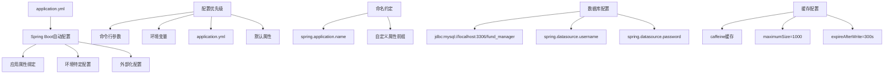

**图表来源**
- [application.yml:1-43](file://src/main/resources/application.yml#L1-L43)

**章节来源**
- [application.yml:1-43](file://src/main/resources/application.yml#L1-L43)

## 架构设计原则

### 分层架构设计

项目采用了经典的三层架构设计，实现了关注点分离：

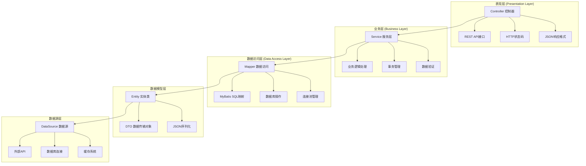

**图表来源**
- [FundController.java:15-46](file://src/main/java/com/qoder/fund/controller/FundController.java#L15-L46)
- [FundService.java:18-65](file://src/main/java/com/qoder/fund/service/FundService.java#L18-L65)

### 约定优于配置

项目充分体现了Spring Boot的核心设计理念：

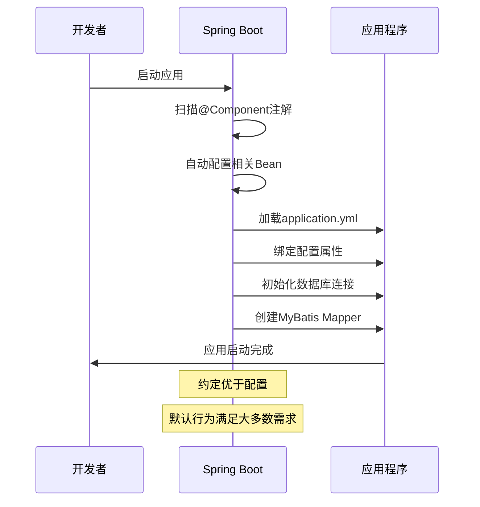

## 依赖管理与构建配置

### Maven POM配置分析

项目使用Spring Boot Starter Parent作为父POM，实现了版本管理和插件配置的统一管理：

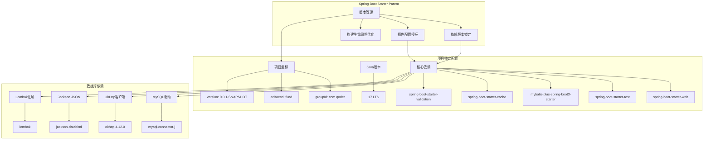

**图表来源**
- [pom.xml:5-43](file://pom.xml#L5-L43)
- [pom.xml:20-87](file://pom.xml#L20-L87)

**章节来源**
- [pom.xml:1-107](file://pom.xml#L1-L107)

### 构建工具配置

项目集成了Maven Wrapper和Spring Boot Maven Plugin：

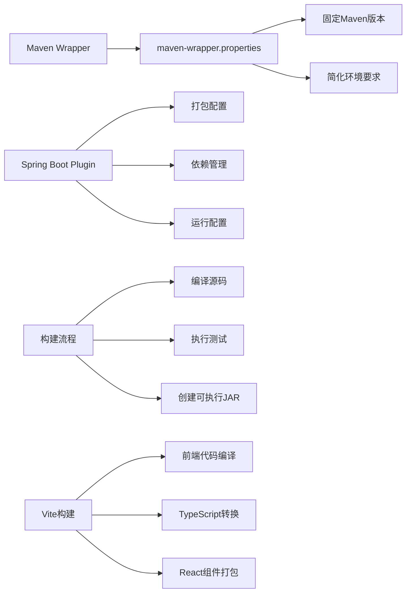

**图表来源**
- [.mvn/wrapper/maven-wrapper.properties:1-4](file://.mvn/wrapper/maven-wrapper.properties#L1-L4)
- [pom.xml:89-104](file://pom.xml#L89-L104)
- [vite.config.ts:1-16](file://fund-web/vite.config.ts#L1-L16)

**章节来源**
- [.mvn/wrapper/maven-wrapper.properties:1-4](file://.mvn/wrapper/maven-wrapper.properties#L1-L4)
- [pom.xml:89-104](file://pom.xml#L89-L104)
- [vite.config.ts:1-16](file://fund-web/vite.config.ts#L1-L16)

## 测试策略与集成

### JUnit 5测试框架集成

项目采用JUnit 5作为测试框架，并与Spring Boot Test进行深度集成：

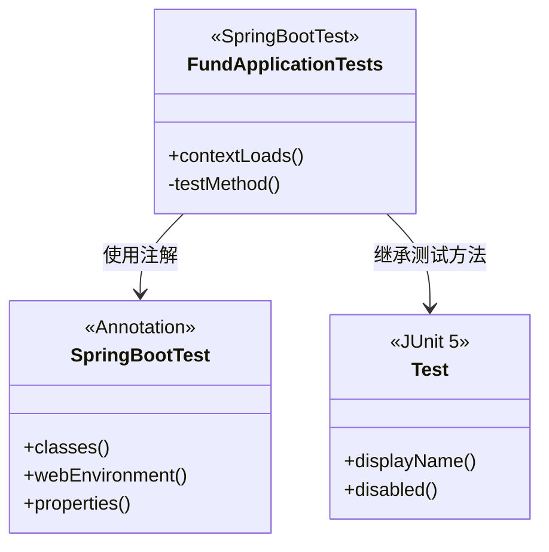

**图表来源**
- [FundApplicationTests.java:6-12](file://src/test/java/com/qoder/fund/FundApplicationTests.java#L6-L12)

### 测试配置策略

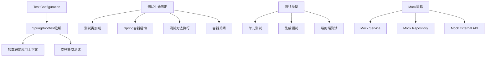

**图表来源**
- [FundApplicationTests.java:1-14](file://src/test/java/com/qoder/fund/FundApplicationTests.java#L1-L14)

**章节来源**
- [FundApplicationTests.java:1-14](file://src/test/java/com/qoder/fund/FundApplicationTests.java#L1-L14)

## 代码组织规范

### 命名约定指导

项目遵循Spring Boot和Java开发的最佳实践：

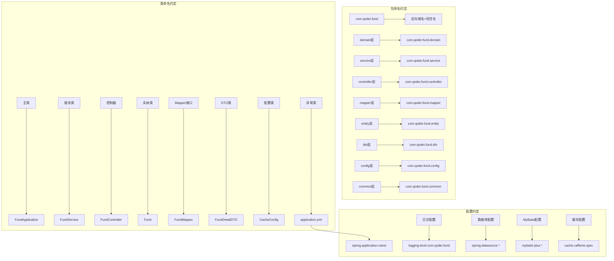

### 代码结构最佳实践

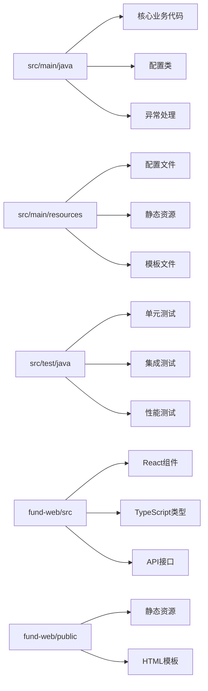

## Spring Boot约定优于配置理念

### 自动配置机制

Spring Boot通过约定实现了大部分配置的自动化：

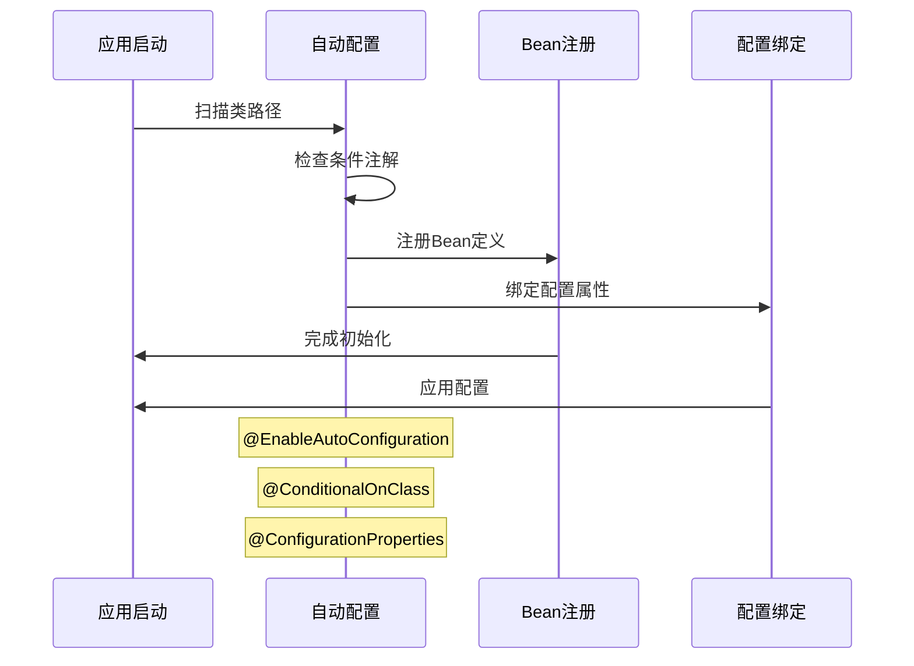

### 条件化配置

项目通过条件注解实现了灵活的配置选择：

```mermaid
flowchart TD
A[条件注解] --> B[@ConditionalOnClass]
A --> C[@ConditionalOnMissingBean]
A --> D[@ConditionalOnProperty]
E[配置选择] --> F[开发环境]
E --> G[测试环境]
E --> H[生产环境]
I[Profile配置] --> J[application-dev.yml]
I --> K[application-test.yml]
I --> L[application-prod.yml]
M[Active Profile] --> N[spring.profiles.active]
O[External Config] --> P[application-{profile}.yml]
```

## 最佳实践建议

### 项目结构优化建议

基于当前项目状态，建议考虑以下优化方向：

```mermaid
graph TB
subgraph "功能模块化"
A[domain模块] --> B[fund-domain]
C[service模块] --> D[fund-service]
E[controller模块] --> F[fund-web]
G[repository模块] --> H[fund-repository]
I[api模块] --> J[fund-api]
end
subgraph "配置分离"
K[基础配置] --> L[application.yml]
M[环境配置] --> N[application-{env}.yml]
O[外部配置] --> P[application-{profile}.yml]
Q[数据库配置] --> R[schema.sql]
Q --> S[data.sql]
end
subgraph "监控与运维"
T[健康检查] --> U[actuator]
V[指标收集] --> W[metrics]
X[日志管理] --> Y[logback-spring.xml]
Z[缓存监控] --> AA[cache statistics]
BB[数据库监控] --> CC[performance metrics]
end
subgraph "开发工具"
DD[IDE配置] --> EE[Spring Boot DevTools]
FF[热重载] --> GG[前端Vite HMR]
HH[调试配置] --> II[断点调试]
JJ[代码质量] --> KK[SonarQube]
LL[API文档] --> MM[Swagger/OpenAPI]
```

### 开发工作流建议

```mermaid
flowchart TD
A[开发流程] --> B[编码]
A --> C[测试]
A --> D[构建]
A --> E[部署]
F[CI/CD管道] --> G[代码质量检查]
F --> H[自动化测试]
F --> I[安全扫描]
F --> J[持续部署]
K[文档维护] --> L[API文档]
K --> M[架构文档]
K --> N[用户手册]
O[监控告警] --> P[应用监控]
O --> Q[数据库监控]
O --> R[性能监控]
S[版本管理] --> T[Git分支策略]
S --> U[SemVer版本]
S --> V[发布日志]
```

## 总结

本基金管理系统项目展现了现代Spring Boot应用的良好开端。项目采用了完整的双端架构设计，后端使用Spring Boot + MyBatis-Plus，前端使用React + TypeScript + Vite，实现了前后端分离的现代化Web应用架构。

### 主要优势

1. **完整的双端架构**：前后端分离设计，职责明确，便于团队协作
2. **现代化技术栈**：Spring Boot、React、TypeScript等主流技术
3. **规范的项目结构**：遵循Maven标准布局，易于理解和维护
4. **完善的配置管理**：Spring Boot自动配置，减少样板代码
5. **数据库设计规范**：关系型数据库规范化设计，支持复杂业务场景
6. **测试框架集成**：JUnit 5 + Spring Boot Test，保证代码质量

### 技术亮点

- **Spring Boot自动配置**：通过约定实现大部分配置的自动化
- **MyBatis-Plus简化开发**：提供强大的ORM功能和代码生成
- **React + TypeScript类型安全**：提供更好的开发体验和代码质量
- **Vite快速构建**：提供极速的开发和构建体验
- **Caffeine缓存**：提升系统性能和响应速度
- **数据库初始化**：通过schema.sql和data.sql自动初始化数据

### 后续发展方向

1. **功能扩展**：基于PRD文档逐步实现核心功能
2. **性能优化**：数据库索引优化、缓存策略优化
3. **安全加固**：用户认证授权、数据加密、API安全
4. **监控完善**：引入APM监控、日志分析、性能指标
5. **部署优化**：容器化部署、微服务架构演进
6. **用户体验**：界面优化、交互改进、移动端适配

项目展现了良好的技术基础和架构设计，为后续的功能扩展和团队协作提供了坚实的技术支撑。