# 项目结构详解

<cite>
**本文档引用的文件**
- [pom.xml](file://pom.xml)
- [FundApplication.java](file://src/main/java/com/qoder/fund/FundApplication.java)
- [application.properties](file://src/main/resources/application.properties)
- [FundApplicationTests.java](file://src/test/java/com/qoder/fund/FundApplicationTests.java)
- [.gitignore](file://.gitignore)
- [maven-wrapper.properties](file://.mvn/wrapper/maven-wrapper.properties)
</cite>

## 目录
1. [引言](#引言)
2. [项目结构概览](#项目结构概览)
3. [核心组件分析](#核心组件分析)
4. [架构设计原则](#架构设计原则)
5. [依赖管理与构建配置](#依赖管理与构建配置)
6. [测试策略与集成](#测试策略与集成)
7. [代码组织规范](#代码组织规范)
8. [Spring Boot约定优于配置理念](#spring-boot约定优于配置理念)
9. [最佳实践建议](#最佳实践建议)
10. [总结](#总结)

## 引言

本项目是一个基于Spring Boot的基金管理系统原型，采用现代化的Maven项目结构和Spring Boot约定优于配置的设计理念。项目虽然目前处于初始阶段，但已经建立了完整的开发环境基础，为后续的功能扩展奠定了坚实的技术基础。

## 项目结构概览

该项目遵循标准的Maven项目布局，采用了清晰的分层架构设计：

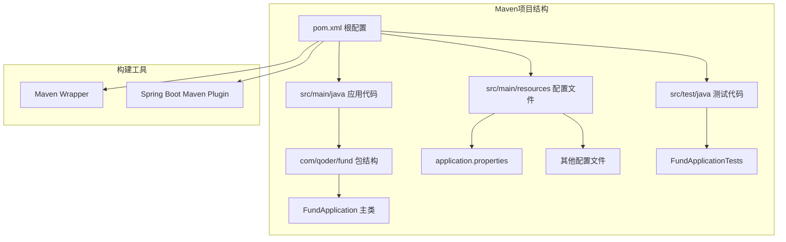

**图表来源**
- [pom.xml:1-55](file://pom.xml#L1-L55)
- [FundApplication.java:1-14](file://src/main/java/com/qoder/fund/FundApplication.java#L1-L14)

**章节来源**
- [pom.xml:1-55](file://pom.xml#L1-L55)
- [FundApplication.java:1-14](file://src/main/java/com/qoder/fund/FundApplication.java#L1-L14)

## 核心组件分析

### FundApplication主类

FundApplication是整个Spring Boot应用的入口点，体现了Spring Boot的自动配置特性：

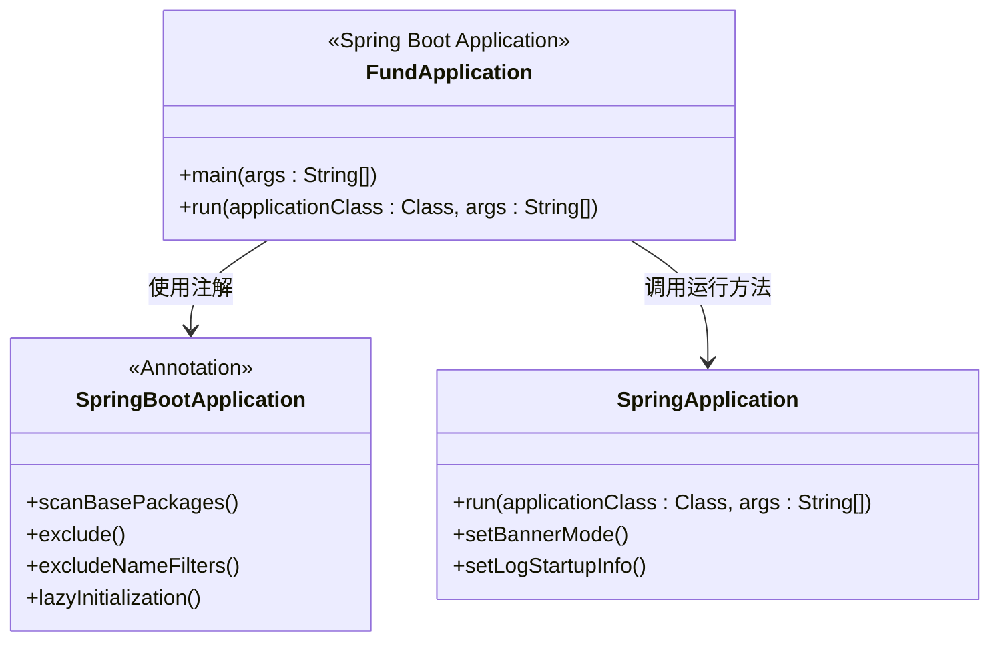

**图表来源**
- [FundApplication.java:6-11](file://src/main/java/com/qoder/fund/FundApplication.java#L6-L11)

该主类具有以下特点：
- 使用`@SpringBootApplication`注解实现自动配置扫描
- 通过静态main方法启动Spring Boot应用
- 默认扫描当前包及其子包的所有组件

**章节来源**
- [FundApplication.java:1-14](file://src/main/java/com/qoder/fund/FundApplication.java#L1-L14)

### 配置文件管理

项目采用Spring Boot的配置文件管理机制：

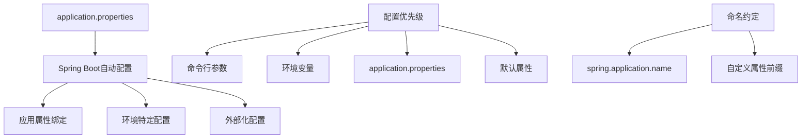

**图表来源**
- [application.properties:1-2](file://src/main/resources/application.properties#L1-L2)

**章节来源**
- [application.properties:1-2](file://src/main/resources/application.properties#L1-L2)

## 架构设计原则

### 包结构设计

项目采用了标准的Java包命名约定和Spring Boot推荐的单模块结构：

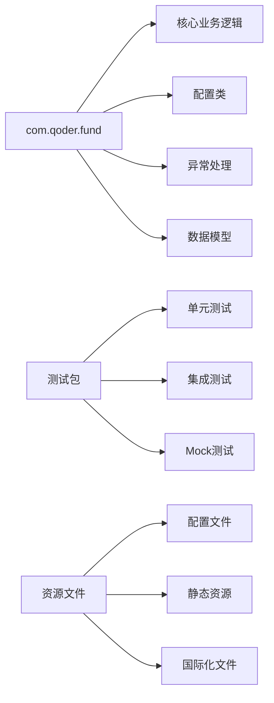

这种设计遵循了以下原则：
- **单一职责**：每个包专注于特定的功能领域
- **层次清晰**：从基础设施到业务逻辑的清晰分层
- **可扩展性**：为未来功能扩展预留空间

### 约定优于配置

项目充分体现了Spring Boot的核心设计理念：

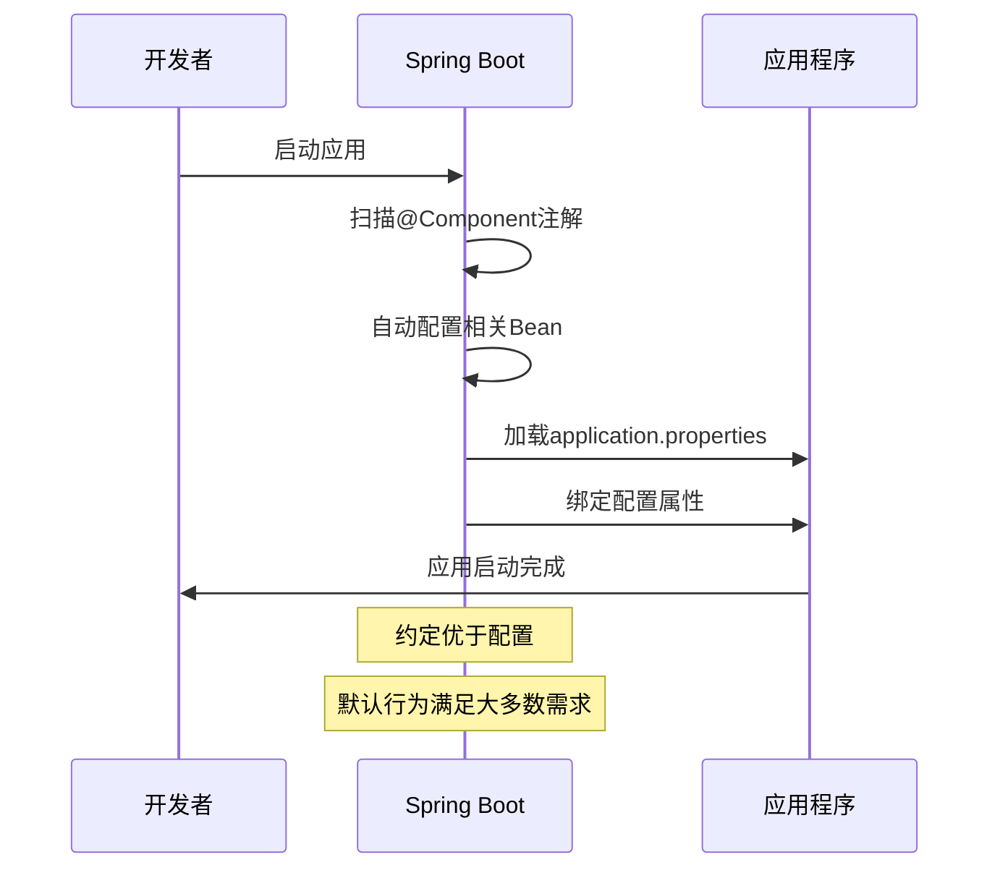

## 依赖管理与构建配置

### Maven POM配置分析

项目使用Spring Boot Starter Parent作为父POM，实现了版本管理和插件配置的统一管理：

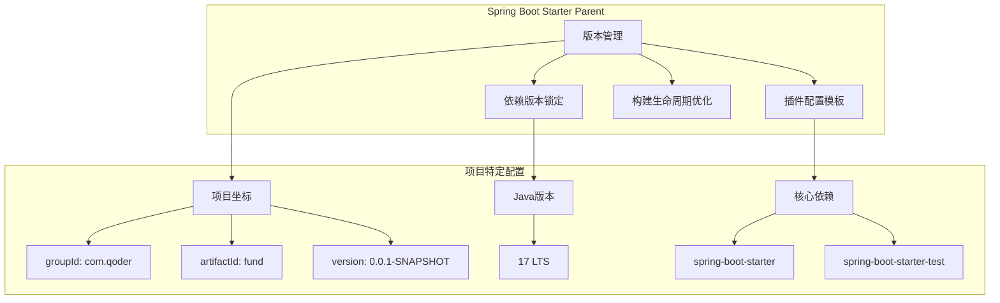

**图表来源**
- [pom.xml:5-43](file://pom.xml#L5-L43)

**章节来源**
- [pom.xml:1-55](file://pom.xml#L1-L55)

### 构建工具配置

项目集成了Maven Wrapper和Spring Boot Maven Plugin：

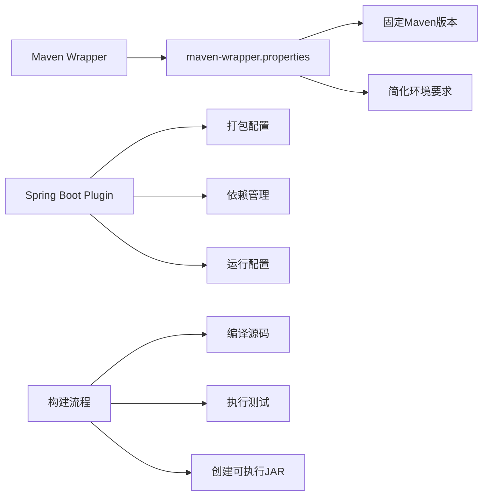

**图表来源**
- [maven-wrapper.properties:1-4](file://.mvn/wrapper/maven-wrapper.properties#L1-L4)
- [pom.xml:45-52](file://pom.xml#L45-L52)

**章节来源**
- [.mvn/wrapper/maven-wrapper.properties:1-4](file://.mvn/wrapper/maven-wrapper.properties#L1-L4)
- [pom.xml:45-52](file://pom.xml#L45-L52)

## 测试策略与集成

### JUnit 5测试框架集成

项目采用JUnit 5作为测试框架，并与Spring Boot Test进行深度集成：

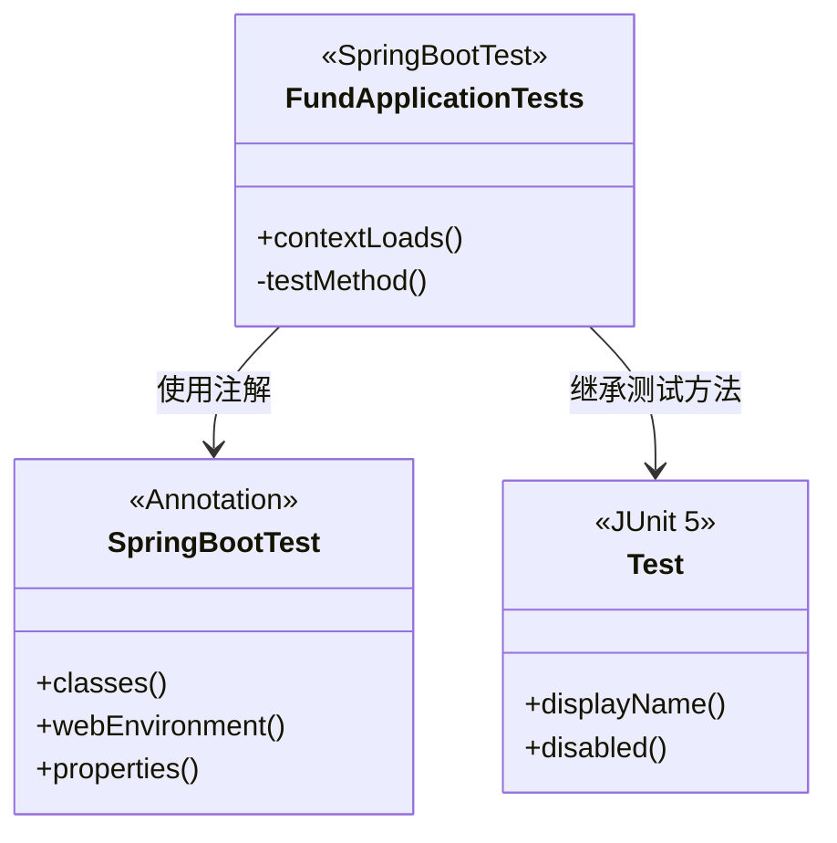

**图表来源**
- [FundApplicationTests.java:6-12](file://src/test/java/com/qoder/fund/FundApplicationTests.java#L6-L12)

### 测试配置策略

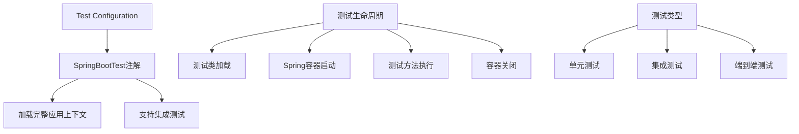

**图表来源**
- [FundApplicationTests.java:1-14](file://src/test/java/com/qoder/fund/FundApplicationTests.java#L1-L14)

**章节来源**
- [FundApplicationTests.java:1-14](file://src/test/java/com/qoder/fund/FundApplicationTests.java#L1-L14)

## 代码组织规范

### 命名约定指导

项目遵循Spring Boot和Java开发的最佳实践：

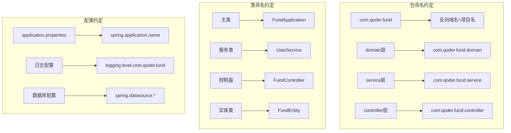

### 代码结构最佳实践

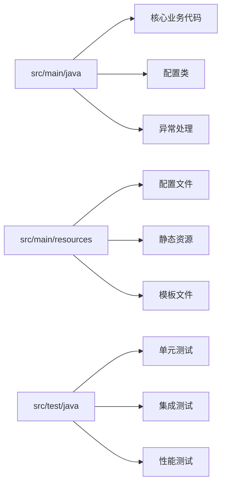

## Spring Boot约定优于配置理念

### 自动配置机制

Spring Boot通过约定实现了大部分配置的自动化：

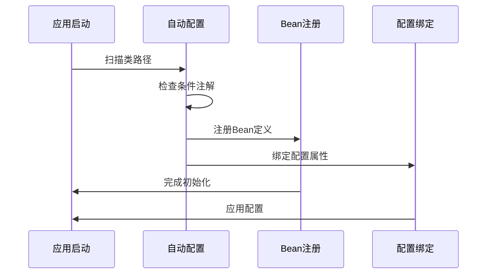

### 条件化配置

项目通过条件注解实现了灵活的配置选择：

```mermaid
flowchart TD
A[条件注解] --> B[@ConditionalOnClass]
A --> C[@ConditionalOnMissingBean]
A --> D[@ConditionalOnProperty]
E[配置选择] --> F[开发环境]
E --> G[测试环境]
E --> H[生产环境]
I[Profile配置] --> J[application-dev.properties]
I --> K[application-test.properties]
I --> L[application-prod.properties]
```

## 最佳实践建议

### 项目结构优化建议

基于当前项目状态，建议考虑以下优化方向：

```mermaid
graph TB
subgraph "功能模块化"
A[domain模块] --> B[fund-domain]
C[service模块] --> D[fund-service]
E[controller模块] --> F[fund-web]
G[repository模块] --> H[fund-repository]
end
subgraph "配置分离"
I[基础配置] --> J[application.properties]
K[环境配置] --> L[application-{env}.properties]
M[外部配置] --> N[application-{profile}.properties]
end
subgraph "监控与运维"
O[健康检查] --> P[actuator]
Q[指标收集] --> R[metrics]
S[日志管理] --> T[logback-spring.xml]
end
```

### 开发工作流建议

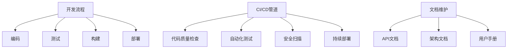

## 总结

本基金管理系统项目展现了现代Spring Boot应用的良好开端。项目结构清晰、配置简洁，充分体现了Spring Boot约定优于配置的设计理念。通过合理的包结构设计、完善的依赖管理、标准化的测试策略，为后续的功能扩展和团队协作奠定了坚实基础。

项目的主要优势包括：
- **简洁的项目结构**：遵循Maven标准布局，易于理解和维护
- **Spring Boot自动配置**：减少样板代码，提高开发效率
- **完善的测试框架**：集成JUnit 5和Spring Boot Test
- **现代化的构建工具**：使用Maven Wrapper确保环境一致性

建议在后续开发中继续遵循这些最佳实践，逐步完善功能模块，建立完整的开发、测试、部署流水线。